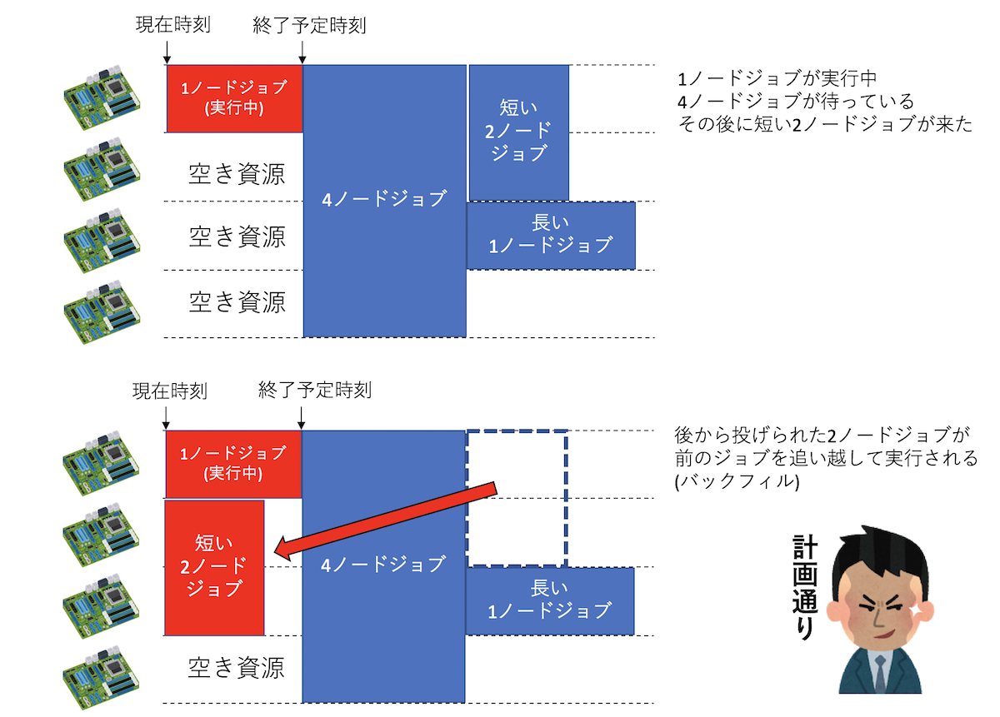
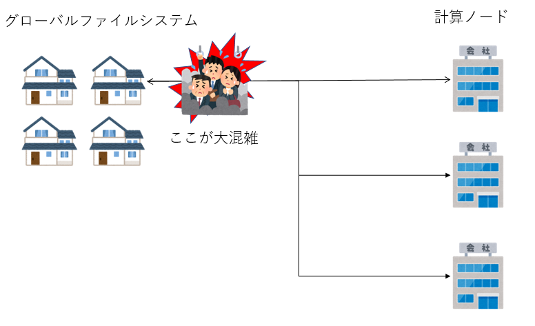
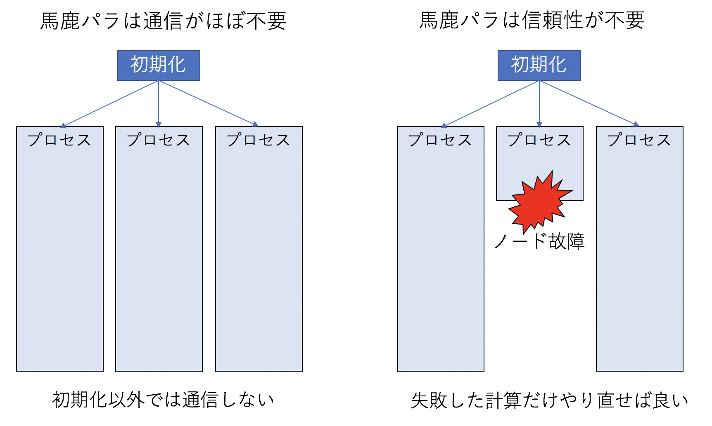
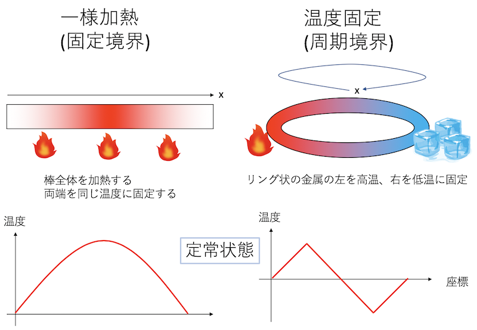
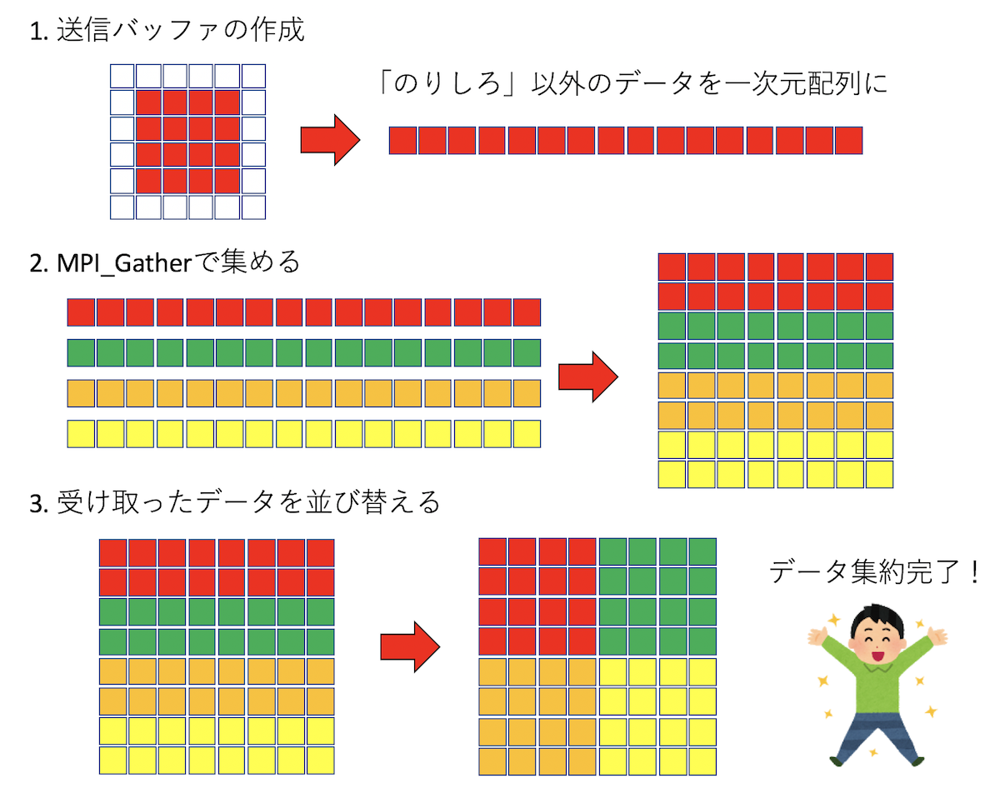
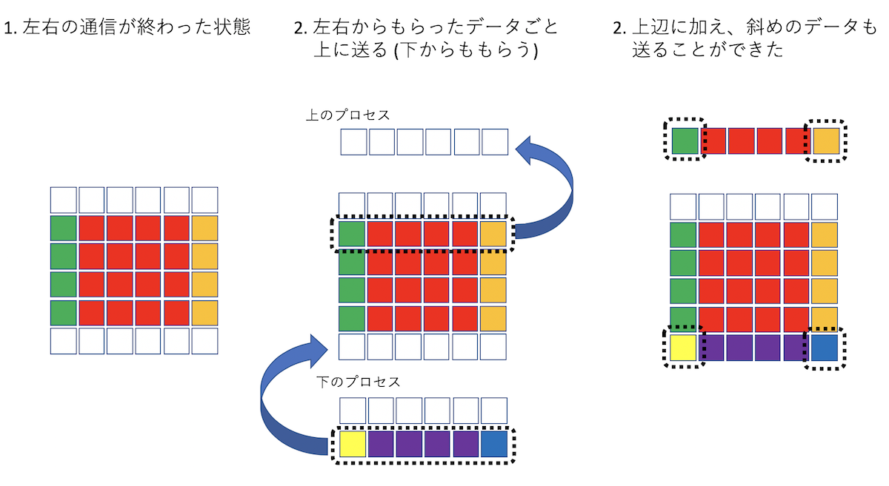

# 一週間でなれる！スパコンプログラマ

[](https://creativecommons.org/licenses/by/4.0/)

## はじめに

世の中にはスーパーコンピューター、略してスパコンというものがある。こういうすごそうな名前があるものの例にもれず、「スパコンとはなにか」という定義は曖昧である。人によって「何がスパコンか」の定義は違うと思うが、とりあえずここではCPUとメモリを積んだ「ノード」がたくさんあり、それらが高速なネットワークでつながっていて、大きなファイルシステムを持っているもの、と思っておけば良いと思う。

スパコンは名前に「スーパー」とついているだけに、「なんかすごそうなもの」「使うのが難しいもの」という印象を持つ人もいるだろう。しかし、スパコンを使うのに要求される技術そのものは非常に単純かつ簡単である。自分の経験として、プログラミングの素養がある学生であれば、詳しい人に一ヶ月もレクチャーを受ければ普通にスパコンにジョブを投げ始める。そのくらいスパコンを使うのは簡単なことである。しかし、スパコンは、「使いはじめる」のは簡単であるものの、「使い倒す」のはかなり難しい。経験的に、並列数が十進法で一桁増えるごとに、本質的に異なる難しさに直面する。例えば百並列で走ったコードが千並列で走らなかったり、千並列で走ったコードが一万並列でコケたりする。そのあたりの奥の深さは面白いものの、本稿では扱わない。

この記事では、近くにスパコンに詳しい人がいない人のために、「とりあえず7日間でスパコンを使えるようになる」ことを目指す。

勢いで一応リポジトリを作ったが、書き上がるかどうかはノストラダムスにもわかりません。

## Day 0 : なぜスパコンを使うのか

そもそも、なぜスパコンを使うのか？それは、そこにスパコンがあるからだ。
この日本語で書かれた文章を読んでいるということは、あなたは高確率で日本人であろう。おめでとう。あなたは世界有数のスパコンを使うことができる。なぜなら日本はスパコン大国だからだ。Top500のサイトに行くと、世界の性能トップ500に入るスパコンの、国の内訳を見ることができる。2018年6月時点で、トップは中国の206サイト、二位がアメリカの124サイト、日本は36サイトで三位に入っている。最近の中国の躍進は目覚ましいのだが、そこはさておく。Top500に入るスパコン数は世界三位で、しかも何度も世界一位となるスパコンを保持している日本は、世界有数のスパコン大国と言ってよいだろう。

個人的な経験で、こんなことがあった。とある海外の方と共同研究をしていた時、共同研究者に「こんな計算をしてみたらどうだろう」と提案してみた。
すると彼に「そういうことができたら面白いとは思うけど、計算が重すぎて無理だよ」と言われたので「いや、うちのスパコンでやったら一日仕事だ」と言ったらえらく驚いていた。これは、単に「日本は計算資源に恵まれている」という話にとどまらず、**人の想像力の上限は、普段使っている計算資源の規模で決まる**ということを示唆する。これは極めて重要だと思う。

普通、スパコンを使うのは、「まずローカルなPCで計算をして、それで計算が苦しくなってから、次のステップアップとしてスパコンを検討する」といった順番となるだろう。その時も、まず「これくらいの規模のスパコンを使ったら、これくらいの計算ができる」という事前の検討をしてからスパコンの利用申請をするであろう。つまり「テーマ(目的)が先、スパコン(手段)が後」となる。それは全くもって正しいのであるが、私個人の意見としては、「やることが決まってなくても、どのくらいの計算が必要かわからなくても、まずスパコンを使ってしまう」方がいろいろ良いと思う。普段からローカルPCでしか計算していない人は、なにか研究テーマを検討する際に、スパコンが必要となるテーマを無意識に却下してしまう。逆に、普段からスパコンを使いなれていると、想像力の上限が引き上げられ、普通のPCでは計算できないような選択肢を検討できる。つまり「スパコン(手段)が先、テーマ(目的)は後」である。そもそもスパコンを使うのはさほど難しくないのだし、いろいろ検討する前に、ささっと使い始めてみよう。

### 注意

並列プログラミングに限らないことだが、なにかを始めようとすると、ちょっと先にそれを始めていた人がなんやかんや言ってくることだろう。「並列化効率ガー」「そもそも実行効率が悪いコードを並列化するなんて云々」とか「最初から通信の最適化を考慮云々」とか、そういうことを言ってくる人が必ず湧くが、とりあえず二年くらいは無視してかまわない。なにはともあれスパコンを使えるようになること、チューニング不足の遅いコードであろうが並列化効率が悪かろうが、とりあえずそれなりのノード数で走るコードを書いて実行してみること、まずはそこを目指そう。それなりのノード数で走るコードが書ける、それだけで十分強力な武器になる。


## Day 1 : 環境構築

スパコン上で実行されるプログラムは並列プログラムである。したがって「スパコンを使う」ということは、
狭義には「並列化されたプログラムを実行する」ということを意味する。したがって、誰かが作った並列プログラムをスパコン上で実行すれば、スパコンは使えることになる。
それはそれでOKなのだが、本稿のタイトルは「一週間でなれる！スパコンプログラマ」であるから、スパコン上で動くコードを開発できるようになることを目的とする。
それはすなわち、「並列プログラミングをする」ということである。「並列プログラミング」という字面を見ると「難しそう」という印象を持つかもしれない。
しかし、(世の中の多くの「一見難しそうなもの」がそうであるように)並列プログラミングはさほど難しくない。
「一週間でなれる！スパコンプログラマ」の初日は、まずローカルに並列プログラミング環境を構築し、並列プログラミングに触れてみるところからはじめてみよう。

### MPIとは

一口に「並列化」といっても、様々な種類がありえる。一般に使われている並列プログラミングモデルは、「データ並列」「共有メモリ並列」「分散メモリ並列」の三種類であろう。
以後、プロセスやスレッドといった単語についてかなりいい加減な言葉遣いをするため、ちゃんと学びたい人はちゃんとした書籍を参考にされたい。特にWindowsとLinuxのプロセスの違いとか言い出すと話が長くなるので、ここでは説明しない。また、データ並列についてはとりあえずおいておく。

「共有メモリ並列」とは、並列単位がメモリを共有する並列化方法である。
通常は並列単位としてスレッドを用いるので、ここでは「スレッド並列」と呼ぶ。
逆に「分散メモリ並列」とは、並列単位がメモリを共有しない並列化方法である。
通常は並列単位としてプロセスを用いるので、ここでは「プロセス並列」と呼ぶ。
また、「プロセス並列」と「スレッド並列」を両方行う「ハイブリッド並列」という並列化もある。

まずはプロセスとスレッドの違いについて見てみよう。プロセスとは、OSから見た資源の管理単位である。
プロセスはOSから様々な権限を与えられるが、最も重要なことは「OSから独自のメモリ空間を割り当てられる」ことである。異なるプロセスは異なるメモリ空間を持っており、適切な権限がなければ他のプロセスのメモリを参照できない(そうしないとセキュリティ的に問題がある)。

スレッドとはCPUの利用単位である。通常、一つのCPUコアを利用できるのは一度に一つのスレッドだけである(SMTなどはさておく)。各プロセスは最低一つのスレッドを持っており、プログラムの実行とは、スレッドがCPUコアを使いにいくとである。図解するとこんな感じになる。


「スレッド並列」では、一つのプロセスの中に複数のスレッドを立ち上げ、各スレッドが複数のCPUコアを使うことで性能向上をはかる。複数のスレッドが一つのメモリを共有するため、「共有メモリ並列」となる。例えばOpenMPでディレクティブを入れたり、`std::thread`などを使って明示的にスレッドを起動、制御することで並列化を行う。同じプロセス内のスレッドはメモリを共有するため、お互いに通信をする必要はないが、同時に同じところを書き換えたりしないようにプログラマの責任で排他制御を行う必要がある。コンパイラによっては自動並列化機能を持っているが、それで実現されるのはこのスレッド並列である。

「プロセス並列」とは、複数のプロセスを立ち上げ、それぞれのプロセスに属すスレッドがCPUコアを使いにいくことで性能向上をはかる。プロセス並列はMPI(Message Passing Interface)というライブラリを使って行う。それぞれのプロセスは独自のメモリ空間を持っており、基本的にはお互いから見えないため、意味のある並列化を行うためには、必要に応じて通信を行わなければならない。

さて、プロセス並列とスレッド並列では、一般的にはスレッド並列の方がとっつきやすいと言われている。
以下のような単純なループがあったとする。

```cpp
const int SIZE = 10000;
void func(double a[SIZE], double b[SIZE])
for (int i=0; i < SIZE; i++) {
  a[i] += b[i];
}
```

これをOpenMPでスレッド並列化したければ、以下のようなディレクティブを入れるだけで良い。

```cpp
const int SIZE = 10000;
#pragma omp parallel for  // ← OpenMPによる並列化の指示
void func(double a[SIZE], double b[SIZE])
for (int i=0; i < SIZE; i++) {
  a[i] += b[i];
}
```

同じようなことをMPIでやろうとするとわりとごちゃごちゃ書かなければいけない上に、下手な書き方をするとオーバーヘッドが大きくなって効率が悪くなるかもしれない。しかし、スレッド並列はプロセスの中の並列化であり、一つのプロセスは複数のOSにまたがって存在できないため、複数のノード(ノードの説明については後述)を同時に使うことができない。

逆にプロセス並列の場合は、各プロセスが独立したメモリを保持しているため、他のプロセスの保持するデータがほしければ通信を行う必要がある。この通信はユーザが関数呼び出しを使って明示的に行わなければならない。ただし、通信は別のハードにある別のOS上で実行中の別のプロセスとも行うことができるため、複数のノードを同時に使うことができる。


上図に、簡単に「スレッド並列」と「プロセス並列」の違いをまとめた。本稿の目的は「スパコンプログラマ」になることであり、「スパコン」とは複数のノードを束ねたものであり、「スパコンプログラミング」とは複数のノードをまとめて使うことであるから、論理的必然としてスパコンプログラミングをするためにはプロセス並列が必要となる。というわけで、本稿では主にMPIを用いた分散メモリ並列を取り上げる。

### 余談：MPIは難しいか

たまに「スレッド並列は簡単」「MPIは難しい」という声を聞く。しかし、それなりの期間スパコンと関わって思うのは、「どちらかいえばスレッド並列の方が難しい」「MPIは面倒くさいが難しくない」というのが実感である。

確かにOpenMPなんかを使えば、一行いれるだけでスレッド並列化されて、簡単に数倍の性能が得られたりする。しかし、性能が出なかった時に「なぜ性能が出なかったのか」を調べるのはとても大変である。なぜならOpenMPを使うと「どのように並列化されたか」が隠蔽されてしまうからだ。基本的にはコンパイラが吐くレポートを見て、どのように並列化されたかを「想像」しながら調査をする必要がある。また、同じメモリを複数のスレッドが同時に触りにくるため、「タイミングによってはバグる」という問題を起こす。**この手のマルチスレッドプログラミングのデバッグは一般に地獄である**。少なくとも私はやりたくない。

MPIはいろいろ書かなければならないことが多く、確かに面倒である。しかし、基本的には「書いた通り」に並列化される(ここ読んだプロが「そんなことない！」と怒っている顔が目に浮かぶが、まぁOpenMPと比較して、の話ですよ)。
また、各プロセスのメモリは各プロセスだけのものである。通信するにしても、自分が用意したバッファに他のプロセスが書き込んでくるため、「いつ」「どこに」「誰が」「どのくらい」書き込んでくるかがわかる。これはデバッグするのに非常に重要な情報である。

そんなわけで、「どうせ並列化するなら、最初からMPIで書いてしまえばいいんじゃない？複数ノードを使えるようにもなるし」というのが私の見解である。MPIで必要となる関数も、初期化(`MPI_Init`)と後処理(`MPI_Finalize`)を除けば、相互通信(`MPI_Sendrecv`)と集団通信(`MPI_Allreduce`)の二つだけ知っていればたいがいのことはなんとかなる。それ以上にややこしいことをやりたくなったら、その時にまた調べれば良い。

### MPIのインストール

スパコンを使う前に、まずはローカルPCでMPIによる並列プログラミングに慣れておこう。MPIの開発環境としては、Mac OSX、もしくはLinuxを強く推奨する(というか筆者はWindowsでの並列プログラミング環境の構築方法を知らない)。Linuxはなんでも良いが、とりあえずCentOSを想定する。本稿の読者なら、GCCくらいは既に利用可能な状況であろう。あとはMPIをインストールすれば並列プログラミング環境が整う。

MacでHomebrewを使っているなら、

```sh
brew install openmpi
```

で一発、CentOSなら、

```sh
export PATH=$PATH:/usr/lib64/openmpi/bin/
```

でおしまいである。ここで

```sh
sudo yum install openmpi
```

とすると、開発環境がインストールされないので注意。

インストールがうまくいったかどうかは、MPI用コンパイラ`mpic++`にパスが通っているかどうかで確認できる。
実は、mpic++はインクルードパスやリンクの設定をユーザの代わりにやってくれるラッパーに過ぎず、実際のコンパイラは`clang++`、もしくは`g++`が使われる。

例えばMacでは

```sh
$ mpic++ --version
Apple LLVM version 10.0.0 (clang-1000.11.45.2)
Target: x86_64-apple-darwin17.7.0
Thread model: posix
InstalledDir: /Applications/Xcode.app/Contents/Developer/Toolchains/XcodeDefault.xctoolchain/usr/bin
```

と、clang++にパスが通っていることがわかる。Linuxの場合はg++である。

```sh
$ mpic++ --version
g++ (GCC) 4.8.5 20150623 (Red Hat 4.8.5-28)
Copyright (C) 2015 Free Software Foundation, Inc.
This is free software; see the source for copying conditions.  There is NO
warranty; not even for MERCHANTABILITY or FITNESS FOR A PARTICULAR PURPOSE.
```

したがって、インクルードパスやリンクの設定を明示的にするならば、`mpic++`を呼び出す必要はない。
スパコンサイトによっては、環境変数でMPIのインクルードパスが設定されている場合もあるだろう。その場合は単に`g++`でも`icpc`でも、MPIを用いたコードがそのままコンパイルできる。ただし、リンクのために`-lmpi`の指定が(場合によっては`-lmpi_cxx`も)必要なので注意。

### はじめてのMPI

環境構築ができたら、こんなコードを書いて、[hello.cpp](day1/hello.cpp)という名前で保存してみよう。

```c++
#include <cstdio>
#include <mpi.h>

int main(int argc, char **argv) {
  MPI_Init(&argc, &argv);
  printf("Hello MPI World!\n");
  MPI_Finalize();
}
```

以下のようにしてコンパイル、実行してみる。

```sh
$ mpic++ hello.cpp
$ ./a.out
Hello MPI World!
```

せっかくなので並列実行する前に、`mpic++`を使わずにコンパイルできることを確認してみよう。Macの場合、`g++`で先程の`hello.cpp`をコンパイルしようとすると「mpi.hが見つからないよ」と怒られる。

```sh
$ g++ hello.cpp
hello.cpp:2:10: fatal error: mpi.h: No such file or directory
 #include <mpi.h>
          ^~~~~~~
compilation terminated.
```

なので、コンパイラにその場所を教えてあげればよい。ヘッダファイルの場所だけ教えても「ライブラリが見つからないよ」と怒られるので、それも一緒に教えてあげよう。

```sh
g++ hello.cpp -I/usr/local/opt/open-mpi/include -L/usr/local/opt/open-mpi/lib -lmpi  -lmpi_cxx
```

問題なくコンパイルできた。ちなみに筆者の手元のCentOSでは、

```sh
g++ test.cpp -I/usr/include/openmpi-x86_64 -L/usr/lib64/openmpi/lib -lmpi -lmpi_cxx
```

でコンパイルできた。環境によってパスは異なるが、インクルードパスとライブラリパス、そしてライブラリ`-lmpi`(環境によっては`-lmpi_cxx`も)を指定すれば`mpic++`を使わなくてもコンパイルできる。「`mpic++`はラッパに過ぎず、ヘッダとライブラリを正しく指定すればどんなコンパイラでも使える」と知っていると、MPI関連でトラブルが起きた時にたまに役に立つので覚えておきたい。

さて、並列実行してみよう。並列実行には`mpirun`の引数に実行プログラムと並列数を指定する。

```sh
$ mpirun -np 2 ./a.out
Hello MPI World!
Hello MPI World!
```

メッセージが二行表示された。プログラムの実行の際、こんなことが起きている。

1. `mpirun`が`-np 2`を見て、プロセスを2つ立ち上げる。
2. `MPI_Init`が通信環境を初期化する
3. 各プロセスが、それぞれ`Hello MPI World`を実行する。
4. `MPI_Finalize`が通信環境を終了する。

複数のプロセスが立ち上がり、なにか処理をしているのだから、これは立派な並列プログラムである。しかし、このままでは、全てのプロセスが同じ処理しかできない。そこで、MPIは立ち上げたプロセスに **ランク(rank)** という通し番号を振り、それを使って並列処理をする。

### ランク

MPIでは、起動したプロセスに通し番号が振られる。その通し番号のことを **ランク(rank)** と呼ぶ。
ランクの取得には`MPI_Comm_rank`関数を使う。

```cpp
int rank;
MPI_Comm_rank(MPI_COMM_WORLD, &rank);
```

これを実行すると変数`rank`にランク番号が入る。N並列している場合、ランクは0からN-1までである。
試してみよう。

[day1/rank.cpp](day1/rank.cpp)

```cpp
#include <cstdio>
#include <mpi.h>

int main(int argc, char **argv) {
  MPI_Init(&argc, &argv);
  int rank;
  MPI_Comm_rank(MPI_COMM_WORLD, &rank);
  printf("Hello! My rank is %d\n", rank);
  MPI_Finalize();
}
```

実行するとこうなる。

```sh
$ mpic++ rank.cpp  
$ mpirun -np 4 ./a.out
--------------------------------------------------------------------------
There are not enough slots available in the system to satisfy the 4 slots
that were requested by the application:
  ./a.out

Either request fewer slots for your application, or make more slots available
for use.
--------------------------------------------------------------------------
```

おっと、エラーが出た。このエラーは「予め定義されたスロット数よりプロセス数が多いよ」というもので、
筆者の環境ではMacでは出るが、Linuxではでない。このエラーが出た場合は`mpirun`に
`--oversubscribe`オプションをつける。

```sh
$ mpirun --oversubscribe -np 4 ./a.out
Hello! My rank is 0
Hello! My rank is 2
Hello! My rank is 1
Hello! My rank is 3
```

無事にそれぞれのプロセスで異なるランク番号が表示された。

MPIプログラムでは、全く同じソースコードのレプリカが作成される。違いはこのランクだけである。
したがって、プログラマはこのランク番号によって処理を変えることで、並列処理を書く。
どんな書き方をしても自由である。例えば4並列実行する場合、

```cpp
#include <cstdio>
#include <mpi.h>

int main(int argc, char **argv) {
  MPI_Init(&argc, &argv);
  int rank;
  MPI_Comm_rank(MPI_COMM_WORLD, &rank);
  if (rank == 0) {
    // Rank 0の処理
  } else if (rank == 1) {
    // Rank 1の処理
  } else if (rank == 2) {
    // Rank 2の処理
  } else if (rank == 3) {
    // Rank 3の処理
  }
  MPI_Finalize();
}
```

みたいな書き方をしても良い。この場合、ランク0から3まで全く関係のない仕事をさせることができる。
まぁ、普通はこういう書き方をせずに、後で説明する「サンプル並列」「パラメタ並列」や、「領域分割」をすることが多いが、
「そうすることが多い」というだけで、「そうしなければならない」ということではない。
まとめると、

* MPIは、複数のプロセスを起動する
* それぞれのプロセスには、「ランク」という一意な通し番号が振られる。
* MPIプログラムは、ランクの値によって処理を変えることで、プロセスごとに異なる処理をする

こんな感じになる。これがMPIプログラムのすべてである。なお、複数のノードにまたがってMPIプロセスを
立ち上げた場合でも、ランク番号は一意に振られる。例えば、ノードあたり4プロセス、10ノードで実行した場合、
全体で40プロセスが起動されるが、それぞれに0から39までのランク番号が振られる。
その番号が、各ノードにどのように割当られるかは設定に依るので注意。

### 標準出力について

さて、端末で

```sh
mpirun -np 4 ./a.out
```

などとしてMPIプログラムを実行したとする。この場合は4プロセス立ち上がり、それぞれにPIDが与えられ、固有のメモリ空間を持つ。しかし、これらのプロセスは標準出力は共有している。
したがって、「せーの」で標準出力に出力しようとしたら競合することになる。
この時、例えば他のプロセスが出力している時に他のプロセスが書き込んだり、出力が混ざったりしないように、
後ろで交通整理が行われる。そもそも画面になにかを表示する、というのはわりと奥が深いのだが、
そのあたりの話は [tanakamura](https://github.com/tanakamura) さんの
[実践的低レベルプログラミング](https://tanakamura.github.io/pllp/docs/) とかを読んでほしい。

さて、とにかく今は標準出力というリソースは一つしかないのに、4つのプロセスがそこを使う。
この時、「あるひとかたまりの処理については、一つのプロセスが独占して使う」ようにすることで
競合が起きないようにする。
「ひとかたまりの処理」とは、例えば「`printf`で出力を始めてから終わるまで」である。

例えば先程の[day1/rank.cpp](day1/rank.cpp)の例では、

```cpp
printf("Hello! My rank is %d\n", rank);
```

という命令があった。ここでは、まず出力すべき文字列、例えば
`Hello! My rank is 0`を作る。そして、せーので書き出す。
イメージとしては

```cpp
puts("Hello! My rank is 0");
puts("Hello! My rank is 1");
puts("Hello! My rank is 2");
puts("Hello! My rank is 3");
```

という4つの命令が「ランダムな順番で」に実行される。
しかし、順番が入れ替わっても

```cpp
puts("Hello! My rank is 0");
puts("Hello! My rank is 2");
puts("Hello! My rank is 1");
puts("Hello! My rank is 3");
```

とかになるだけで、さほど表示は乱れない。

さて、同様なプログラムを`std::cout`で書いてみよう。

こんな感じになると思う。

[day1/rank_stream.cpp](day1/rank_stream.cpp)

```cpp
#include <iostream>
#include <mpi.h>

int main(int argc, char **argv) {
  MPI_Init(&argc, &argv);
  int rank;
  MPI_Comm_rank(MPI_COMM_WORLD, &rank);
  std::cout << "Hello! My rank is " << rank << std::endl;
  MPI_Finalize();
}
```

さて、この場合は、プロセスの切り替わりタイミング(標準出力の占有期限)が`<<`で切り替わる可能性がある。

イメージとしては、

```cpp
std::cout << "Hello! My rank is ";
std::cout << "0";
std::cout << std::endl;
std::cout << "Hello! My rank is ";
std::cout << "1";
std::cout << std::endl;
std::cout << "Hello! My rank is ";
std::cout << "2";
std::cout << std::endl;
std::cout << "Hello! My rank is ";
std::cout << "3";
std::cout << std::endl;
```

という命令が「ランダムな順番で」に実行される可能性がある。

すると、例えば

```sh
$ mpirun -np 4 ./a.out
Hello! My rank isHello! My rank is
0
1
Hello! My rank is 3

Hello! My rank is 2
```

のように表示が乱れる可能性がある。
これが乱れるかどうかは、システムのバッファリングがどうなっているかに依存し、
システムのバッファリングがどうなっているかは、MPIの実装に依存する。

参考→[MPIにおける各プロセスの連携と標準出力のバッファリング](https://qiita.com/angel_p_57/items/d3ae52f57467b9180dfd)

つまり、手元で表示が乱れなくても、別のマシンでは表示が乱れる可能性がある。なので、もし標準出力を使いたいなら、一度`std::stringstream`にまとめてから一度に書き出すか、素直に`printf`を使うほうが良いと思う。

なお、MPIのデバッグ目的に標準出力を使うのは良いが、例えば結果の出力や計算の進捗の出力に使うのはあまりおすすめできない。そのあたりはジョブスケジューラを用いたジョブの実行のあたりで説明すると思う。

ちなみに、Open MPIには「各ランクごとの標準出力を、別々のファイルに吐き出す」というオプションがある。

参考：[MPIプログラムのデバッグ](https://qiita.com/nariba/items/2277c2eb428886eae80d)

例えば、先程の例では、

```sh
mpirun --output-filename hoge -np 4 ./a.out
```

とすると、Linuxでは標準出力の代わりに`hoge.1.X`というファイルがプロセスの数だけ作成され、そこに保存される。中身はこんな感じ。

```sh
$ ls hoge.*  
hoge.1.0  hoge.1.1  hoge.1.2  hoge.1.3

$ cat hoge.1.0
Hello! My rank is 0

$ cat hoge.1.1
Hello! My rank is 1
```

Macで同様なことをすると、以下のようにディレクトリが掘られる。

```sh
$ mpiexec --output-filename hoge -np 4 --oversubscribe ./a.out
Hello! My rank is 0
Hello! My rank is 1
Hello! My rank is 2
Hello! My rank is 3

$ tree hoge
hoge
└── 1
    ├── rank.0
    │   ├── stderr
    │   └── stdout
    ├── rank.1
    │   ├── stderr
    │   └── stdout
    ├── rank.2
    │   ├── stderr
    │   └── stdout
    └── rank.3
        ├── stderr
        └── stdout
```

標準出力にも出力した上で、各ディレクトリに、各プロセスの標準出力と標準エラー出力が保存される。覚えておくと便利な時があるかもしれない。

### GDBによるMPIプログラムのデバッグ

本稿の読者の中には普段からgdbを使ってプログラムのデバッグを行っている人がいるだろう。
並列プログラムのデバッグは一般に極めて面倒だが、とりあえずgdbを使ったMPIプログラムのデバッグ方法を知っていると将来何かの役に立つかもしれない。
あと、これは筆者だけかもしれないが、ソース読んだりするより、gdb経由でプログラムの振る舞いを解析したほうがなんかいろいろ理解しやすかったりする。
というわけで、gdbでMPIプロセスにアタッチする方法を紹介する。普段からgdbを使っていなければこの節は読み飛ばしてかまわない。

gdbでデバッグできるのは一度に一つのプロセスのみである。しかし、MPIプログラムは複数のプロセスを起動する。
したがって、

* 起動されたすべてのプロセスについてgdbをアタッチする
* 特定のプロセス一つだけにgdbをアタッチする

の二通りの方法が考えられる。ここでは後者の方法を採用する。なお、両方の方法が[Open MPIのFAQ: Debugging applications in parallel](https://www.open-mpi.org/faq/?category=debugging)に記載されているので興味のある方は参照されたい。

gdbは、プロセスIDを使って起動中のプロセスにアタッチする機能がある。そこで、まずMPIプログラムを実行し、その後で
gdbで特定のプロセスにアタッチする。しかし、gdbでアタッチするまで、MPIプログラムには特定の場所で待っていてほしい。
というわけで、

* 故意に無限ループに陥るコードを書いておく
* MPIプログラムを実行する
* gdbで特定のプロセスにアタッチする
* gdbで変数をいじって無限ループを脱出させる
* あとは好きなようにデバッグする

という方針でいく。なお、なぜかMac OSではMPIプロセスへのgdbのアタッチがうまくいかなかったので、以下はCentOSで実行している。

こんなコードを書く。

[gdb_mpi.cpp](day1/gdb_mpi.cpp)

```cpp
#include <cstdio>
#include <sys/types.h>
#include <unistd.h>
#include <mpi.h>

int main(int argc, char **argv) {
  MPI_Init(&argc, &argv);
  int rank;
  MPI_Comm_rank(MPI_COMM_WORLD, &rank);
  printf("Rank %d: PID %d\n", rank, getpid());
  fflush(stdout);
  int i = 0;
  int sum = 0;
  while (i == rank) {
    sleep(1);
  }
  MPI_Allreduce(&rank, &sum, 1, MPI_INT, MPI_SUM, MPI_COMM_WORLD);
  printf("%d\n", sum);
  MPI_Finalize();
}
```

`MPI_Allreduce`はまだ説明していないが、全プロセスで変数の総和を取る関数である。
このコードは、自分のPIDを出力してから、ランク0番のプロセスだけ無限ループに陥る。
このコードを`-g`つきでコンパイルし、とりあえず4プロセスで実行してみよう。

```sh
$ mpic++ -g gdb_mpi.cpp
$ mpirun -np 4 ./a.out
Rank 2: PID 3646
Rank 0: PID 3644
Rank 1: PID 3645
Rank 3: PID 3647
```

4プロセス起動して、そこでランク0番だけ無限ループしているので、他のプロセスが待ちの状態になる。
この状態でランク0番にアタッチしよう。もう一枚端末を開いてgdbを起動、ランク0のPID(実行の度に異なるが、今回は3644)にアタッチする。

```sh
$ gdb
(gdb) attach 3644
Attaching to process 3644
Reading symbols from /path/to/a.out...done.
(snip)
(gdb)
```

この状態で、バックトレースを表示してみる。

```sh
(gdb) bt
#0  0x00007fc229e2156d in nanosleep () from /lib64/libc.so.6
#1  0x00007fc229e21404 in sleep () from /lib64/libc.so.6
#2  0x0000000000400a04 in main (argc=1, argv=0x7ffe6cfd0d88) at gdb_mpi.cpp:15
```

sleep状態にあるので、`main`関数から`sleep`が、`sleep`から`nanosleep`が呼ばれていることがわかる。
ここから`main`に戻ろう。`finish`を二回入力する。

```sh
(gdb) finish
Run till exit from #0  0x00007fc229e2156d in nanosleep () from /lib64/libc.so.6
0x00007fc229e21404 in sleep () from /lib64/libc.so.6
(gdb) finish
Run till exit from #0  0x00007fc229e21404 in sleep () from /lib64/libc.so.6
main (argc=1, argv=0x7ffe6cfd0d88) at gdb_mpi.cpp:14
14    while (i == rank) {
```

`main`関数まで戻ってきた。この後、各ランク番号`rank`の総和を、変数`sum`に入力するので、
`sum`にウォッチポイントを設定しよう。

```sh
(gdb) watch sum
Hardware watchpoint 1: sum
```

現在は変数`i`の値が`0`で、このままでは無限ループするので、変数の値を書き換えてから続行(continue)してやる。

```sh
(gdb) set var i = 1
(gdb) c
Continuing.
Hardware watchpoint 1: sum

Old value = 0
New value = 1
0x00007fc229eaa676 in __memcpy_ssse3 () from /lib64/libc.so.6
```

ウォッチポイントにひっかかった。この状態でバックトレースを表示してみよう。

```sh
(gdb) bt
#0  0x00007fc229eaa676 in __memcpy_ssse3 () from /lib64/libc.so.6
#1  0x00007fc229820185 in opal_convertor_unpack ()
   from /opt/openmpi-2.1.1_gcc-4.8.5/lib/libopen-pal.so.20
#2  0x00007fc21e9afbdf in mca_pml_ob1_recv_frag_callback_match ()
   from /opt/openmpi-2.1.1_gcc-4.8.5/lib/openmpi/mca_pml_ob1.so
#3  0x00007fc21edca942 in mca_btl_vader_poll_handle_frag ()
   from /opt/openmpi-2.1.1_gcc-4.8.5/lib/openmpi/mca_btl_vader.so
#4  0x00007fc21edcaba7 in mca_btl_vader_component_progress ()
   from /opt/openmpi-2.1.1_gcc-4.8.5/lib/openmpi/mca_btl_vader.so
#5  0x00007fc229810b6c in opal_progress ()
   from /opt/openmpi-2.1.1_gcc-4.8.5/lib/libopen-pal.so.20
#6  0x00007fc22ac244b5 in ompi_request_default_wait_all ()
   from /opt/openmpi-2.1.1_gcc-4.8.5/lib/libmpi.so.20
#7  0x00007fc22ac68955 in ompi_coll_base_allreduce_intra_recursivedoubling ()
   from /opt/openmpi-2.1.1_gcc-4.8.5/lib/libmpi.so.20
#8  0x00007fc22ac34633 in PMPI_Allreduce ()
   from /opt/openmpi-2.1.1_gcc-4.8.5/lib/libmpi.so.20
#9  0x0000000000400a2c in main (argc=1, argv=0x7ffe6cfd0d88) at gdb_mpi.cpp:17
```

ごちゃごちゃっと関数呼び出しが連なってくる。MPIは規格であり、様々な実装があるが、今表示されているのはOpen MPIの実装である。内部で`ompi_coll_base_allreduce_intra_recursivedoubling`とか、それっぽい関数が呼ばれていることがわかるであろう。興味のある人は、[OpenMPIのソース](https://www.open-mpi.org/source/)をダウンロードして、上記と突き合わせてみると楽しいかもしれない。

さて、続行してみよう。二回continueするとプログラムが終了する。

```sh
(gdb) c
Continuing.
Hardware watchpoint 1: sum

Old value = 1
New value = 6
0x00007fc229eaa676 in __memcpy_ssse3 () from /lib64/libc.so.6
(gdb) c
Continuing.
[Thread 0x7fc227481700 (LWP 3648) exited]
[Thread 0x7fc226c80700 (LWP 3649) exited]

Watchpoint 1 deleted because the program has left the block in
which its expression is valid.
0x00007fc229d7e445 in __libc_start_main () from /lib64/libc.so.6
```

`mpirun`を実行していた端末も、以下のような表示をして終了するはずである。

```sh
$ mpic++ -g gdb_mpi.cpp
$ mpirun -np 4 ./a.out
Rank 2: PID 3646
Rank 0: PID 3644
Rank 1: PID 3645
Rank 3: PID 3647
6
6
6
6
```

ここではgdbでMPIプロセスにアタッチするやり方だけを説明した。ここを読むような人はgdbを使いこなしているであろうから、アタッチの仕方さえわかれば、後は好きなようにデバッグできるであろう。
ただし、私の経験では、並列プログラミングにおいてgdbを使ったデバッグは最終手段であり、できるだけ細かくきちんとテストを書いて、そもそもバグが入らないようにしていくことが望ましい。

## Day 2 : ジョブの投げ方

### スパコンとは

スパコンを使うのに、必ずしもスパコンがどのように構成されているかを知る必要はない。しかし、せっかくスパコンを使うのだから、スパコンとは何かについて簡単に知っておいても良いであろう。
ただし、こういう単語にありがちだが「何がスパコンか」は人によって大きく異なる。ここで紹介するのはあくまで「執筆者が思うスパコンの定義」の説明であり、他の人は他の定義があることを承知されたい。

普通のPCは、CPU、メモリ、ネットワーク、ディスクなどから構成されている。スパコンも全く同様に、CPU、メモリ、ネットワーク、ディスクがある。
それぞれちょっと高級品を使っているだけで、基本的には普通のPCと同じと思って良い。ただし、PCとはつなぎ方がちょっと異なる。
スパコンは、CPUとメモリをまとめたものを「ノード」と呼ぶ。このノードをたくさん集めて高速なネットワークでつないだものがスパコン本体である。普通のPCではCPUの近くにメモリがあったが、最近のスパコンのノードはディスクレスの構成にすることが多い。そのかわり、大きなファイルシステムとネットワークでつなぐ。


一般的なスパコンの構成は上図のような感じになる。ノードは大きく分けて「ログインノード」と「計算ノード」の二種類がある。ユーザはインターネット経由でログインノードにログインし、そこで作業をする。実際の計算は計算ノードで行う。ログインノード、計算ノード、ファイルシステムは、高速なネットワークで接続されている。この高速ネットワークは長らくInfiniBandという規格がデファクトスタンダードとなっていたが、近年になってIntelのOmniPathの採用例も増えているようである。ファイルシステムについては、Lustreというファイルシステムがデファクトスタンダードであるが、目的によってはGPFS(今はIBM Spectrum Scaleに名前が変わったらしい)なども選択される。

さて、「ノード」という呼び方をしているが、これは本質的にはパソコンと同じものなので、スパコンとはパソコンを大量に並べて高速なネットワークで相互につないだもの、と言える。特に最近はCPUとしてx86の採用が多いため、ますます「普通のスパコンを大量に並べたもの」という印象が強くなるだろう。しかし、**「普通のパソコンを大量に並べたらスパコンになるか」というとそうではない**。スパコンで最も重要なもの、それは「信頼性」である。

普通にPCを使っていたら、わりとPCの部品は壊れることを知っているであろう。ありとあらゆる箇所が壊れる可能性があるが、ファンやディスクなどの回るものなどは特に壊れやすい。また、メモリなどもよく壊れるものの代表である。CPUやマザー、ネットワークカードなども壊れる。スパコンは多くの部品から構成されるため、壊れるのが非常に稀であっても、全体としては無視できない確率で壊れてしまう。

例えば「京コンピュータ」が10ペタフロップスを達成した時には、[計算の実行に88128ノードを使って29時間28分かかっている](http://www.riken.jp/pr/topics/2011/20111102/)。これは約260万ノード時間であるから、この計算が90%の確率で実行できるためには、各ノードが3000年くらいは壊れない「保証」が必要になる。
逆に、もし各ノードが1年に一度くらい壊れるならば、およそ6分に一度どこかのノードが壊れることになり、とても使い物にならない。


つまり、大規模計算とは大縄跳びのようなものであり、それなりのノード数でまともに計算を行うためには、かなり高信頼なシステムを組む必要があることがわかるであろう。他にも様々な「スパコンらしさ」「スパコンならではの工夫」はあるのだが、なにはともあれ「高信頼であること」が非常に重要である。たまにゲーム機や格安チップを並べて「格安スパコン」を作った、というニュースが話題になるのだが、実はスパコンでは計算部分だけでなく「信頼性」と「ネットワーク」にかなりコストがかかっており、そこをケチると、当然ながら「信頼性」や「ネットワーク」が必要とされる計算ができないスパコンになる。もちろん「やりたい計算」が「格安スパコン」でできるのであればそれを選択すれば良いが、ただピーク性能と値段を比較して「スパコンは高い」と即断しないようにしてほしい。星の王子さまも「いちばんたいせつなことは、目に見えない」って言ってることだしね・・・。

### 余談：BlueGene/Lのメモリエラー

スパコンは部品が多いために故障が問題になると書いた。
他にも、普通のPCではあまり問題にならないことがスパコンでは問題になることがある。それは宇宙線である。

宇宙線とは、文字通り宇宙から飛んでくる放射線のことである。
例えば国立科学博物館などに行った際には、霧箱展示を見て欲しい。普段意識していないが、宇宙線はわりとびゅんびゅん飛んでいる。
これが半導体素子にぶつかることで誤動作を起こす。
特に問題となるのはメモリで、宇宙線によりランダムにビット反転が起きてしまい、結果がおかしくなる。
この問題を防ぐため、メモリには1ビットのエラーは訂正可能、
2ビットのエラーについては検出可能となるようなエラー訂正機能をつけるのが一般的である。

しかし、この機能がついていないスパコンがある。IBMのBlueGene/Lである。
BlueGeneは、比較的非力なノードを多数結合させることで、全体として高い性能と省電力を両立させよう、という設計思想をもった
スパコンで、例えば計算ノードのOSがマルチユーザをサポートしないなど、随所に思い切った割り切りが見られる。
その中で特に驚くのが、CPUのL1キャッシュにエラー訂正機能がないことである。
BlueGene/LのL1には、1ビットのエラー検出機能のみがあり、訂正することができない。
したがって、ビットエラーが起きるとそのままシステムがクラッシュする。

当時、BlueGene/Lを導入したローレンス・リバモア国立研究所の[マニュアル](https://asc.llnl.gov/computing_resources/bluegenel/basics/)によると、
フルノード(20万コア)で計算すると平均的に6時間に一度程度、宇宙線によるL1のビットエラーで計算がクラッシュする、と試算されている。
これに対してユーザは、3つの手段を取ることができた。

* 諦める： フルノードで6時間程度なので、例えば1万コア使って計算しても、平均故障間隔は120時間程度になる。なので、そのまま計算して死んだら諦める、というのは現実的な選択であった。
* メモリ保護モードを使う： BlueGene/Lには「write throughモード」が用意されていた。これはL1のビットエラーをL2や主記憶を使ってソフトウェア的に保護するモードであったらしい。ユーザは何もしなくて良いが、このモードを選択すると10%から40%程度の性能劣化があったようだ。
* 例外を受け取ってユーザ側でなんとかする： L1がビットエラーの検出をした時、OSが例外を飛ばすモード。ユーザ側がなんとかする。

通常は「諦める」か、性能劣化が許容範囲内であればwrite throughモードを使っていたようだが、BlueGene/Lのフルノードで長時間計算し、
2007年のGordon Bell賞を受賞したリバモアのチームは「例外を受け取ってユーザ側でなんとかする」方法を選択した。
具体的には、メモリの一部にチェックポイントデータを保持しておき、例外を受け取ったら直近のチェックポイントからリスタートする
コードを書いたそうだ。[論文](https://dl.acm.org/citation.cfm?id=1362700)によると、フルノードを三日間程度の計算中、
数回例外を受け取ってリスタートしたらしい。このチームのメンバーに話を聞いたことがあるが、プログラムのどの場所で例外が来ても
大丈夫なように組むのが大変だったと言っていた記憶がある。

「システムが大きくなるとハードウェアだけで信頼性を担保するのは難しくなるため、一部をソフトウェアでなんとかしよう」というような話は昔から言われており、
多くの研究があって実験的にシステムに組み込まれたものもあるのだが、そのような思想が実運用に供されたのは筆者の知る限りBlueGene/Lを除いて他はない。

そもそもなぜL1にエラー訂正をつけなかったのか、つけられなかったのかはわからないのだが、後継機であるBlueGene/PにはどうやらL1にもエラー訂正がついたところを見ると、ユーザからは不評だったのかもしれない。BlueGeneシリーズはHPC業界ではかなり売れたようで、
[2007年6月のTop500リスト](https://www.top500.org/lists/2007/06/)のトップ10に、BlueGeneが4つ入っている。
BlueGeneは、第一世代のBlueGene/L、第二世代のBlueGene/P、第三世代のBlueGene/Qと開発が進められたが、そこでBlueGeneプロジェクトは終了した。

### スパコンのアカウントの取得方法

スパコンを使うためには、スパコンのアカウントを手に入れなければならない。ある意味ここが最難関である。スパコンを使う技術そのものは非常に簡単に身につくが、スパコンのアカウントを手に入れる、というのは技術に属すスキルではないからだ。

とりあえず、世の中には様々なスパコンがある。企業が開発のためにスパコンを導入していることもあるし、最近はクラウドもスパコンと呼んで良いような計算資源を用意している。将棋ソフト、Ponanzaの開発者の山本さんは機械学習のための計算資源が足りず、[さくらインターネットにお願いして大規模な計算資源を借りた](http://ascii.jp/elem/000/001/171/1171630/index-2.html)そうなのだが、そういう強いメンタルを持っていない人は、通常の手続きでスパコンのアカウントを取得しよう。

まず、スパコンといえば、大型計算機センター(大計センター)である。たとえば[東京大学情報基盤センター](https://www.itc.u-tokyo.ac.jp/)のようなところは、申請すれば、かなり割安な金額で計算資源を借りることができる。また、様々な公募を行っており、共同研究という形で無料で計算資源を借りることもできるようである。

[物性研究所](http://www.issp.u-tokyo.ac.jp/supercom/)は、テーマが「物性科学」に限られるが、申請が認められれば無料で計算資源を利用できる。ただし、利用資格は修士以上(原則として学部生不可)、申請資格は給料をもらっている研究者(ポスドク以上)なので注意。

「二位じゃだめなんでしょうか？」で話題となった[「京コンピュータ」もテーマを一般公募しており](http://www.hpci-office.jp/pages/proposal_submission)、研究目的であるならば、得られた成果を公表することを前提に無料で利用できる。最大8万ノード、64万コアの計算資源が神戸で君を待っている。

研究目的でスパコンを使うのであれば、利用者は修士以上、申請は研究者、というのが一般的であるが、たとえば「高校生だけどスパコンを使いたい」という人もいるであろう。そういう有望な若者のために、例えば阪大や東工大は「[SuperCon](http://www.gsic.titech.ac.jp/supercon/main/attwiki/index.php?SupercomputingContest2017)」という、スパコン甲子園のようなイベントを行っている。このイベントは、競技プログラミングの一種であるが、問題を解くのに並列計算が必須となる規模が要求されるのが特徴である。

また、2014年には「[高校生がスーパーコンピュータを使って5×5魔方陣の全解を求めることに成功](https://www.ccs.tsukuba.ac.jp/140228_press/)」している。これは筑波大学の学際共同利用プログラムを利用したもので、当時高校一年生が教授と共同研究を行い、スパコンを使い倒した事例である。

率直に言って、日本はスパコン大国であるわりに、若い人(例えば高校生)が「そうだ、スパコン使おう」と気軽に使える状況にはない(この状況はなんとかしたい)。しかし、門戸は狭いながらも高校生に開いているのは確かである。また、そもそも並列プログラミングができなければ、スパコンを使おう、という気持ちにはならないだろう。とりあえずさくっと並列プログラミングをできるようになっておき(どうせ簡単なので)、チャンスがあればスパコンを使う、というスタンスでいればいいんじゃないでしょうか。

### ジョブの実行の仕組み


ローカルPCは自分しか使わないので、好きな時に好きなプログラムを実行して良い。しかし、スパコンは大勢で共有する計算資源であり、各自が好き勝手にプログラムを実行したら大変なことになるため、なんらかの交通整理が必要となる。その交通整理を行うのが「ジョブスケジューラ」である。スパコンでは、プログラムは「ジョブ」という単位で実行される。ユーザはまず、「ジョブスクリプト」と呼ばれるシェルスクリプトを用意する。これは、自分のプログラムの実行手順を記した手紙のようなものである。次にユーザは、ログインノードからジョブスケジューラにジョブの実行を依頼する(封筒をポストに入れるイメージ)。こうしてジョブは実行待ちリストに入る。ジョブスケジューラは実行待ちのジョブのうち、これまでの利用実績や、要求ノード数、実行時間などを見て、次にどのジョブがどこで実行されるべきか決定する。

### ジョブスクリプトの書き方


先に述べたように、スパコンにおいては、プログラムをコンパイルする場所と、実行する場所が異なる。
ユーザは、実行ファイルの他に、ジョブスクリプトというファイルを用意し、それをジョブスケジューラに投げることで
ジョブの実行を依頼する。ジョブスクリプトにはジョブの要求資源と、ジョブの実行の仕方が書いてあり、
ジョブスケジューラは要求資源をもとに、そのジョブをいつ、どこで実行するかを決める。
そして実行の順番がきたら、ジョブスクリプトはシェルスクリプトとして実行され、それによってジョブが実行される。
ちなみに待ち行列に入っているジョブが実行状態になることを「ディスパッチ」と呼ぶ。

まず、ジョブスクリプトの冒頭に、特殊なコメントを使ってジョブの要求資源を書く。
ジョブスクリプトの書き方は、どんなジョブスケジューラを使っているか、そのスパコンサイトがどういう運用をしているかによって
異なるので、もしスパコンを使う場合は、スパコンサイトが用意しているであろうマニュアルを適宜参照されたい。
しかし、基本的には、ジョブの要求ノード数や、実行時間を書けば良い。

例えば、ジョブスケジューラの一つ、PBSならば、`#PBS`の後に指示文を書く。
2ノード、12時間の実行を要求するなら

```sh
#PBS -l nodes=2
#PBS -l walltime=24:00:00
```

といった具合である。その次に、ジョブの実行方法を書く。ここで注意して欲しいのは、このプログラムはコンパイル、ジョブ投入をした計算機とは
異なる場所で実行されるということだ。したがって、カレントディレクトリや環境変数などは引き継がれない。
特に、カレントディレクトリが変わるということには注意したい。なので、

```sh
cd /home/path/to/dir
./a.out
```

といった感じに絶対パスで書いても良いが、普通は「ジョブ投入時のカレントディレクトリ」が特別な環境変数に入っているので
それを使う。PBSならば`PBS_O_WORKDIR`にカレントディレクトリが入っているので、

```sh
cd $PBS_O_WORKDIR
./a.out
```

と書くと良いだろう。他にも実行に必要な環境変数などがあれば、それも指定しよう。
こうしてできたジョブスクリプトを、例えば`go.sh`という名前で保存し、

```sh
qsub go.sh
```

などと、ジョブをサブミットするコマンドに渡してやればジョブ投入完了である。ジョブの状態を見るコマンド(PBSならqstat)で、
ジョブが実行待ちに入ったことを確認しよう。

スパコンによっては、搭載メモリ量が多いノード(Fatノードなどと呼ばれる)や、GPGPUが搭載されているノードなど、異なる種類のノードから
構成されている場合がある。その場合はノードの種類ごとに「キュー」と呼ばれる実行単位が設定されているため、
適切なキューを選んで実行すれば良い。

### フェアシェア

実行待ちになったジョブは、ジョブスケジューラによって実行予定の場所と時刻が決定される。
基本的には、前のジョブが終わった時に、待ち行列の先頭にあるジョブが実行されるのだが、
他にも様々な要因がある。その中で重要なのは「フェアシェア」という概念である。

こんな状況を考えてみよう。計算ノードが4ノードあるクラスタを考えよう。
最初にAさんが1ノードジョブを10個投げた。4つのジョブが4ノードで実行され、6つが待ち行列に入った。
その後、Bさんが1ノードジョブを1つ投げたとする。この時、普通にFIFOでスケジューリングしてしまうと、
Bさんのジョブは待ち行列の最後に入ってしまう。すでにAさんは4ノードも占有しているのだから、
次に走るべきジョブはBさんのジョブのような気がしてくるであろう。そうするためには、Bさんのジョブが
既に待ち行列に入っていたジョブを追い越さなければならない。

このようなスケジューリングを行うのがフェアシェアである。まず、ユーザごとに優先度を考える。
ジョブを実行すればするほど優先度が下がり、しばらくジョブが実行されていなければ優先度が上がるようにしよう。
例えばソーシャルゲームのスタミナのようなものだと考えれば良い。
ジョブスケジューラは、計算資源が空いたら、その計算資源で実行できるジョブのうち、もっとも優先度の高いジョブを選んで実行する。
これにより、たくさんジョブを実行している人は優先度が下がり、あまりジョブを実行していない人が後からジョブを投げたら、そちらが優先されるように
ジョブがスケジューリングされる。

### バックフィル



今、4ノードの計算資源があったとして、1ノードから4ノードのジョブを実行できるとしよう。
最初に1ノードのジョブが実行され、次に4ノードのジョブが投入された。4ノードを要求するジョブは、
4ノードとも空かないと実行できないため待たされる。さて、その後、さらに1ノードジョブが投入された。
もし、ジョブスケジューラが「待ち行列に入っているジョブのうち、次に実行可能なジョブを選ぶ」という
アルゴリズムでジョブを選ぶと、いま3ノード空いており、4ノードジョブと1ノードジョブがあるので、
1ノードジョブを選んで実行してしまう。すると、1ノードジョブと4ノードジョブが混ざって投入されるような場合、
1ノードジョブのみが実行され、4ノードジョブは永遠に実行できなくなってしまう。
逆に、1ノードジョブが走っている状況で、次に4ノードジョブを実行させようとすると、先に走っている1ノードジョブが
終わるまで、3ノードが無駄になってしまう。こんな状況を改善するのが「バックフィル」である。

ジョブには「実行予定時間」が記載されている。
したがって、ジョブスケジューラは、先に走っているジョブがいつ終わるか、その終了予定時刻を知っている。
したがって、その終了予定時刻前に終わるジョブであれば、4ノードジョブの実行前に実行させて良い。
このようなジョブのディスパッチを「バックフィル」と呼ぶ。

普通、スパコンにはキューごとにデフォルトで「最長実行時間」が決められており、
ジョブに要求時間の記載がなければ最長実行時間を要求したとみなされるのが普通である。
ユーザは自分のジョブの実行時間が「最長実行時間内に終わるかどうか」だけを気にして、
ジョブの要求時間を記載しない(＝最長実行時間を要求する)ことが多い。
しかし、ちょっと考えてみればわかるが、すべてのジョブが同じ実行時間を要求すると、バックフィルされない。
逆に、もし短い時間で終わることがわかっているジョブに、ちゃんとその時間を要求して投入すれば、
バックフィルによってジョブの隙間に入りやすくなり、ジョブが実行されやすくなる。

スパコン運用担当としての経験から、ジョブスケジューリングを全く気にしないでジョブを投げるユーザと、
ジョブスケジューリングを気にして、最適なジョブ投入戦略を練るユーザの両極端に分かれる。
まぁ、あまりそういうのを気にするのもアレなのだが、3時間とかで終わるジョブなのに、実行時間を指定せずに
24時間を要求し、その結果なかなか実行されずに待たされて「すぐ終わるジョブなのに長く待たされる！」と文句を言うのも
どうかと思うので、少しはジョブスケジューリングを気にしても良いかもしれない。

## ステージング



スパコンが、大きく分けて「ログインノード」「計算ノード」「ファイルシステム」から構成され、それらが
高速なネットワークで結合されていることは既に述べた。ファイルシステムはログインノードにマウントされており、
そこで作業をするのだが、計算ノードからファイルシステムが見えるかどうかはスパコンの構成による。
ログインノードからもすべての計算ノードからファイルシステムが見えるようにしている場合、「グローバルファイルシステム」などと
呼ばれる。計算ノードからグローバルファイルシステムにファイルの読み書きをする場合、ネットワークを経由するため、
ネットワークの構成によっては渋滞が起きることがある。特に大規模なジョブが多数のノードから一気にファイルの読み書きをすると、
通信路がサチって性能がでなくなったり、他のジョブと競合して性能劣化してしまったりする。
そうすると、ファイルの読み書きがボトルネックになってしまい、シミュレーションなどが遅くなってしまう。
こういう状況を防ぐため、計算ノードに小容量だが高速なローカルファイルシステムをつける場合がある。
ローカルファイルシステムは、各計算ノードからしか見えない。もちろんログインノードからも見えない。
各計算ノードが独占して利用できるため、高速に読み書きできる。ローカルファイルシステムとしてSSDを採用する例もあるようだ。

さて、各計算ノードにローカルファイルシステムが用意されているが、それは計算ノードからしか見えない(計算ノードにしかマウントされていない)。
例えば、大量のファイルを処理したいとしよう。そのためには、各プロセスが処理すべきファイルを、
そのプロセスが実行されるノードに接続されたローカルファイルシステムにコピーする必要がある。
また、処理が終わったファイルを、ジョブ終了時にローカルファイルシステムからグローバルファイルシステムに持ってこなければならない。
しかし、ジョブが実行されるまで、ジョブがどの計算ノードで実行されるかわからない。
そこで、これもジョブスケジューラが面倒を見る。


ジョブスクリプトに、どのプロセスが、どんなファイルを必要とし、最後にどんなファイルをグローバルファイルシステムに持ってきて欲しいのかを記載する。
ジョブスケジューラはそれを見て、グローバルファイルシステムとローカルファイルシステムの間のファイルのコピーを行う。
このような作業を「ステージング」と呼ぶ。実行前にローカルにファイルをコピーするのを「ステージイン」、
実行終了後にローカルからグローバルにファイルをとってくるのを「ステージアウト」と呼ぶ。
ステージングはスパコンサイトによって様々な方式があるので、詳細はマニュアルを参照して欲しいが、とにかく
「すべての計算ノードからグローバルファイルシステムを見えるようにしてファイルを読み書きすると、途中の通信路で
渋滞が起きるので、計算ノードの近くにファイルをおいて、計算ノードとグローバルファイルシステムの間のやりとりは
ジョブの実行前と実行後の一回ずつだけにしましょう」というのがステージングである。
例えるなら、会社員が一ヶ月遠くに出向することになって、通勤できなくもないがすごく大変なので、
出向先の近くにマンスリーマンションを借りてしまえば、長時間の移動は最初と最後だけだよね、みたいな感じである。

## Day 3 : 自明並列

### 自明並列、またの名を馬鹿パラとは

例えば、100個の画像データがあるが、それらを全部リサイズしたい、といったタスクを考える。
それぞれのタスクには依存関係が全くないので、全部同時に実行してもなんの問題もない。
したがって、100並列で実行すれば100倍早くなる。
このように、並列タスク間で依存関係や情報のやりとりが発生しない並列化のことを自明並列と呼ぶ。
英語では、Trivial Parallelization(自明並列)とか、Embarrassingly parallel(馬鹿パラ)などと表現される。
「馬鹿パラ」とは「馬鹿でもできる並列化」の略で(諸説あり)、その名の通り簡単に並列化できるため、
文字通り馬鹿にされることも多いのだが、並列化効率が100%であり、最も効率的に計算資源を利用していることになるため、
その意義は大きい。
なにはなくとも、まず馬鹿パラができないことには非自明並列もできないわけだし、馬鹿パラができるだけでも、できない人に比べて
圧倒的な攻撃力を持つことになる。
ここでは、まず馬鹿パラのやり方を見てみよう。

### 自明並列の例1: 円周率

まず、自明並列でよく出てくる例として、サンプリング数を並列化で稼ぐ方法を見てみよう。とりあえず定番の、
モンテカルロ法で円周率を計算してみる。

こんなコードを書いて、[calc_pi.cpp](day3/calc_pi.cpp)という名前で保存してみよう。

```cpp
#include <cstdio>
#include <random>
#include <algorithm>

const int TRIAL = 100000;

double calc_pi(const int seed) {
  std::mt19937 mt(seed);
  std::uniform_real_distribution<double> ud(0.0, 1.0);
  int n = 0;
  for (int i = 0; i < TRIAL; i++) {
    double x = ud(mt);
    double y = ud(mt);
    if (x * x + y * y < 1.0) n++;
  }
  return 4.0 * static_cast<double>(n) / static_cast<double>(TRIAL);
}

int main(void) {
  double pi = calc_pi(0);
  printf("%f\n", pi);
}
```

ここで、`main`関数から呼ばれる関数`calc_pi(const int seed)`が、わざとらしく乱数の種だけ受け取る形になっていることに注意。

普通にコンパイル、実行してみる。

```sh
$ g++ calc_pi.cpp
$ ./a.out
3.145000
```

100000回の試行の結果として、円周率の推定値「3.145000」が得られた。これを並列化してみよう。
並列化手順は簡単である。

1. `mpi.h`をインクルードする
2. main関数の最初と最後に`MPI_Init`と、`MPI_Finalize`をつける。ただし`MPI_Init`が引数に`argc`と`argv`を要求するので、`main`関数の引数をちゃんと書く。
3. `MPI_Comm_rank`関数で、ランク番号を得る。
4. ランク番号を乱数の種に使う
5. そのまま`calc_pi`を呼ぶ。

以上の修正をしたコードを[calc_pi_mpi.cpp](day3/calc_pi_mpi.cpp)という名前で作成する。

```cpp
#include <cstdio>
#include <random>
#include <algorithm>
#include <mpi.h>

const int TRIAL = 100000;

double calc_pi(const int seed) {
  std::mt19937 mt(seed);
  std::uniform_real_distribution<double> ud(0.0, 1.0);
  int n = 0;
  for (int i = 0; i < TRIAL; i++) {
    double x = ud(mt);
    double y = ud(mt);
    if (x * x + y * y < 1.0) n++;
  }
  return 4.0 * static_cast<double>(n) / static_cast<double>(TRIAL);
}

int main(int argc, char **argv) {
  MPI_Init(&argc, &argv);
  int rank;
  MPI_Comm_rank(MPI_COMM_WORLD, &rank);
  double pi = calc_pi(rank);
  printf("%d: %f\n", rank, pi);
  MPI_Finalize();
}
```

ついでに、円周率の推定値を表示するときに自分のランク番号も表示するようにしてみた。
実行結果はこの通り。

```sh
$ mpirun -np 4 --oversubscribe ./a.out
0: 3.145000
1: 3.142160
3: 3.144200
2: 3.146720

$ mpirun -np 4 --oversubscribe ./a.out
0: 3.145000
2: 3.146720
3: 3.144200
1: 3.142160
```

ただし、`--oversubscribe`は、論理コア以上の並列実行を許可するオプションである。
この実行結果から、

1. 実行するたびに出力順序が異なる
2. しかし、同じランクに対応する推定値は変わらない

ことがわかる。

ちゃんと並列計算されているか、timeコマンドで調べてみよう。

```sh
$ ./a.out
0: 3.145000
./a.out  0.04s user 0.01s system 57% cpu 0.086 total

$ time mpirun -np 4 --oversubscribe ./a.out
2: 3.146720
3: 3.144200
1: 3.142160
0: 3.145000
mpirun -np 4 --oversubscribe ./a.out  0.24s user 0.08s system 240% cpu 0.135 total
```

シリアル実行の場合はCPUの利用率が57%だったのが、4並列の場合には240%と、100%を超えたのがわかるだろう。
この例では実行が早く終わりすぎて分かりづらいが、`TRIAL`の値を大きくして実行に時間がかかるようにして、
実行中にtopしてみると、ちゃんと並列実行されていることがわかる。

```sh
PID    COMMAND      %CPU TIME     #TH   #WQ  #PORT MEM    PURG   CMPRS  PGRP
45163  a.out        92.1 00:12.44 3/1   0    15    2612K  0B     0B     45163
45165  a.out        91.8 00:12.48 3/1   0    15    2620K  0B     0B     45165
45164  a.out        91.5 00:12.42 3/1   0    15    2608K  0B     0B     45164
45162  a.out        89.1 00:12.47 3/1   0    15    2620K  0B     0B     45162
```

4並列実行したので、45162から45165まで4つのプロセスが起動され、実行していることがわかる。
このように、なにか統計平均を取りたい時、並列化によってサンプル数を稼ぐ並列化を**サンプル並列**と呼ぶ。

### 自明並列テンプレート

先程の並列プログラム[calc_pi_mpi.cpp](day3/calc_pi_mpi.cpp)のmain関数はこうなっていた。

```cpp
int main(int argc, char **argv) {
  MPI_Init(&argc, &argv);
  int rank;
  MPI_Comm_rank(MPI_COMM_WORLD, &rank);
  double pi = calc_pi(rank);
  printf("%d: %f\n", rank, pi);
  MPI_Finalize();
}
```

実際のプログラムは`calc_pi(rank)`という関数だけで、これはランク(MPIプロセスの通し番号)を受け取って、その番号によって動作を変える関数である。
したがって、自明並列プログラムのテンプレートはこんな感じになる。

```cpp
#include <cstdio>
#include <mpi.h>

void func(const int rank){
  // TODO: ここを埋める
}

int main(int argc, char **argv) {
  MPI_Init(&argc, &argv);
  int rank;
  MPI_Comm_rank(MPI_COMM_WORLD, &rank);
  func(rank);
  MPI_Finalize();
}
```

後は関数`func`の中身を書き換えるだけで、なんでも並列化できる。ファイル処理でもレンダリングでも機械学習でもなんでも。
「これくらい、MPI使わなくてもスレッドでもできる」とか言う人がいるかもしれない。
しかし、OpenMPや`std::thread`を使ったマルチスレッドプログラミングと、MPIを用いたマルチプロセスプログラミングには、
「ノードをまたげるかまたげないか」という大きな違いが存在する。一般に**マルチスレッドプログラミングはノードをまたぐことができない**。
したがって、一つのプログラムが専有できる計算資源は1ノードまでである。しかし、MPIを使った場合は何ノードでも使える。
先程の円周率のコードは、あなたが望むなら数万ノードで実行することだってできる。
つまり、このコードがかけた時点で、誰がなんと言おうとあなたはスパコンプログラマだ。
「一週間でなれる！スパコンプログラマ」と題した本稿だが、三日目にしてもうスパコンプログラマになることができた。

### 自明並列の例2: 多数のファイル処理

自明並列の例として、大量のファイル処理を考えよう。たとえば一つあたり5分で終わるファイルが1000個あったとする。
普通にやれば5000分かかる。手元に8コアのマシンがあり、うまく並列化できたとしても625分。10時間以上かかってしまう
こういう時、手元にMPI並列ができるスパコンなりクラスタがあれば、あっという間に処理ができる。
例えば8コアのCPUが2ソケット載ったノードが10ノード使えるとしよう。うまく並列化できれば30分ちょっとで終わってしまう。
こういう「大量のファイル処理」は、スパコン使いでなくてもよく出てくるシチュエーションなので、自明並列で対応できるようにしたい。

さて、簡単のため、ファイルが連番で`file000.dat`...`file999.dat`となっているとしよう。
これをN並列する時には、とりあえずNで割ってあまりが自分のランク番号と同じやつを処理すればよい。
このように、異なる情報をバラバラに処理する並列化を**パラメタ並列**と呼ぶ。
例えば100個のファイルを16並列で処理する場合にはこんな感じになるだろう。

```cpp
#include <cstdio>
#include <mpi.h>

void process_file(const int index, const int rank) {
  printf("Rank=%03d File=%03d\n", rank, index);
}

int main(int argc, char **argv) {
  MPI_Init(&argc, &argv);
  int rank;
  const int procs = 16;
  MPI_Comm_rank(MPI_COMM_WORLD, &rank);
  const int max_file = 100;
  for (int i = rank; i < max_file; i += procs) {
    process_file(i, rank);
  }
  MPI_Finalize();
}
```

さて、ファイル数はともかく、プロセス数がハードコーディングされているのが気になる。
MPIのプログラムは、実行時にプロセス数を自由に指定することができる。
実行するプロセス数を変えるたびにコンパイルし直すのは面倒だ。
というわけで、実行時に総プロセス数を取得する関数`MPI_Comm_size`が用意されている。
使い方は`MPI_Comm_rank`と同じで、

```cpp
int procs;
MPI_Comm_size(MPI_COMM_WORLD, &procs)
```

とすれば、`procs`にプロセス数が入る。これを使うと、先程のコードは
こんな感じにかける。

[day3/processfiles.cpp](day3/processfiles.cpp)

```cpp
#include <cstdio>
#include <mpi.h>

void process_file(const int index, const int rank) {
  printf("Rank=%03d File=%03d\n", rank, index);
}

int main(int argc, char **argv) {
  MPI_Init(&argc, &argv);
  int rank;
  int procs;
  MPI_Comm_rank(MPI_COMM_WORLD, &rank);
  MPI_Comm_size(MPI_COMM_WORLD, &procs);
  const int max_file = 100;
  for (int i = rank; i < max_file; i += procs) {
    process_file(i, rank);
  }
  MPI_Finalize();
}
```

あとは`process_file`の中身を適当に書けばファイル処理が**ノードをまたいで**並列化される。
ノードをまたがなくて良い、つまり共有メモリの範囲内で良いのなら、
MPIでプログラムを書かなくても例えば[makefileの並列処理機能](https://qiita.com/kaityo256/items/c147679157d9d3fe036e)を使って処理することもできる。
しつこいが、MPIを使うメリットは並列プログラムがノードをまたぐことができることにある。

### 自明並列の例3: 統計処理

最初に、馬鹿パラで円周率を求めた。N並列ならN個の円周率の推定値が出てくるので、後でそれを統計処理すれば良い。しかし、せっかくなので統計処理もMPIでやってしまおう。各プロセスで円周率の推定値$x_i$が求まったとする。平均値は

$$
\bar{x} = \frac{1}{N} \sum x_i
$$

と求まる。また、不偏分散$\sigma^2$は

$$
\sigma^2 = \frac{1}{n-1} \sum (x_i)^2 - \frac{n}{n-1} \bar{x}^2
$$

である。以上から、円周率の推定値$x_i$の総和と、$x_i^2$の総和が求められれば、期待値と標準偏差が求められる。

MPIにおける総和演算は`MPI_Allreduce`関数で実行できる。

```cpp
double pi =  calc_pi(rank);
double pi_sum = 0.0;
MPI_Allreduce(&pi, &pi_sum, 1, MPI_DOUBLE, MPI_SUM, MPI_COMM_WORLD);
```

第一引数から、「和を取りたい変数」「和を受け取りたい変数」「変数の数」「変数の型」「やりたい演算」「コミュニケータ」の順番で指定する。ここでは一つの変数のみ総和演算を行っているが、配列を渡して一気に複数のデータについて総和を取ることもできる。また、総和だけでなく積や論理演算も実行できる。

円周率の推定値`pi`と、その自乗`pi2 = pi*pi`について総和を取り、定義通りに期待値と標準偏差を求めるコードが[day3/calc_pi_reduce.cpp](day3/calc_pi_reduce.cpp)である。

```cpp
#include <cstdio>
#include <random>
#include <algorithm>
#include <cmath>
#include <mpi.h>

const int TRIAL = 100000;

double calc_pi(const int seed) {
  std::mt19937 mt(seed);
  std::uniform_real_distribution<double> ud(0.0, 1.0);
  int n = 0;
  for (int i = 0; i < TRIAL; i++) {
    double x = ud(mt);
    double y = ud(mt);
    if (x * x + y * y < 1.0) n++;
  }
  return 4.0 * static_cast<double>(n) / static_cast<double>(TRIAL);
}

int main(int argc, char **argv) {
  MPI_Init(&argc, &argv);
  int rank;
  int procs;
  MPI_Comm_rank(MPI_COMM_WORLD, &rank);
  MPI_Comm_size(MPI_COMM_WORLD, &procs);
  double pi = calc_pi(rank);
  double pi2 = pi * pi;
  double pi_sum = 0.0;
  double pi2_sum = 0.0;
  printf("%f\n", pi);
  MPI_Allreduce(&pi, &pi_sum, 1, MPI_DOUBLE, MPI_SUM, MPI_COMM_WORLD);
  MPI_Allreduce(&pi2, &pi2_sum, 1, MPI_DOUBLE, MPI_SUM, MPI_COMM_WORLD);
  double pi_ave = pi_sum / procs;
  double pi_var = pi2_sum / (procs - 1) - pi_sum * pi_sum / procs / (procs - 1);
  double pi_stdev = sqrt(pi_var);
  MPI_Barrier(MPI_COMM_WORLD);
  if (rank == 0) {
    printf("pi = %f +- %f\n", pi_ave, pi_stdev);
  }
  MPI_Finalize();
}
```

最後に呼んでいる`MPI_Barrier`は、「ここで全プロセス待ち合わせをしなさい」という命令である。`MPI_Allreduce`は全プロセスで情報を共有するが、一番最後にランク0番が代表して統計情報を表示している。以下が実行例である。

```sh
$ mpic++ calc_pi_reduce.cpp
$ mpirun --oversubscribe -np 4  ./a.out
3.144200
3.142160
3.146720
3.145000
pi = 3.144520 +- 0.001892

$ mpirun --oversubscribe -np 8  ./a.out
3.145000
3.142160
3.144200
3.144080
3.139560
3.146720
3.139320
3.136040
pi = 3.142135 +- 0.003565
```

4並列では4つの推定値、8並列では8つの推定値が出てきて、最後に平均と標準偏差が表示されている。各自、エクセルかGoogle Spreadsheetに値を突っ込んでみて、平均と標準偏差が正しく計算できていることを確かめられたい。ちなみに、並列数が多いほうが標準偏差が小さくなることが期待されるが、乱数の初期値の与え方が悪かったのか、データが偏ってしまった。そのあたりが気になる方は、適当に修正してほしい。

### 並列化効率

並列化した際、並列化しなかった場合に比べてどれくらい効果的に並列化されたかを知りたくなる。
その効率を示すのが並列化効率である。
いや、別にあなたが知りたくなくても、並列化していると「並列化効率は？」と聞いてくる人は絶対に出てくる。
個人的には、最初は並列化効率とかあまり気にせずに楽しくやるのが良いと思うのだが、一応並列化効率についての
知識もあったほうが良いだろう。

さて、並列化は、計算資源をたくさん突っ込むことで、同じタスクをより早く終わらせるか、より大きなタスクを実行することである。
計算資源を増やした時に、どれだけ効率が良くなかったを示す指標を「スケーリング」という。
N倍の計算資源を突っ込んだ時に、同じタスクは理想的には1/Nの時間で終わってほしい。
このようなスケーリングを「ストロングスケーリング」と呼ぶ。
逆に、計算資源あたりのタスク(計算規模)を固定した場合、N倍の計算資源を突っ込んでも、同じ時間で計算が終わってほしい。
このようなスケーリングを「ウィークスケーリング」と呼ぶ。一般に、ストロングスケーリングの効率を上げる方がウィークスケーリングの効率を上げるより難しい。


まず、ストロングスケーリングの効率を定義しよう。
並列化単位はプロセスでもスレッドでも良いが、とりあえずプロセス並列を考えることにする(スレッド並列でも全く同様に並列化効率を定義できる)。
並列化前、つまり1プロセスで実行した時、あるタスクが$T_1$の時間で終わったとしよう。
同じサイズのタスクを、$N$プロセスで計算して、計算時間が$T_N$になったとする。
この時、並列化効率$\alpha$は

$$
\alpha = \frac{T_1}{N T_N}
$$

で定義される。例えば、1プロセスで10秒で終わるジョブが、10プロセスで1秒で終われば並列化効率1(つまり100%)、
10プロセスで2秒で終わったら、並列化効率0.5(つまり50%)である。

ウィークスケーリングでは、「プロセスあたり」のタスクを固定する。
したがって、並列数を増やす時、解くべきタスクのサイズも比例して大きくする。
例えばタスクのサイズを10倍にして、並列数も10倍にした場合、理想的には計算時間が変わらないで欲しい。
なので、そういう場合に並列化効率が1となるように定義する。
あるタスクを1プロセスで実行した時、あるタスクが$T_1$の時間で終わったとしよう。
その$N$倍のサイズのタスクを、$N$プロセスで計算した時に、計算時間が$T_N$となったとする。
この時、並列化効率$\alpha$は

$$
\alpha = \frac{T_1}{T_N}
$$

で定義される。例えば、1プロセスで12秒で終わったタスクがあったとして、10倍のタスクを10プロセスで計算した場合に
16秒かかったとすると、並列化効率は12/16 = 0.75、つまり75%となる。

まぁ要するに並列化した後の実行時間$T_N$が小さいほど嬉しい(＝並列化効率が高い)のであるから、
$T_N$が分母にある、とおぼえておけば間違いない。ストロングスケーリングにはファクター$N$がつき、
ウィークスケーリングにはファクターがつかないが、これも理想的な状況を考えればどっちがどっちだか
すぐ思い出せるであろう。

## サンプル並列とパラメタ並列の違い

Day3では、馬鹿パラとして「サンプル並列」と「パラメタ並列」を紹介した。
「サンプル並列」とは、計算資源を統計平均を稼ぐのに利用する並列化で、
「パラメタ並列」とは、計算資源を異なるパラメータを処理するのに利用する並列化である。
ここでは「パラメタ並列」としてファイル処理の例をあげたが、例えば
なにかの温度依存性を調べたい時、温度をパラメータとして、温度10点を10並列する、みたいな計算が
典型的なパラメタ並列である。

「サンプル並列」も「パラメタ並列」もウィークスケーリングに属し、それぞれのタスクの計算時間に
大きなばらつきがあったりしなければ、かなり大規模な計算をしても理想的な並列化効率が出せる。
ただし、「パラメタ並列」は、100倍の計算資源を突っ込めば100倍のパラメータを処理できるのに対して、
「サンプル並列」は100倍の計算資源を突っ込んでも、統計精度は10倍にしかならない。
これは、サンプリングによる精度の向上が、サンプル数の平方根でしか増えないからだ。
したがって、いかに並列化効率が100%に近くても、サンプル平均に大規模な計算資源を突っ込むのはあまり効率がよくない。
なにかの精度を一桁上げたいからといって100倍の計算資源を突っ込む前に、もう少し効率的な方法がないか調べた方が良い。
また、パラメタ並列でも、複数のパラメタを組み合わせると、調べるべき点数が非常に増える。
この時、それらすべてを、詳細にパラメタ並列で調べるのはあまり効率がよくない。
ただ、とりあえず雑に「あたり」をつけるのにパラメタ並列は向いているので、それで
だいたい調べるべき場所を確認した後、なにか別の方法でそこを詳細に調べるのが良いであろう。

## Day 4 : 領域分割による非自明並列

### 非自明並列

Day 3では自明並列を扱ってきた。自明並列は別名「馬鹿パラ」と呼ばれ、馬鹿にされる傾向にあるのだが、並列化効率が高いため、「計算資源は」最も有効に使える計算方法である。さて、「スパコンはノードを束ねたもの」であり、「ノードとは本質的にはPCと同じもの」であることは既に述べた。しかし「普通のPCを多数束ねたらスパコンになるか」というとそうではなく、スパコンとして動作をするためには「ネットワーク」と「信頼性」が重要なのであった。実は、馬鹿パラは「ネットワーク」と「信頼性」のどちらも必要としない。



パラメタ並列の場合、一番最初に「どのパラメタをどのプロセスが担当すべきか」をばらまくのに通信したあとは通信不要である(計算が終わったら結果をファイルに吐いてしまえばよい)。したがって、各ノードが高速なネットワークで接続されている必要はなく、たとえばイーサネットなどでつないでしまって全く問題ない。
また、大規模な非自明並列計算を実行するには高い信頼性が求められるが、馬鹿パラは信頼性も要求しない。計算途中でノードが壊れてしまっても、そのノードでしていた計算だけやり直せばよいだけのことである。
つまり馬鹿パラとは最も計算資源は有効に使えるものの、「ネットワーク」と「信頼性」という、スパコンの重要な特性を全く使わない計算方法なのであった。なので、主に馬鹿パラで計算する場合には、「普通のPCを多数束ねたPCクラスタ」で全く構わない。

さて、馬鹿パラであろうとなんであろうと、スパコンを活用していることにはかわりないし、それで良い科学的成果が出るのならそれで良いのだが、せっかくスパコンを使うのなら、もう少し「スパコンらしさ」を活用してみたい。というわけで、「ネットワーク」と「信頼性」をどちらも要求する **非自明並列 (non-trivial parallel)** に挑戦してみよう。

馬鹿パラではほとんど通信が発生しなかったのに対して、非自明並列は頻繁に通信が必要とする。
科学計算はなんらかの繰り返し計算(例えば時間発展)をすることが多いが、意味のある並列計算を行う場合、毎ステップ通信が必要となる。この時、「計算に関わる全ノードと毎回通信が発生する」タイプと、「論理的に距離が近いノードのみと通信が必要となる」タイプにわかれる。


毎回全ノードと計算が必要になるタイプは、典型的には高速フーリエ変換が必要となる場合である。
例えば、「円周率を一兆桁計算する」といった計算において、多倍長計算が必要となり、その多倍長計算の実行にフーリエ変換が使われる。乱流の計算にもフーリエ変換が使われる。以上、地球シミュレータで大規模な乱流シミュレーションが行われたが、これは地球シミュレータの強力なネットワークがなければ実現が難しかった。こういう全ノード通信は、バタフライ型のアルゴリズムで実行されることが多いが、ここでは深入りしない。興味のある人は「並列FFT」などでググってみて欲しい。

それに対して、「近いノードのみ」と通信が必要となるタイプは、典型的には領域分割による並列化にあらわれる。領域分割とは、「計算したい領域」をプロセス数で分割して、隣接する領域で必要となる情報を通信しながら計算を実行するような並列化である。うまくプロセスを配置しないと、論理的には近い領域が、物理的には遠いノードに配置されたりして効率が悪くなるので注意したい。

とりあえず図を見て、「全体通信の方が大変そうだな」と思うであろう。基本的には、計算量に対して通信量、通信頻度が低いほど並列化が楽になる(効率が出しやすい)。計算コストと通信コストの比を「粒度」と呼ぶこともある(後で説明するかもしれないし、しないかもしれない)。

とりあえずここでは非自明並列の例として、領域分割をやってみる。

### 一次元拡散方程式 (シリアル版)

領域分割による並列化の題材として、一次元拡散方程式を考えよう。
これは熱を加えられたり冷やされたりした物質の温度がどう変化していくかを表す方程式である。
時刻$t$、座標$x$における温度を$T(x,t)$とすると、熱伝導度を$\kappa$として、

$$
\frac{\partial T}{\partial t} = \kappa \frac{\partial^2 T}{\partial x^2}
$$

で表される。この方程式の定常状態は、時間微分がゼロとなる状態で与えられるから、

$$
\kappa \frac{\partial^2 T}{\partial x^2} = 0
$$

ある関数の二回微分がゼロなので、解は二次関数か一次関数で与えられることがわかりますね。
ちなみに一般の時刻における解はフーリエ変換で求められる。理工系の大学生であれば二年生くらいまでで習っているはずなので
各自復習されたい。

さて、この偏微分方程式を数値的に解くために空間を$L$分割して差分化しよう。
時間については一次のオイラー法、空間については中央差分を取ると、時間刻みを$h$、
$n$ステップ目に$i$番目のサイトの温度を$T_i^{n}$として、

$$
T_i^{n+1} = T_i^{n} + \frac{T_{i+1}^n - 2 T_{i}^n T_{i-1}^n}{2h}
$$

で得られる。例えば時間ステップ$n$の温度を`std::vector<double> lattice`で表すと、上記の式をそのままコードに落とすと

```cpp
  std::copy(lattice.begin(), lattice.end(), orig.begin());
  for (int i = 1; i < L - 1; i++) {
    lattice[i] += (orig[i - 1] - 2.0 * orig[i] + orig[i + 1]) * 0.5 * h;
  }
```

と書ける。らくちんですね。これだと両端(`lattice[0]`と`lattice[L-1]`)が更新されないので、周期境界条件を課しておく。以上を、1ステップ時間を進める関数`onestep`として実装しよう。

```cpp
void onestep(std::vector<double> &lattice, const double h) {
  static std::vector<double> orig(L);
  std::copy(lattice.begin(), lattice.end(), orig.begin());
  for (int i = 1; i < L - 1; i++) {
    lattice[i] += (orig[i - 1] - 2.0 * orig[i] + orig[i + 1]) * 0.5 * h;
  }
  // For Periodic Boundary
  lattice[0] += (orig[L - 1] - 2.0 * lattice[0]  + orig[1]) * 0.5 * h;
  lattice[L - 1] += (orig[L - 2] - 2.0 * lattice[L - 1] + orig[0]) * 0.5 * h;
}
```

これで数値計算部分はおしまい。ついでに、系の状態をファイルにダンプする関数も書いておこう。

```cpp
void dump(std::vector<double> &data) {
  static int index = 0;
  char filename[256];
  sprintf(filename, "data%03d.dat", index);
  std::cout << filename << std::endl;
  std::ofstream ofs(filename);
  for (int i = 0; i < data.size(); i++) {
    ofs << i << " " << data[i] << std::endl;
  }
  index++;
}
```

あとは適当な条件を与えれば時間発展させることができる。ここでは、「一様加熱」と「温度固定」の二通りを試してみよう。コードはこちら。

[day4/thermal.cpp](day4/thermal.cpp)



一様加熱というのは、系のすべての場所を一様に加熱することである。
単位時間あたりの加熱量を`Q`として、

```cpp
    for (auto &s : lattice) {
      s += Q * h;
    }
```

とすれば良い。ただしこのままでは全体が熱くなってしまうので、棒の両端の温度を0に固定しよう。

```cpp
    lattice[0] = 0.0;
    lattice[L - 1] = 0.0;
```

計算部分はこんな感じにかける。

```cpp
void uniform_heating(std::vector<double> &lattice) {
  const double h = 0.2;
  const double Q = 1.0;
  for (int i = 0; i < STEP; i++) {
    onestep(lattice, h);
    for (auto &s : lattice) {
      s += Q * h;
    }
    lattice[0] = 0.0;
    lattice[L - 1] = 0.0;
    if ((i % DUMP) == 0) dump(lattice);
  }
}
```

何ステップかに一度、系の状態をファイルに吐いている。
定常状態は、両端がゼロとなるような二次関数、具体的には

$$
T(x) = -x (x-L)
$$

となる。二次関数で、両端がゼロとなること、これが熱伝導方程式の解になっていることを確認しよう。

計算結果はこんな感じになる。


時間がたつにつれて温度が上がっていき、定常状態に近づいていくのがわかる。

この例では、周期境界条件がちゃんとできているか確認できないので、温度が境界をまたぐような条件、「温度固定」を試してみよう。リング状の金属の棒の、ある点を高温に、反対側を低温に固定する。すると、定常状態は、高温と低温を結ぶ直線になる。

計算部分はこんな感じに書けるだろう。

```cpp
void fixed_temperature(std::vector<double> &lattice) {
  const double h = 0.01;
  const double Q = 1.0;
  for (int i = 0; i < STEP; i++) {
    onestep(lattice, h);
    lattice[L / 4] = Q;
    lattice[3 * L / 4] = -Q;
    if ((i % DUMP) == 0) dump(lattice);
  }
}
```

計算結果はこんな感じ。


時間がたつにつれて、定常状態である直線になる。ちなみに、定常状態で温度勾配が直線になる現象は[フーリエの法則](https://ja.wikipedia.org/wiki/%E7%86%B1%E4%BC%9D%E5%B0%8E#%E3%83%95%E3%83%BC%E3%83%AA%E3%82%A8%E3%81%AE%E6%B3%95%E5%89%87)という名前がついている。あのフーリエ変換のフーリエさんである。もともとフーリエは熱伝導の問題を解くためにフーリエ級数を編み出したのであった。

### 一次元拡散方程式 (並列版)

さて、一次元拡散方程式のシミュレーションコードがかけたところで、これを並列化しよう。
並列化の方法としては領域分割を採用する。
要するに空間をプロセスの数で分割して、各プロセスは自分の担当する領域を、必要に応じて隣のプロセスから情報をもらいながら更新する。
隣の領域の情報を参照する必要があるので、その部分を「のりしろ」として保持し、そこを通信することになる。

TODO: のりしろの絵

並列化で考えなければいけないことの一つに「ファイル出力をどうするか」というものがある。これまでプロセスが一つしかなかったので、そいつがファイルを吐けばよかったのだが、プロセス並列をしていると、別々のプロセスがそれぞれ系の状態を分割して保持している。どうにかしてこれをファイルに吐かないといけない。並列計算をする前に、まずは領域分割をして、各プロセスが別々に保持している状態をどうやってファイルに吐くか考えてみよう。いろいろ方法はあるだろうが、とりあえず「全プロセス勝手に吐くく」「一つのファイルに追記」「一度まとめてから吐く」の三通りの方法が考えられる。


1. 「全プロセス勝手に吐く」これは各プロセスが毎ステップ勝手にファイルを吐く方法。例えばtステップ目にi番目のプロセスが`file_t_i.dat`みたいな形式で吐く。コーディングは楽だが、毎ステップ、プロセスの数だけ出力されるので大量のファイルができる。また、解析のためには各プロセスが吐いたファイルをまとめないといけないのでファイル管理が面倒。
2. 「一つのファイルに追記」毎ステップ、ファイルをひとつだけ作成し、プロセスがシリアルに次々と追記していく方法。出力されるファイルはシリアル実行の時と同じなので解析は楽だが、「追記」をするためにプロセスが順番待ちをする。数千プロセスでやったら死ぬほど遅かった。
3. 「一度まとめてから吐く」いちど、ルートプロセス(ランク0番)に通信でデータを集めてしまってから、ルートプロセスが責任を持って一気に吐く。数千プロセスでも速度面で問題なくファイル出力できたが、全プロセスが保持する状態を一度一つのノードに集めるため、数万プロセス実行時にメモリ不足で落ちた。

とりあえずメモリに問題なければ「3. 一度まとめてから吐く」が楽なので、今回はこれを採用しよう。メモリが厳しかったり、数万プロセスの計算とかする時にはなにか工夫してくださいまし。

さて、「一度まとめてから吐く」ためには、「各プロセスにバラバラにあるデータを、どこかのプロセスに一括して持ってくる」必要があるのだが、MPIには
そのものずばり`MPI_Gather`という関数がある。使い方は以下のサンプルを見たほうが早いと思う。

[day4/gather.cpp](day4/gather.cpp)

```cpp
#include <cstdio>
#include <mpi.h>
#include <vector>

const int L = 8;

int main(int argc, char **argv) {
  MPI_Init(&argc, &argv);
  int rank, procs;
  MPI_Comm_rank(MPI_COMM_WORLD, &rank);
  MPI_Comm_size(MPI_COMM_WORLD, &procs);
  const int mysize = L / procs;
  // ローカルなデータ(自分のrank番号で初期化)
  std::vector<int> local(mysize, rank);
  // 受け取り用のグローバルデータ
  std::vector<int> global(L);
  // 通信(ランク0番に集める)
  MPI_Gather(local.data(), mysize, MPI_INT, global.data(), mysize, MPI_INT, 0,  MPI_COMM_WORLD);

  // ランク0番が代表して表示
  if (rank == 0) {
    for (int i = 0; i < L; i++) {
      printf("%d", global[i]);
    }
    printf("\n");
  }
  MPI_Finalize();
}
```

これは、長さ`L=8`のデータを、それぞれのプロセスが`mysize = L/procs`個ずつ持っている、という状況を模している。
それぞれのプロセスが保持するデータは`local`に格納されている。これらはそれぞれ自分のランク番号で初期化されている。
これを全部ランク0番に集め、`global`で受け取って表示する、というコードである。

実行結果はこんな感じ。

```sh
$ mpic++ gather.cpp
$ mpirun -np 1 ./a.out
00000000

$ mpirun -np 2 ./a.out
00001111

$ mpirun -np 4 ./a.out
00112233

$ mpirun -np 8 ./a.out
01234567
```

1分割から8分割まで試してみた。これができれば、一次元熱伝導方程式の並列化は難しくないだろう。
全データをまとめた後は、そのデータをシリアル版のファイルダンプに渡せば良いので、こんな関数を書けば良い。

```cpp
void dump_mpi(std::vector<double> &local, int rank, int procs) {
  static std::vector<double> global(L);
  MPI_Gather(&(local[1]), L / procs, MPI_DOUBLE, global.data(), L / procs, MPI_DOUBLE, 0,  MPI_COMM_WORLD);
  if (rank == 0) {
    dump(global);
  }
}
```

各プロセスは`local`という`std::vector`にデータを保持しているが、両端に「のりしろ」があるので、そこだけ除いたデータをまとめて
`global`という`std::vector`に受け取り、ランク0番が代表してシリアル番のダンプ関数`dump`を呼んでいる。

ファイル出力の目処がついたところで、並列化を考えよう。差分方程式なので、両端にそれぞれ1サイト分の「のりしろ」を用意して、
そこだけ隣と通信すれば良い。MPIの基本的な通信関数として、`MPI_Send`による送信と`MPI_Recv`による受信が用意されているが、
それらをペアで使うより、送受信を一度にやる`MPI_Sendrecv`を使った方が良い。`MPI_Send`と`MPI_Recv`を使うと
デッドロックの可能性がある上に、一般には`MPI_Sendrecv`の方が性能が良いためだ。

TODO: MPI_SendとRecvのデッドロックの絵

というわけで、並列化した計算コードはこんな感じになる。

```cpp
void onestep(std::vector<double> &lattice, double h, int rank, int procs) {
  const int size = lattice.size();
  static std::vector<double> orig(size);
  std::copy(lattice.begin(), lattice.end(), orig.begin());
  // ここから通信のためのコード
  const int left = (rank - 1 + procs) % procs; // 左のランク番号
  const int right = (rank + 1) % procs; // 右のランク番号
  MPI_Status st;
  // 右端を右に送って、左端を左から受け取る
  MPI_Sendrecv(&(lattice[size - 2]), 1, MPI_DOUBLE, right, 0, &(orig[0]), 1, MPI_DOUBLE, left, 0, MPI_COMM_WORLD, &st);
  // 左端を左に送って、右端を右から受け取る
  MPI_Sendrecv(&(lattice[1]), 1, MPI_DOUBLE, left, 0, &(orig[size - 1]), 1, MPI_DOUBLE, right, 0, MPI_COMM_WORLD, &st);

  //あとはシリアル番と同じ
  for (int i = 1; i < size - 1; i++) {
    lattice[i] += (orig[i - 1] - 2.0 * orig[i] + orig[i + 1]) * 0.5 * h;
  }
}
```

コードのコメントの通りで、難しいことはないと思う。`MPI_Sendrecv`で「データを送るプロセス」と「データを受け取るプロセス」が違うことに注意。
クリスマスパーティのプレゼント交換の時のように、みんなで輪になって、右の人にプレゼントを渡し、左の人からプレゼントを受け取る、みたいなイメージである。
もちろん「右に渡して右から受け取る」という通信方式でも良いが、「右に渡して左から受け取る」方がコードが楽だし、筆者の経験ではそっちの方が早かった。

計算部分ができたので、あとは条件を追加すれば物理的なシミュレーションができる。
まずは一様加熱。

```cpp
void uniform_heating(std::vector<double> &lattice, int rank, int procs) {
  const double h = 0.2;
  const double Q = 1.0;
  for (int i = 0; i < STEP; i++) {
    onestep(lattice, h, rank, procs);
    for (auto &s : lattice) {
      s += Q * h;
    }
    if (rank == 0) {
      lattice[1] = 0.0;
    }
    if (rank == procs - 1) {
      lattice[lattice.size() - 2] = 0.0;
    }
    if ((i % DUMP) == 0) dump_mpi(lattice, rank, procs);
  }
}
```

シリアル版とほぼ同じだが、「両端の温度を固定」する時に、左端はランク0番が、右端は`procs-1`版が担当しているので、そこだけif文が入る。
あとは`dump`を`dump_mpi`に変えるだけ。

次に、温度の固定条件。

```cpp
void fixed_temperature(std::vector<double> &lattice, int rank, int procs) {
  const double h = 0.01;
  const double Q = 1.0;
  const int s = L / procs;
  for (int i = 0; i < STEP; i++) {
    onestep(lattice, h, rank, procs);
    if (rank == (L / 4 / s)) {
      lattice[L / 4 - rank * s + 1] = Q;
    }
    if (rank == (3 * L / 4 / s)) {
      lattice[3 * L / 4 - rank * s + 1] = -Q;
    }
    if ((i % DUMP) == 0) dump_mpi(lattice, rank, procs);
  }
}
```

これも一様加熱と同じで、「温度を固定している場所がどのプロセスが担当するどの場所か」を調べる必要があるが、それを考えるのはさほど難しくないだろう。

そんなわけで完成した並列コードがこちら。

[day4/thermal_mpi.cpp](day4/thermal_mpi.cpp)

せっかく並列化したので、高速化したかどうか調べてみよう。一様加熱の計算をさせてみる。

まずはシリアル版の速度。

```sh
$ clang++ -O3 -std=c++11 thermal.cpp
$ time ./a.out
data000.dat
data001.dat
(snip)
data099.dat
./a.out  0.05s user 0.12s system 94% cpu 0.187 total
```

次、並列版。

```sh
$ time mpirun -np 2 --oversubscribe ./a.out
data000.dat
data001.dat
(snip)
data099.dat
mpirun -np 2 --oversubscribe ./a.out  0.42s user 0.16s system 176% cpu 0.330 total

$ time mpirun -np 4 --oversubscribe ./a.out
data000.dat
data001.dat
(snip)
data099.dat
mpirun -np 4 --oversubscribe ./a.out  1.73s user 0.88s system 234% cpu 1.116 total

$ time mpirun -np 8 --oversubscribe ./a.out
data000.dat
data001.dat
(snip)
data099.dat
mpirun -np 8 --oversubscribe ./a.out  3.28s user 2.89s system 311% cpu 1.980 total
```

うん、無事に並列数を上げるほど遅くなった。

~~YA・TTA・NE☆~~

まぁ、サイズが小さいし、一次元だから計算もとても軽いので、通信のために余計なことをする分遅くなることは実は予想できていた。しかし、領域分割の基本的なテクニックはこのコードにすべて含まれているし、これができれば原理的には差分法で陽解法なコードは全部並列化できてしまうので、応用範囲は広い。

## Day 5 : 二次元反応拡散方程式

Day 4で一次元拡散方程式を領域分割により並列化した。後はこの応用で相互作用距離が短いモデルはなんでも領域分割できるのだが、二次元、三次元だと、一次元よりちょっと面倒くさい。後、熱伝導方程式は、「最終的になにかに落ち着く」方程式なので、シミュレーションしててあまりおもしろいものではない。そこで、二次元で、差分法で簡単に解けて、かつ結果がそこそこ面白い題材として反応拡散方程式(reaction-diffusion system)を取り上げる。反応拡散方程式とは、拡散方程式に力学系がくっついたような系で、様々なパターンを作る。例えば「reaction-diffusion system」でイメージ検索してみて欲しい。生物の模様なんかがこの方程式系で説明されたりする。

世の中には様々な反応拡散方程式があるのだが、ここでは[Gray-Scottモデル](https://groups.csail.mit.edu/mac/projects/amorphous/GrayScott/)と呼ばれる、以下の方程式系を考えよう。

$$
\frac{\partial u}{\partial t} = D_u \Delta u + u^2 v - (F+k)u
$$

$$
\frac{\partial v}{\partial t} = D_v \Delta v - u^2 v + F(1-v)
$$

これは$U$と$V$という化学物質の化学反応を模した方程式である。
$U$が活性化因子、$V$が抑制因子と呼ばれる。
$U$と$V$の濃度を$u$、$v$とすると、$V$の濃いところでは$U$が生成されないことがわかる。
$D_u$や$D_v$は拡散係数であり、$D_v/D_u = 2$にとる。つまり、$V$の方が拡散しやすい物質となる。
この方程式を計算することにしよう。

ちなみに、世界で広く使われている表記と$U$と$V$が逆のようである。プログラム全部書き終わってから気がついたので、申し訳ないがそのままにする。

### シリアル版

まず、ある点におけるラプラシアンを返す関数`laplacian`を用意しよう。中央差分で表現すると、上下左右の点との平均との差で表現すれば良いので、こう書ける。

```cpp
double laplacian(int ix, int iy, vd &s) {
  double ts = 0.0;
  ts += s[ix - 1 + iy * L];
  ts += s[ix + 1 + iy * L];
  ts += s[ix + (iy - 1) * L];
  ts += s[ix + (iy + 1) * L];
  ts -= 4.0 * s[ix + iy * L];
  return ts;
}
```

また、$u$と$v$の力学系の部分を計算する関数も作っておこう。

```cpp
double calcU(double tu, double tv) {
  return tu * tu * tv - (F + k) * tu;
}

double calcV(double tu, double tv) {
  return -tu * tu * tv + F * (1.0 - tv);
}
```

さて、差分を計算する際、$t+1$ステップ目の計算に$t$ステップの物理量を使う。
もしここで$t$の値をどんどん更新してしまうと、ある場所の物理量を計算する時に$t$の値と$t+1$の値が混ざっておかしなことになる。実は、一次元拡散方程式ではそれを防ぐため、一度$t$の時の値を別の領域にコピーして、それを使って$t+1$の値を計算するようにしていた(要するに手抜きである)。しかし、二次元でこれをやるとさすがにコピーのオーバーヘッドが大きい。
そこで、同じ物理量を表す配列を二本ずつ用意して、奇数時刻と偶数時刻で使い分けることにしよう。
具体的には`u`に対して`u2`という配列も用意しておく。
いま偶数時刻だとすると`u2`から`u`を、奇数時刻なら`u`から`u2`を計算する。

というわけで、1ステップ時間発展を行う関数`calc`はこう書ける。

```cpp
void calc(vd &u, vd &v, vd &u2, vd &v2) {
  for (int iy = 1; iy < L - 1; iy++) {
    for (int ix = 1; ix < L - 1; ix++) {
      double du = 0;
      double dv = 0;
      const int i = ix + iy * L;
      du = Du * laplacian(ix, iy, u);
      dv = Dv * laplacian(ix, iy, v);
      du += calcU(u[i], v[i]);
      dv += calcV(u[i], v[i]);
      u2[i] = u[i] + du * dt;
      v2[i] = v[i] + dv * dt;
    }
  }
}
```

Gray-Scott系は、最初に「種」を置いておくと、そこから模様が広がっていく系である。なので最初に種を置いておこう。

```cpp
void init(vd &u, vd &v) {
  int d = 3;
  for (int i = L / 2 - d; i < L / 2 + d; i++) {
    for (int j = L / 2 - d; j < L / 2 + d; j++) {
      u[j + i * L] = 0.7;
    }
  }
  d = 6;
  for (int i = L / 2 - d; i < L / 2 + d; i++) {
    for (int j = L / 2 - d; j < L / 2 + d; j++) {
      v[j + i * L] = 0.9;
    }
  }
}
```

系の中央のuとvに、それぞれ6x6の領域、12x12の初期値を種として置くコードである。

以上を元に、時間発展を行う`main`関数はこんな感じになる。

```cpp
int main() {
  const int V = L * L;
  vd u(V, 0.0), v(V, 0.0);
  vd u2(V, 0.0), v2(V, 0.0);
  init(u, v);
  for (int i = 0; i < TOTAL_STEP; i++) {
    if (i & 1) {
      calc(u2, v2, u, v);
    } else {
      calc(u, v, u2, v2);
    }
    if (i % INTERVAL == 0) save_as_dat(u);
  }
}
```

先程述べたように、偶数時刻と奇数時刻で二本の配列を使い分けているのに注意。

`save_as_dat`は、呼ばれるたびに配列を連番のファイル名で保存する関数である。

全体のコードはこんな感じになる。

[day5/gs.cpp](day5/gs.cpp)

コンパイル、実行してみよう。

```sh
$ g++ -O3 gs.cpp
$ time ./a.out
conf000.dat
conf001.dat
conf002.dat
(snip)
conf097.dat
conf098.dat
conf099.dat
./a.out  1.61s user 0.03s system 96% cpu 1.697 total
```

出てきたデータ(`*.dat`)は、倍精度実数が`L*L`個入っている。これをRubyで読み込んでPNG形式で吐く
スクリプトを作っておこう。

[day5/image.rb](day5/image.rb)

```rb
require "cairo"
require "pathname"

def convert(datfile)
  puts datfile
  buf = File.binread(datfile).unpack("d*")
  l = Math.sqrt(buf.size).to_i
  m = 4
  size = l * m

  surface = Cairo::ImageSurface.new(Cairo::FORMAT_RGB24, size, size)
  context = Cairo::Context.new(surface)
  context.set_source_rgb(1, 1, 1)
  context.rectangle(0, 0, size, size)
  context.fill

  l.times do |x|
    l.times do |y|
      u = buf[x + y * l]
      context.set_source_rgb(0, u, 0)
      context.rectangle(x * m, y * m, m, m)
      context.fill
    end
  end
  pngfile = Pathname(datfile).sub_ext(".png").to_s
  surface.write_to_png(pngfile)
end

`ls *.dat`.split(/\n/).each do |f|
  convert(f)
end
```

TODO:特に難しいことは何もしていないけど説明いる？

これで一括で処理する。

```sh
$ ruby image.rb
conf000.dat
conf001.dat
conf002.dat
(snip)
conf097.dat
conf098.dat
conf099.dat
```

するとこんな感じの画像が得られる。


### 並列化ステップ1: 通信の準備など

さて、さっそく反応拡散方程式を二次元領域分割により並列化していくわけだが、
並列化で重要なのは、 **いきなり本番コードで通信アルゴリズムを試さない** ということである。
まずは、今やろうとしている通信と同じアルゴリズムだけを抜き出したコードを書き、ちゃんと想定通りに通信できていることを確かめる。
実際のデータは倍精度実数だが、とりあえず整数データでいろいろためそう。

まず、通信関連のコードを書く前に、領域分割により、全体をどうやって分割するか、
各プロセスはどこを担当するかといった基本的なセットアップを確認しよう。

いま、LxLのグリッドがあるとしよう。これをprocsプロセスで分割する。
この時、なるべく「のりしろ」が小さくなるように分割したい。
例えば4プロセスなら2x2に、24プロセスなら6x4という具合である。
このためには、与えられたプロセス数を、なるべく似たような数字になるように
因数分解してやらないといけない。
MPIにはそのための関数、`MPI_Dims_create`が用意されている。
使い方は、二次元分割なら、`procs`にプロセス数が入っているとして、

```cpp
  int d2[2] = {};
  MPI_Dims_create(procs, 2, d2);
```

のように呼ぶと、`d2[0]`と`d2[1]`に分割数が入ってくる。三次元分割をしたければ、

```cpp
  int d3[3] = {};
  MPI_Dims_create(procs, 3, d3);
```

などと、分割数3を指定し、3要素の配列を食わせてやれば良い。
ただし、OpenMPIの`MPI_Dims_create`は若干動作が怪しいので注意すること。
例えば9プロセスを二次元分割したら3x3になってほしいが、9x1を返してくる。
Intel MPIやSGI MPTはちゃんと3x3を返してくるので、このあたりは実装依存のようだ。
気になる場合は自分で因数分解コードを書いて欲しい。

さて、procsプロセスを、GX*GYと分割することにしよう。
すると、各プロセスは、横がL/GX、縦がL/GY個のサイトを保持すれば良い。
例えば8x8の系を4プロセスで並列化する際、一つのプロセスが担当するのは4x4となるが、
上下左右に1列余分に必要になるので、合わせて6x6のデータを保持することになる。


また、各プロセスは自分がどの場所を担当しているかも知っておきたいし、担当する領域のサイズも保持しておきたい。
これらに加えてランクや総プロセス数といった並列化情報を、`MPIinfo`という構造体にまとめて突っ込んで置こう。
とりあえず必要な情報はこんな感じだろうか。

```cpp
struct MPIinfo {
  int rank;  //ランク番号
  int procs; //総プロセス数
  int GX, GY; // プロセスをどう分割したか (GX*GY=procs)
  int local_grid_x, local_grid_y; // 自分が担当する位置
  int local_size_x, local_size_y; // 自分が担当する領域のサイズ(のりしろ含まず)
};
```

`MPIinfo`の各値をセットする関数、`setup_info`を作っておこう。こんな感じかな。

```cpp
void setup_info(MPIinfo &mi) {
  int rank = 0;
  int procs = 0;
  MPI_Comm_rank(MPI_COMM_WORLD, &rank);
  MPI_Comm_size(MPI_COMM_WORLD, &procs);
  int d2[2] = {};
  MPI_Dims_create(procs, 2, d2);
  mi.rank = rank;
  mi.procs = procs;
  mi.GX = d2[0];
  mi.GY = d2[1];
  mi.local_grid_x = rank % mi.GX;
  mi.local_grid_y = rank / mi.GX;
  mi.local_size_x = L / mi.GX;
  mi.local_size_y = L / mi.GY;
}
```

自分が保持するデータを`std::vector<int> local_data`として宣言しよう。のりしろの部分も考慮するとこんな感じになる。

```cpp
  MPIinfo mi;
  setup_info(mi);
  std::vector<int> local_data((mi.local_size_x + 2) * (mi.local_size_y + 2), 0);
```

あとの通信がうまくいっているか確認するため、ローカルデータに「のりしろ」以外に通し番号を降っておこう。
例えばL=8で、procs = 4の場合に、各プロセスにこういうデータを保持させたい。

```sh
rank = 0
 000 000 000 000 000 000
 000 000 001 002 003 000
 000 004 005 006 007 000
 000 008 009 010 011 000
 000 012 013 014 015 000
 000 000 000 000 000 000

rank = 1
 000 000 000 000 000 000
 000 016 017 018 019 000
 000 020 021 022 023 000
 000 024 025 026 027 000
 000 028 029 030 031 000
 000 000 000 000 000 000

rank = 2
 000 000 000 000 000 000
 000 032 033 034 035 000
 000 036 037 038 039 000
 000 040 041 042 043 000
 000 044 045 046 047 000
 000 000 000 000 000 000

rank = 3
 000 000 000 000 000 000
 000 048 049 050 051 000
 000 052 053 054 055 000
 000 056 057 058 059 000
 000 060 061 062 063 000
 000 000 000 000 000 000
```

このような初期化をする関数`init`を用意する。

```cpp
void init(std::vector<int> &local_data, MPIinfo &mi) {
  const int offset = mi.local_size_x * mi.local_size_y * mi.rank;
  for (int iy = 0; iy < mi.local_size_y; iy++) {
    for (int ix = 0; ix < mi.local_size_x; ix++) {
      int index = (ix + 1) + (iy + 1) * (mi.local_size_x + 2);
      int value = ix + iy * mi.local_size_x + offset;
      local_data[index] = value;
    }
  }
}
```

自分が担当する領域の左上に来る番号を`offset`として計算し、そこから通し番号を降っているだけである。
このローカルなデータをダンプする関数も作っておく。

```cpp
void dump_local_sub(std::vector<int> &local_data, MPIinfo &mi) {
  printf("rank = %d\n", mi.rank);
  for (int iy = 0; iy < mi.local_size_y + 2; iy++) {
    for (int ix = 0; ix < mi.local_size_x + 2; ix++) {
      unsigned int index = ix + iy * (mi.local_size_x + 2);
      printf("%03d ", local_data[index]);
    }
    printf("\n");
  }
  printf("\n");
}
```

`dump_local_sub`に自分が保持する`std::vector`を渡せば表示されるのだが、
複数のプロセスから一気に標準出力に吐くと表示が乱れる可能性がある。
各プロセスからファイルに吐いてしまっても良いが、こういう時は、プロセスの数だけループをまわし、ループカウンタが自分のランク番号と同じになった時に書き込む、
というコードが便利である。全プロセスが順番待ちをするので速度は遅いが、主にデバッグに使うので問題ない。
こんな感じである。

```cpp
void dump_local(std::vector<int> &local_data, MPIinfo &mi) {
  for (int i = 0; i < mi.procs; i++) {
    MPI_Barrier(MPI_COMM_WORLD);
    if (i == mi.rank) {
      dump_local_sub(local_data, mi);
    }
  }
}
```

毎回バリア同期が必要なことに注意。この、

```cpp
  for (int i = 0; i < procs; i++) {
    MPI_Barrier(MPI_COMM_WORLD);
    if (i == rank) {
      do_something();
    }
  }
```

というイディオムは、MPIで頻出するので覚えておくと良いかもしれない。
4プロセス実行し、`dump_local`を呼ぶと、先程の「のりしろ付きのローカルデータ」がダンプされる。

### 並列化ステップ2: データの保存

計算を実行するにあたり、必要な通信は、

* 時間発展のための「のりしろ」の通信
* 計算の途中経過のデータの保存のための集団通信

の二種類である。一次元分割の時と同様に、まずは後者、データの保存のための通信を考えよう。



時間発展した結果を保存したいので、各プロセスが保持するデータを集約したい。
各プロセスが保持するデータをローカルデータ、系全体のデータをグローバルデータと呼ぶことにする。
「のりしろ」は計算の時には必要だが、データの保存の時には不要だ。
なので、各プロセスはまず、ローカルデータから「のりしろ」を除いたデータを用意し、
それを`MPI_Gather`を使ってルートプロセスに集める。

今、各プロセスがこんな感じにデータを持っていたとする。

```sh
rank = 0
 000 000 000 000 000 000
 000 000 001 002 003 000
 000 004 005 006 007 000
 000 008 009 010 011 000
 000 012 013 014 015 000
 000 000 000 000 000 000

rank = 1
 000 000 000 000 000 000
 000 016 017 018 019 000
 000 020 021 022 023 000
 000 024 025 026 027 000
 000 028 029 030 031 000
 000 000 000 000 000 000

rank = 2
 000 000 000 000 000 000
 000 032 033 034 035 000
 000 036 037 038 039 000
 000 040 041 042 043 000
 000 044 045 046 047 000
 000 000 000 000 000 000

rank = 3
 000 000 000 000 000 000
 000 048 049 050 051 000
 000 052 053 054 055 000
 000 056 057 058 059 000
 000 060 061 062 063 000
 000 000 000 000 000 000
```

000は「のりしろ」である。グローバル領域は二次元的に分割されるが、各プロセスはそれを一次元的に保持しているので、「のりしろ」を除いてデータをコピーするところを除けば、通信部分は一次元の時と同じになる。

```sh
void gather(std::vector<int> &local_data, MPIinfo &mi) {
  const int lx = mi.local_size_x;
  const int ly = mi.local_size_y;
  std::vector<int> sendbuf(lx * ly);
  // 「のりしろ」を除いたデータのコピー
  for (int iy = 0; iy < ly; iy++) {
    for (int ix = 0; ix < lx; ix++) {
      int index_from = (ix + 1) + (iy + 1) * (lx + 2);
      int index_to = ix + iy * lx;
      sendbuf[index_to] = local_data[index_from];
    }
  }
  std::vector<int> recvbuf;
  if (mi.rank == 0) {
    recvbuf.resize(lx * ly * mi.procs);
  }
  MPI_Gather(sendbuf.data(), lx * ly, MPI_INT, recvbuf.data(), lx * ly, MPI_INT, 0,  MPI_COMM_WORLD);
  // ここで、ランク0番のプロセスの保持するrecvbufにグローバルデータが入る。
}
```

しかし、このようにして集約されたグローバルデータは、各プロセスが論理的に保持するデータと場所が異なり、こんな感じになる。

```sh
Before reordering
 000 001 002 003 004 005 006 007
 008 009 010 011 012 013 014 015
 016 017 018 019 020 021 022 023
 024 025 026 027 028 029 030 031
 032 033 034 035 036 037 038 039
 040 041 042 043 044 045 046 047
 048 049 050 051 052 053 054 055
 056 057 058 059 060 061 062 063
```

数字が連番になっているのがわかるだろうか。デバッグに便利なように、そうなるようにローカルデータに数字を振っておいた。
さて、論理的にはこういう配置になっていて欲しい。

```sh
After reordering
 000 001 002 003 016 017 018 019
 004 005 006 007 020 021 022 023
 008 009 010 011 024 025 026 027
 012 013 014 015 028 029 030 031
 032 033 034 035 048 049 050 051
 036 037 038 039 052 053 054 055
 040 041 042 043 056 057 058 059
 044 045 046 047 060 061 062 063
```

というわけで、そうなるようにデータを並び替えればよい。並び替えのための関数`reordering`はこう書けるだろう。

```cpp
void reordering(std::vector<int> &v, MPIinfo &mi) {
  std::vector<int> v2(v.size());
  std::copy(v.begin(), v.end(), v2.begin());
  const int lx = mi.local_size_x;
  const int ly = mi.local_size_y;
  int i = 0;
  for (int r = 0; r < mi.procs; r++) {
    int rx = r % mi.GX;
    int ry = r / mi.GX;
    int sx = rx * lx;
    int sy = ry * ly;
    for (int iy = 0; iy < ly; iy++) {
      for (int ix = 0; ix < lx; ix++) {
        int index = (sx + ix) + (sy + iy) * L;
        v[index] = v2[i];
        i++;
      }
    }
  }
}
```

以上の処理まで含めて、`gather`完成である。

```cpp
void gather(std::vector<int> &local_data, MPIinfo &mi) {
  const int lx = mi.local_size_x;
  const int ly = mi.local_size_y;
  std::vector<int> sendbuf(lx * ly);
  // 「のりしろ」を除いたデータのコピー
  for (int iy = 0; iy < ly; iy++) {
    for (int ix = 0; ix < lx; ix++) {
      int index_from = (ix + 1) + (iy + 1) * (lx + 2);
      int index_to = ix + iy * lx;
      sendbuf[index_to] = local_data[index_from];
    }
  }
  std::vector<int> recvbuf;
  if (mi.rank == 0) {
    recvbuf.resize(lx * ly * mi.procs);
  }
  MPI_Gather(sendbuf.data(), lx * ly, MPI_INT, recvbuf.data(), lx * ly, MPI_INT, 0,  MPI_COMM_WORLD);
  if (mi.rank == 0) {
    printf("Before reordering\n");
    dump_global(recvbuf);
    reordering(recvbuf, mi);
    printf("After reordering\n");
    dump_global(recvbuf);
  }
}
```

送信前や送信後にデータの処理が必要となるので、やってることが単純なわりにコード量がそこそこの長さになる。
このあたりが「MPIは面倒くさい」と言われる所以かもしれない。筆者も「MPIは面倒くさい」ことは否定しない。
しかし、ここまで読んでくださった方なら「MPIは難しくはない」ということも同意してもらえると思う。
MPIは書いた通りに動く。なので、通信アルゴリズムが決まっていれば、その手順どおりに書くだけである。
実際面倒なのは通信そのものよりも、通信の前処理と後処理だったりする(そもそも今回も通信は一行だけだ)。

以上をすべてまとめたコードは以下の通り。

[day5/gather2d.cpp](day5/gather2d.cpp)

main関数だけ書いておくとこんな感じ。

```cpp
int main(int argc, char **argv) {
  MPI_Init(&argc, &argv);
  MPIinfo mi;
  setup_info(mi);
  // ローカルデータの確保
  std::vector<int> local_data((mi.local_size_x + 2) * (mi.local_size_y + 2), 0);
  // ローカルデータの初期化
  init(local_data, mi);
  // ローカルデータの表示
  dump_local(local_data, mi);
  // ローカルデータを集約してグローバルデータに
  gather(local_data, mi);
  MPI_Finalize();
}
```

まぁ、そのまんま手続きを書いただけですね。

### 並列化ステップ2: のりしろの通信

さて、計算を実行するためには、上下左右のプロセスから自分の「のりしろ」に情報を受け取らないといけない。
問題は、二次元の場合には角の情報、つまり「斜め方向」の通信も必要なことである。
普通に考えると、左右2回、上下2回、角4つで8回の通信が必要となるのだが、左右から受け取ったデータを、上下に転送することで、4回の通信で斜め方向の通信も完了する。

どうでも良いが筆者は昔ブログを書いており(今は書いてないが)、「斜め方向の通信どうするかなぁ」と書いたら、日記の読者二人から別々にこのアルゴリズムを教えていただいた(その節はありがとうございます)。ブログも書いてみるものである。

データの転送を図解するとこんな感じになる。まず、左右方向の通信。実際の例では2x2分割のため、自分から見て左にいるプロセスと右にいるプロセスが同一になってしまうが、図では別プロセスとして描いているから注意。


左右の通信が終わったら、左右からもらったデータも込みで上下に転送する。以下は、「下から受け取り、上に送る」通信。



最後の点線で囲ったデータが「斜め方向のプロセスが保持していたデータ」であり、間接的に受け取ったことになる。

まず、上下左右にいるプロセス番号を知りたい。`MPIinfo`に`get_rank`メソッドを追加しておこう。

```cpp
struct MPIinfo {
  int rank;
  int procs;
  int GX, GY;
  int local_grid_x, local_grid_y;
  int local_size_x, local_size_y;
  // 自分から見て(dx,dy)だけずれたプロセスのrankを返す
  int get_rank(int dx, int dy) {
    int rx = (local_grid_x + dx + GX) % GX;
    int ry = (local_grid_y + dy + GY) % GY;
    return rx + ry * GX;
  }
};
```

これを使って、左右(x方向)に通信して、右と左の「のりしろ」データを交換するコードはこんな感じに書ける。

```cpp
void sendrecv_x(std::vector<int> &local_data, MPIinfo &mi) {
  const int lx = mi.local_size_x;
  const int ly = mi.local_size_y;
  std::vector<int> sendbuf(ly);
  std::vector<int> recvbuf(ly);
  int left = mi.get_rank(-1, 0);
  int right = mi.get_rank(1, 0);
  for (int i = 0; i < ly; i++) {
    int index = lx + (i + 1) * (lx + 2);
    sendbuf[i] = local_data[index];
  }
  MPI_Status st;
  MPI_Sendrecv(sendbuf.data(), ly, MPI_INT, right, 0,
               recvbuf.data(), ly, MPI_INT, left, 0, MPI_COMM_WORLD, &st);
  for (int i = 0; i < ly; i++) {
    int index = (i + 1) * (lx + 2);
    local_data[index] = recvbuf[i];
  }

  for (int i = 0; i < ly; i++) {
    int index = 1 + (i + 1) * (lx + 2);
    sendbuf[i] = local_data[index];
  }
  MPI_Sendrecv(sendbuf.data(), ly, MPI_INT, left, 0,
               recvbuf.data(), ly, MPI_INT, right, 0, MPI_COMM_WORLD, &st);
  for (int i = 0; i < ly; i++) {
    int index = lx + 1 + (i + 1) * (lx + 2);
    local_data[index] = recvbuf[i];
  }
}
```

全く同様にy方向の通信も書けるが、先に述べたように「左右からもらったデータも転送」するため、その分がちょっとだけ異なる。

このアルゴリズムを実装するとこんな感じになる。

[day5/sendrecv.cpp](day5/sendrecv.cpp)

実行結果はこんな感じ。

```sh
$ mpic++ sendrecv.cpp
$ mpirun -np 4 ./a.out

# 通信前
rank = 0
 000 000 000 000 000 000
 000 000 001 002 003 000
 000 004 005 006 007 000
 000 008 009 010 011 000
 000 012 013 014 015 000
 000 000 000 000 000 000

rank = 1
 000 000 000 000 000 000
 000 016 017 018 019 000
 000 020 021 022 023 000
 000 024 025 026 027 000
 000 028 029 030 031 000
 000 000 000 000 000 000

rank = 2
 000 000 000 000 000 000
 000 032 033 034 035 000
 000 036 037 038 039 000
 000 040 041 042 043 000
 000 044 045 046 047 000
 000 000 000 000 000 000

rank = 3
 000 000 000 000 000 000
 000 048 049 050 051 000
 000 052 053 054 055 000
 000 056 057 058 059 000
 000 060 061 062 063 000
 000 000 000 000 000 000

# 左右の通信終了後

rank = 0
 000 000 000 000 000 000
 019 000 001 002 003 016
 023 004 005 006 007 020
 027 008 009 010 011 024
 031 012 013 014 015 028
 000 000 000 000 000 000

rank = 1
 000 000 000 000 000 000
 003 016 017 018 019 000
 007 020 021 022 023 004
 011 024 025 026 027 008
 015 028 029 030 031 012
 000 000 000 000 000 000

rank = 2
 000 000 000 000 000 000
 051 032 033 034 035 048
 055 036 037 038 039 052
 059 040 041 042 043 056
 063 044 045 046 047 060
 000 000 000 000 000 000

rank = 3
 000 000 000 000 000 000
 035 048 049 050 051 032
 039 052 053 054 055 036
 043 056 057 058 059 040
 047 060 061 062 063 044
 000 000 000 000 000 000

# 上下の通信終了後 (これで斜め方向も完了)

rank = 0
 063 044 045 046 047 060
 019 000 001 002 003 016
 023 004 005 006 007 020
 027 008 009 010 011 024
 031 012 013 014 015 028
 051 032 033 034 035 048

rank = 1
 047 060 061 062 063 044
 003 016 017 018 019 000
 007 020 021 022 023 004
 011 024 025 026 027 008
 015 028 029 030 031 012
 035 048 049 050 051 032

rank = 2
 031 012 013 014 015 028
 051 032 033 034 035 048
 055 036 037 038 039 052
 059 040 041 042 043 056
 063 044 045 046 047 060
 019 000 001 002 003 016

rank = 3
 015 028 029 030 031 012
 035 048 049 050 051 032
 039 052 053 054 055 036
 043 056 057 058 059 040
 047 060 061 062 063 044
 003 016 017 018 019 000
```

先の図と比べて、正しく通信が行われていることを確認してほしい。

結局、通信プログラムとはこういうことをする。

* 送信バッファと受信バッファを用意する
* 送信バッファに送るべきデータをコピー
* 通信する
* 受信バッファに来たデータを必要な場所にコピー

通信そのものは関数呼び出し一発で難しくも面倒でもないが、送受信バッファの作業が面倒くさい。

### 並列化ステップ3: 並列コードの実装

通信に使うアルゴリズムの確認が終わったので、いよいよ差分法コードに実装してみよう。まず、初期化の部分を考えないといけない。初期化についてはグローバル座標で考えたいが、実際に値を入れるのは各プロセスが保持するローカルデータである。そこで、「このグローバル座標が自分の領域に含まれるか？」「含まれるなら、そのインデックスはどこか？」が知りたくなる。それをMPIinfoのメソッドとして追加しておこう。

```cpp
struct MPIinfo {
  int rank;
  int procs;
  int GX, GY;
  int local_grid_x, local_grid_y;
  int local_size_x, local_size_y;
  
  // 自分から見て +dx, +dyだけずれたプロセスのランクを返す
  int get_rank(int dx, int dy) {
    int rx = (local_grid_x + dx + GX) % GX;
    int ry = (local_grid_y + dy + GY) % GY;
    return rx + ry * GX;
  }

  // 自分の領域に含まれるか
  bool is_inside(int x, int y) {
    int sx = local_size_x * local_grid_x;
    int sy = local_size_y * local_grid_y;
    int ex = sx + local_size_x;
    int ey = sy + local_size_y;
    if (x < sx)return false;
    if (x >= ex)return false;
    if (y < sy)return false;
    if (y >= ey)return false;
    return true;
  }
  // グローバル座標をローカルインデックスに
  int g2i(int gx, int gy) {
    int sx = local_size_x * local_grid_x;
    int sy = local_size_y * local_grid_y;
    int x = gx - sx;
    int y = gy - sy;
    return (x + 1) + (y + 1) * (local_size_x + 2);
  }
};
```

そうすると、初期化処理はこんな感じにかける。

```cpp
void init(vd &u, vd &v, MPIinfo &mi) {
  int d = 3;
  for (int i = L / 2 - d; i < L / 2 + d; i++) {
    for (int j = L / 2 - d; j < L / 2 + d; j++) {
      if (!mi.is_inside(i, j)) continue;
      int k = mi.g2i(i, j);
      u[k] = 0.7;
    }
  }
  d = 6;
  for (int i = L / 2 - d; i < L / 2 + d; i++) {
    for (int j = L / 2 - d; j < L / 2 + d; j++) {
      if (!mi.is_inside(i, j)) continue;
      int k = mi.g2i(i, j);
      v[k] = 0.9;
    }
  }
}
```

要するにグローバル座標でループを回してしまって、自分の領域に入っていたら(`mi.is_inside(i, j)==true`)、ローカルインデックスを取得して、そこに値を書き込む、というだけのコードである。自分の守備範囲外もループが回って非効率に思えるかもしれないが、どうせ初期化処理は最初に一度しか走らないし、こうしておくと他の初期化をしたい時や、ファイルから読み込む時に、シリアルコードと並列コードで同じファイルが使えたりして便利である。

初期化処理が済んだら、可視化用のファイル保存コードを書こう。といっても、ステップ2で書いたコードを`int`から`double`に変えて、標準出力にダンプしていたのをファイルに保存するだけである。

```cpp
// 各プロセスから保存用のデータを受け取ってセーブ
void save_as_dat_mpi(vd &local_data, MPIinfo &mi) {
  const int lx = mi.local_size_x;
  const int ly = mi.local_size_y;
  vd sendbuf(lx * ly);
  // 「のりしろ」を除いたデータのコピー
  for (int iy = 0; iy < ly; iy++) {
    for (int ix = 0; ix < lx; ix++) {
      int index_from = (ix + 1) + (iy + 1) * (lx + 2);
      int index_to = ix + iy * lx;
      sendbuf[index_to] = local_data[index_from];
    }
  }
  vd recvbuf;
  if (mi.rank == 0) {
    recvbuf.resize(lx * ly * mi.procs);
  }
  MPI_Gather(sendbuf.data(), lx * ly, MPI_DOUBLE, recvbuf.data(), lx * ly, MPI_DOUBLE, 0,  MPI_COMM_WORLD);
  if (mi.rank == 0) {
    reordering(recvbuf, mi);
    save_as_dat(recvbuf);
  }
}
```

データの再配置(`reordering`)もほとんど同じなので割愛。ここで、 **いきなり時間発展させずに** 初期化処理をしてからファイルに保存し、正しく初期化、保存できているか確認しておこう。

「のりしろ」の通信部分も、基本的に`int`を`double`に変更するだけなので割愛。ただし、`u`と`v`の両方を通信しないといけないので、それをまとめて行う関数を作っておこう。

```cpp
void sendrecv(vd &u, vd &v, MPIinfo &mi) {
  sendrecv_x(u, mi);
  sendrecv_y(u, mi);
  sendrecv_x(v, mi);
  sendrecv_y(v, mi);
}
```

これを時間発展直前に呼び出せば、「のりしろ」部分の通信が完了している。
ここでも、**いきなり時間発展させずに** 初期化処理を行った後に「のりしろ通信」を行い、ローカルデータをダンプして正しく通信できているか確認しよう。

そこまでできればあとはシリアル版とほぼ同じ。main関数はこんな感じになる。

```cpp
int main(int argc, char **argv) {
  MPI_Init(&argc, &argv);
  MPIinfo mi;
  setup_info(mi);
  const int V = (mi.local_size_x + 2) * (mi.local_size_y + 2);
  vd u(V, 0.0), v(V, 0.0);
  vd u2(V, 0.0), v2(V, 0.0);
  init(u, v, mi);
  for (int i = 0; i < TOTAL_STEP; i++) {
    if (i & 1) {
      sendrecv(u2, v2, mi);
      calc(u2, v2, u, v, mi);
    } else {
      sendrecv(u, v, mi);
      calc(u, v, u2, v2, mi);
    }
    if (i % INTERVAL == 0) save_as_dat_mpi(u, mi);
  }
  MPI_Finalize();
}
```

MPIの初期化、終了処理、および計算の直前に通信を呼んでるところ以外はシリアル版と変わらないことがわかる。

実行してみよう。普通の`mpic++`を使ってしまうと`clang++`が呼ばれてしまう。先程、`g++`でコンパイルしたシリアル版と実行時間を比較するため、明示的に`g++`でコンパイルして実行しよう。筆者の環境ではMPIのヘッダやライブラリにパスが通っているので、`-lmpi -lmpi_cxx`をつけるだけでコンパイルできる。

```sh
$ g++ -O3 gs_mpi.cpp -lmpi -lmpi_cxx
$ time mpirun -np 4 --oversubscribe ./a.out
conf000.dat
conf001.dat
conf002.dat
(snip)
conf098.dat
conf099.dat
mpirun -np 4 --oversubscribe ./a.out  2.39s user 0.29s system 321% cpu 0.832 total
```

321%とか出てるので、並列化できているようだ。実行時間も1.697s→0.832sと倍近く早くなっている。
実行結果も可視化して確認してみよう。


うん、大丈夫そうですね。

さて、いまは4コアあるローカルPCで4プロセス実行したから、理想的には4倍早くなって欲しいのに、2倍近くしか早くなっていない。つまり、並列化効率は50%程度である。

ん？並列化効率が物足りない？ **そういう時はウィースケーリングに逃げてサイズで殴れ！**

というわけでサイズをでかくする。一辺4倍にして再度実行してみよう。

```diff
-const int L = 128;
+const int L = 512;
```

```sh
$ g++ -O3 gs.cpp
$ time ./a.out
(snip)
./a.out  57.98s user 0.16s system 99% cpu 58.248 total

$ g++ -O3 gs_mpi.cpp -lmpi -lmpi_cxx
$ time mpirun -np 4 --oversubscribe ./a.out
./a.out  57.98s user 0.16s system 99% cpu 58.248 total
mpirun -np 4 --oversubscribe ./a.out  68.28s user 1.72s system 382% cpu 18.305 total
```

実行時間が58.248s → 18.305となり、並列化効率も80%近くに向上した。それでもなんか文句を言ってくる人がいたら、とてもローカルPCのメモリには乗りきらないほど大きな系を計算して黙らせよう。「並列化効率で悩んだらサイズに逃げろ」と覚えておくと良い。

### 余談：MPIの面倒くささ

本格的な領域分割コードの例として、二次元反応拡散方程式を並列化してみた。「並列化」によってどれくらいコードが増えたか見てみよう。

```sh
$ wc gs.cpp gs_mpi.cpp
      89     430    1969 gs.cpp
     272    1271    7345 gs_mpi.cpp
     361    1701    9314 total
```

というわけで、89行から272行になった。3倍増である。つまり、もともとの計算コードの二倍の量の通信コードがついたことになる。といっても、「通信コードそのもの」の量は大したことがない。

```sh
$ grep MPI_ gs_mpi.cpp
  MPI_Comm_rank(MPI_COMM_WORLD, &rank);
  MPI_Comm_size(MPI_COMM_WORLD, &procs);
  MPI_Dims_create(procs, 2, d2);
  MPI_Gather(sendbuf.data(), lx * ly, MPI_DOUBLE, recvbuf.data(), lx * ly, MPI_DOUBLE, 0,  MPI_COMM_WORLD);
  MPI_Status st;
  MPI_Sendrecv(sendbuf.data(), ly, MPI_DOUBLE, right, 0,
               recvbuf.data(), ly, MPI_DOUBLE, left, 0, MPI_COMM_WORLD, &st);
  MPI_Sendrecv(sendbuf.data(), ly, MPI_DOUBLE, left, 0,
               recvbuf.data(), ly, MPI_DOUBLE, right, 0, MPI_COMM_WORLD, &st);
  MPI_Status st;
  MPI_Sendrecv(sendbuf.data(), lx + 2, MPI_DOUBLE, up, 0,
               recvbuf.data(), lx + 2, MPI_DOUBLE, down, 0, MPI_COMM_WORLD, &st);
  MPI_Sendrecv(sendbuf.data(), lx + 2, MPI_DOUBLE, down, 0,
               recvbuf.data(), lx + 2, MPI_DOUBLE, up, 0, MPI_COMM_WORLD, &st);
  MPI_Init(&argc, &argv);
  MPI_Finalize();

$ grep MPI_ gs_mpi.cpp | wc
      16      82     850
```

`MPI_Status st`の宣言を除くと14行だけである。それ以外はバッファの準備と整理に費やされている。
これをもって「MPIは面倒くさい」というであれば、私は同意する。しかし、「MPIの面倒くささ」の本質はそこではないように思う。

MPIを使って並列コードを書くことを「並列化 (parallelization)」と呼ぶ。「並列化」という言葉から想像されるのは、「もともとあるシリアル版のコードを改造して並列コードを書く」という作業であろう。典型的には、

1. シリアルコードを書く
2. 大きな系がやりたくなったので、OpenMPを使ってスレッド並列をする
3. さらにMPIを使って並列版に修正する

といった開発プロセスとなりがちなのだと思われる。しかし、既存のコードを修正してMPIを入れていく作業は極めて面倒くさく、バグが入りやすく、かつやっている最中に何をやってるかわからなくなりがちである。一度何をやってるかわからない状態になったら、もうどこがバグなのか、バグが何に起因するのかわからず、泥沼にハマっていく。筆者は、学生さんだけでなくプログラムで飯を食っているプロな人でもそういう状態になっているのを何度も目撃している。

さて、スレッド並列はともかく、**MPIを使った並列化とは、MPI向けに新規にコードを書き直す作業**である。「正しい」並列化プロセスは以下の通りとなる。

1. シリアルコードを書く
2. MPI並列化に必要な通信パターンを抽出する
3. その通信パターンだけを抜き出してテストコードを書く
4. シリアルコードとテストコードを参照しながら、新規にコードを開発する

具体的に4つ目のプロセスでは、「初期化してgatherして保存し、正しいことを確認」「初期化後にのりしろ通信して、正しいことを確認」してから、次のステップに進んでいる。並列版として開発した`gs_mpi.cpp`は、シリアル版である`gs.cpp`をコピーせず、`gs.cpp`を参照しながらゼロから開発していった。MPIは面倒である。その感覚は正しい。しかし、順を追って開発していけば、別に難しくはない。ソースコードが三倍になった、というと「うっ」と思うかもしれないが、それでも300行も無いのだし、通信コードを書くこと自体は対して時間はかからない。並列化に限ったことではないが、プログラムの開発時間のほとんどはデバッグでしめられている。面倒臭がらずに、通信ロジックのテストコードなどをきちんと書いていけば、さほど時間はかからずに並列化することができるだろう。

もし2万行のソースコードを渡されて「並列化しろ」と言われたら？それはもうご愁傷様としか……

## Day 6 : ハイブリッド並列

* ハイブリッド並列とは
* なぜハイブリッド並列が必要か

できればハイブリッド並列したくないから、あまり真面目に書く気がしない・・・。

## Day 7 : より実践的なスパコンプログラミング

ここまで読んだ人、お疲れ様です。ここから読んでいる人、それでも問題ありません。
「一週間でなれる！」と銘打ってだらだら書いてきたが、神様も6日間で世界を作って最後の日は休んだそうなので、
Day 7は何かを系統的に話すというよりは、私のスパコンプログラマとしての経験を雑多に書いてみようと思う。

### SIMDについて

スパコンプログラミングに興味があるような人なら、「SIMD」という言葉を聞いたことがあるだろう。SIMDとは、「single instruction multiple data」の略で、「一回の命令で複数のデータを同時に扱う」という意味である。先に、並列化は大きく分けて「データ並列」「共有メモリ並列」「分散メモリ並列」の三種類になると書いたが、SIMDはデータ並列(Data parallelism)に属す。現在、一般的に数値計算に使われるCPUにはほとんどSIMD命令が実装されている。まず、なぜSIMDが必要になるか、そしてSIMDとは何かについて見てみよう。

計算機というのは、要するにメモリからデータと命令を取ってきて、演算器に投げ、結果をメモリに書き戻す機械である。CPUの動作単位は「サイクル」で表される。演算器に計算を投げてから、結果が返ってくるまでに数サイクルかかるが、現代のCPUではパイプライン処理という手法によって事実上1サイクルに1個演算ができる。1サイクル1演算できるので、あとは「1秒あたりのサイクル数=動作周波数」を増やせば増やすほど性能が向上することになる。

というわけでCPUベンダーで動作周波数を向上させる熾烈な競争が行われたのだが、2000年代に入って動作周波数は上がらなくなった。これはリーク電流による発熱が主な原因なのだが、ここでは深く立ち入らない。1サイクルに1演算できる状態で、動作周波数をもう上げられないのだから、性能を向上させるためには「1サイクルに複数演算」をさせなければならない。これにはいくつかの解決策が考えられた。


まず、単純に演算器の数を増やすという方法が考えられる。1サイクルで命令を複数取ってきて、同時に実行できるものがあれば
複数の演算器に同時に投げることで1サイクルあたりの演算数を増やそう、という方法論である。これを **スーパースカラ** と呼ぶ。独立に実行できる命令がないと性能が上がらないため、よくアウトオブオーダー実行と組み合わされる。要するに命令をたくさん取ってきて命令キューにためておき、スケジューラがそこを見て独立に実行できる命令を選んでは演算器に投げる、ということをする。

この方法には「命令セットの変更を伴わない」という大きなメリットがある。ハードウェアが勝手に並列実行できる命令を探して同時に実行してくれるので、プログラマは何もしなくて良い。そういう意味において、 **スーパースカラとはハードウェアにがんばらせる方法論** である。デメリット、というか問題点は、実行ユニットの数が増えると、依存関係チェックの手間が指数関数的に増えることである。一般的には整数演算が4つ程度、浮動小数点演算が2つくらいまでが限界だと思われる。

さて、スーパースカラの問題点は、命令の依存関係チェックが複雑であることだった。そこさえ解決できるなら、演算器をたくさん設置していくらでも性能が向上できると期待できる。そこで、事前に並列に実行できる命令を並べておいて、それをそのままノーチェックで演算器に流せばいいじゃないか、という方法論である。整数演算器や浮動小数点演算器、メモリのロードストアといった実行ユニットを並べておき、それらに供給する命令を予め全部ならべたものを「一つの命令」とする。一つ一つの命令が極めて長くなるので、この方式は「Very Long Instruction Word (超長い命令語)」、略してVLIWと呼ばれる。実際にはコンパイラがソースコードを見て並列に実行できる命令を抽出し、なるべく並列に実行できるように並べて一つの命令を作る。そういう意味において、 **VLIWとはコンパイラにがんばらせる方法論**である。

この方式で性能を稼ぐためには、VLIWの「命令」に有効な命令が並んでなければならない。しかし、命令に依存関係が多いと
同時に使える実行ユニットが少なくなり、「遊ぶ」実行ユニットに対応する箇所には「NOP(no operation = 何もしない)」が並ぶことになるVLIWはIntelとHPが共同開発したIA-64というアーキテクチャに採用され、それを実装したItanium2はそれなりにスパコン向けに採用された。個人的にはItanium2は(レジスタもいっぱいあって)好きな石なのだが、この方式が輝くためには「神のように賢いコンパイラ」が必須となる。一般に「神のように賢いコンパイラ」を要求する方法はだいたい失敗する。また、命令セットが実行ユニットの仕様と強く結びついており、後方互換性に欠けるのも痛い。VLIWは組み込み用途では人気があるものの、いまのところハイエンドなHPC向けとしてはほぼ滅びたと言ってよいと思う。

さて、「ハードウェアにがんばらせる」方法には限界があり、「コンパイラにがんばらせる」方法には無理があった。
残る方式は **プログラマにがんばらせる方法論** だけである。それがSIMDである。

異なる命令をまとめてパックするのは難しい。というわけで、命令ではなく、データをパックすることを考える。
たとえば「C=A+B」という足し算を考える。これは「AとBというデータを取ってきて、加算し、Cとしてメモリに書き戻す」という動作をする。ここで、「C1 = A1+B1」「C2 = A2+B2」という独立な演算があったとしよう。予め「A1:A2」「B1:B2」とデータを一つのレジスタにパックしておき、それぞれの和を取ると「C1:C2」という、2つの演算結果がパックしたレジスタが得られる。このように複数のデータをパックするレジスタをSIMDレジスタと呼ぶ。例えばAVX2なら256ビットのSIMDレジスタがあるため、64ビットの倍精度実数を4つパックできる。そしてパックされた4つのデータ間に独立な演算を実行することができる。
ここで、ハードウェアはパックされたデータの演算には依存関係が無いことを仮定する。つまり依存関係の責任はプログラマ側にある。ハードウェアから見れば、レジスタや演算器の「ビット幅」が増えただけのように見えるため、ハードウェアはさほど複雑にならない。しかし、性能向上のためには、SIMDレジスタを活用したプログラミングを行わなければならない。
SIMDレジスタを活用して性能を向上させることを俗に「SIMD化 (SIMD-vectorization)」などと呼ぶ。
原理的には、コンパイラによってSIMD化は可能であり、最近のコンパイラのSIMD最適化能力の向上には目を見張るものがある。
しかし、効果的なSIMD化のためにはデータ構造の変更を伴うことが多く、コンパイラにはそういったグローバルな変更を伴う最適化が困難であることから、基本的には「SIMD化はプログラマが手で行う必要がある」のが現状である。

とりあえず簡単なSIMD化の例を見てみよう。こんなコードを考える。
一次元の配列の単純な和のループである。

[day7/func.cpp](day7/func.cpp)

```cpp
const int N = 10000;
double a[N], b[N], c[N];

void func() {
  for (int i = 0; i < N; i++) {
    c[i] = a[i] + b[i];
  }
}
```

これを普通にコンパイルすると、こんなアセンブリになる。

```sh
g++ -O1 -S func.cpp  
```

```asm
  xorl  %eax, %eax
  leaq  _a(%rip), %rcx
  leaq  _b(%rip), %rdx
  leaq  _c(%rip), %rsi
  movsd (%rax,%rcx), %xmm0
  addsd (%rax,%rdx), %xmm0
  movsd %xmm0, (%rax,%rsi)
  addq  $8, %rax
  cmpq  $80000, %rax
  jne LBB0_1
```

配列`a`,`b`,`c`のアドレスを`%rcx`, `%rdx`, `%rsi`に取得し、
`movsd`で`a[i]`のデータを`%xmm0`に持ってきて、`addsd`で`a[i]+b[i]`を計算して`%xmm0`に保存し、
それを`c[i]`の指すアドレスに`movsd`で書き戻す、ということをやっている。
これはスカラーコードなのだが、`xmm`は128ビットSIMDレジスタである。
x86は歴史的経緯からスカラーコードでも浮動小数点演算にSIMDレジスタである`xmm`を使うのだが、ここでは深く立ち入らない。
興味のある人は、適当な文献でx86における浮動小数点演算の歴史を調べられたい。

さて、このループをAVX2を使ってSIMD化することを考える。
AVX2のSIMDレジスタはymmで表記される。ymmレジスタは256ビットで、倍精度実数(64ビット)が4つ保持できるので、

* ループを4倍展開する
* 配列aから4つデータを持ってきてymmレジスタに乗せる
* 配列bから4つデータを持ってきてymmレジスタに乗せる
* 二つのレジスタを足す
* 結果のレジスタを配列cのしかるべき場所に保存する

ということをすればSIMD化完了である。SIMD化には組み込み関数を使う。コードを見たほうが早いと思う。

[day7/func_simd.cpp](day7/func_simd.cpp)

```cpp
#include <x86intrin.h>
void func_simd() {
  for (int i = 0; i < N; i += 4) {
    __m256d va = _mm256_load_pd(&(a[i]));
    __m256d vb = _mm256_load_pd(&(b[i]));
    __m256d vc = va + vb;
    _mm256_store_pd(&(c[i]), vc);
  }
}
```

`__m256d`というのが256ビットのSIMDレジスタを表す変数だと思えば良い。
そこに4つ連続したデータを持ってくる命令が`_mm256_load_pd`であり、
SIMDレジスタの内容をメモリに保存する命令が`_mm256_load_pd`である。
これをコンパイルしてアセンブリを見てみよう。

```sh
g++ -O1 -mavx2 -S func_simd.cpp
```

```asm
  xorl  %eax, %eax
  leaq  _a(%rip), %rcx
  leaq  _b(%rip), %rdx
  leaq  _c(%rip), %rsi
  xorl  %edi, %edi
LBB0_1:  
  vmovupd (%rax,%rcx), %ymm0         # (a[i],a[i+1],a[i+2],a[i+3]) -> ymm0
  vaddpd  (%rax,%rdx), %ymm0, %ymm0  # ymm0 + (b[i],b[i+1],b[i+2],b[i+3]) -> ymm 0
  vmovupd %ymm0, (%rax,%rsi)         # ymm0 -> (c[i],c[i+1],c[i+2],c[i+3])
  addq  $4, %rdi    # i += 4
  addq  $32, %rax
  cmpq  $10000, %rdi
  jb  LBB0_1
```

ほとんどそのままなので、アセンブリ詳しくない人でも理解は難しくないと思う。
配列のアドレスを`%rcx`, `%rdx`, `%rsi`に取得するところまでは同じ。
元のコードでは`movsd`で`xmm`レジスタにデータをコピーしていたのが、
`vmovupd`で`ymm`レジスタにデータをコピーしているのがわかる。

念の為、このコードが正しく計算できてるかチェックしよう。
適当に乱数を生成して配列`a[N]`と`b[N]`に保存し、ついでに答えも`ans[N]`に保存しておく。

```cpp
int main() {
  std::mt19937 mt;
  std::uniform_real_distribution<double> ud(0.0, 1.0);
  for (int i = 0; i < N; i++) {
    a[i] = ud(mt);
    b[i] = ud(mt);
    ans[i] = a[i] + b[i];
  }
  check(func, "scalar");
  check(func_simd, "vector");
}
```

倍精度実数同士の比較はいろいろ微妙なので、バイト単位で比較しよう。
ここでは配列`c[N]`と`ans[N]`を`unsigned char`にキャストして比較している。

```cpp
void check(void(*pfunc)(), const char *type) {
  pfunc();
  unsigned char *x = (unsigned char *)c;
  unsigned char *y = (unsigned char *)ans;
  bool valid = true;
  for (int i = 0; i < 8 * N; i++) {
    if (x[i] != y[i]) {
      valid = false;
      break;
    }
  }
  if (valid) {
    printf("%s is OK\n", type);
  } else {
    printf("%s is NG\n", type);
  }
}
```

全部まとめたコードはこちら。

[day7/simdcheck.cpp](day7/simdcheck.cpp)

実際に実行してテストしてみよう。

```sh
$ g++ -mavx2 -O3 simdcheck.cpp
$ ./a.out
scalar is OK
vector is OK
```

正しく計算できているようだ。

さて、これくらいのコードならコンパイラもSIMD化してくれる。で、問題はコンパイラがSIMD化したかどうかをどうやって判断するかである。
一つの方法は、コンパイラの吐く最適化レポートを見ることだ。インテルコンパイラなら`-qopt-report`で最適化レポートを見ることができる。

```sh
$ icpc -march=core-avx2 -O2 -c -qopt-report -qopt-report-file=report.txt func.cpp
$ cat report.txt
Intel(R) Advisor can now assist with vectorization and show optimization
  report messages with your source code.
(snip)
LOOP BEGIN at func.cpp(5,3)
   remark #15300: LOOP WAS VECTORIZED
LOOP END
```

実際にはもっとごちゃごちゃ出てくるのだが、とりあえず最後に「LOOP WAS VECTORIZED」とあり、SIMD化できたことがわかる。
しかし、どうSIMD化したのかはさっぱりわからない。`-qopt-report=5`として最適レポートのレベルを上げてみよう。

```sh
$ icpc -march=core-avx2 -O2 -c -qopt-report=5 -qopt-report-file=report5.txt func.cpp
$ cat report5.txt
Intel(R) Advisor can now assist with vectorization and show optimization
  report messages with your source code.
(snip)
LOOP BEGIN at func.cpp(5,3)
   remark #15388: vectorization support: reference c has aligned access   [ func.cpp(6,5) ]
   remark #15388: vectorization support: reference a has aligned access   [ func.cpp(6,5) ]
   remark #15388: vectorization support: reference b has aligned access   [ func.cpp(6,5) ]
   remark #15305: vectorization support: vector length 4
   remark #15399: vectorization support: unroll factor set to 4
   remark #15300: LOOP WAS VECTORIZED
   remark #15448: unmasked aligned unit stride loads: 2
   remark #15449: unmasked aligned unit stride stores: 1
   remark #15475: --- begin vector loop cost summary ---
   remark #15476: scalar loop cost: 6
   remark #15477: vector loop cost: 1.250
   remark #15478: estimated potential speedup: 4.800
   remark #15488: --- end vector loop cost summary ---
   remark #25015: Estimate of max trip count of loop=625
LOOP END
```

このレポートから以下のようなことがわかる。

* ymmレジスタを使ったSIMD化であり (vector length 4)
* ループを4倍展開しており(unroll factor set to 4)
* スカラーループのコストが6と予想され (scalar loop cost: 6)
* ベクトルループのコストが1.250と予想され (vector loop cost: 1.250)
* ベクトル化による速度向上率は4.8倍であると見積もられた (estimated potential speedup: 4.800)

でも、こういう時にはアセンブリ見ちゃった方が早い。

```sh
icpc -march=core-avx2 -O2 -S func.cpp
```

コンパイラが吐いたアセンブリを、少し手で並び替えたものがこちら。

```asm
        xorl      %eax, %eax
..B1.2:
        lea       (,%rax,8), %rdx
        vmovupd   a(,%rax,8), %ymm0
        vmovupd   32+a(,%rax,8), %ymm2
        vmovupd   64+a(,%rax,8), %ymm4
        vmovupd   96+a(,%rax,8), %ymm6
        vaddpd    b(,%rax,8), %ymm0, %ymm1
        vaddpd    32+b(,%rax,8), %ymm2, %ymm3
        vaddpd    64+b(,%rax,8), %ymm4, %ymm5
        vaddpd    96+b(,%rax,8), %ymm6, %ymm7
        vmovupd   %ymm1, c(%rdx)
        vmovupd   %ymm3, 32+c(%rdx)
        vmovupd   %ymm5, 64+c(%rdx)
        vmovupd   %ymm7, 96+c(%rdx)
        addq      $16, %rax
        cmpq      $10000, %rax
        jb        ..B1.2
```

先程、手でループを4倍展開してSIMD化したが、さらにそれを4倍展開していることがわかる。

これ、断言しても良いが、こういうコンパイラの最適化について調べる時、コンパイラの最適化レポートとにらめっこするよりアセンブリ読んじゃった方が絶対早いと思う。
「アセンブリを読む」というと身構える人が多いのだが、どうせSIMD化で使われる命令ってそんなにないし、
最低でも「どんな種類のレジスタが使われているか」を見るだけでも「うまくSIMD化できてるか」がわかる。
ループアンロールとかそういうアルゴリズムがわからなくても、
アセンブリ見てxmmだらけだったらSIMD化は(あまり)されてないし、ymmレジスタが使われていればAVX/AVX2を使ったSIMD化で、
zmmレジスタが使われていればAVX-512を使ったSIMD化で、`vmovupd`が出てればメモリからスムーズにデータがコピーされてそうだし、
`vaddpd`とか出てればちゃんとSIMDで足し算しているなとか、そのくらいわかれば実用的にはわりと十分だったりする。
そうやっていつもアセンブリを読んでいると、そのうち「アセンブリ食わず嫌い」が治って、コンパイラが何を考えたか
だんだんわかるようになる……かもしれない。

### チェックポイントリスタート

スパコンにジョブを投げるとき、投げるキューを選ぶ。このとき、キューごとに「実行時間の上限」が決まっていることがほとんである。実行時間制限はサイトやキューごとに違うが、短いと一日、長くても一週間程度であることが多い。一般に長時間実行できるキューは待ち時間も長くなる傾向にあるため、可能であれば長いジョブを短く分割して実行したほうが良い。このときに必要となるのがチェックポイントリスタートである。

## おわりに

本稿を読んでスパコンを使ってみよう、と思う人が一人でも増えたなら幸いである。

## ライセンス

Copyright (C) 2018 Hiroshi Watanabe

この文章と絵(pptxファイルを含む)はクリエイティブ・コモンズ 4.0 表示 (CC-BY 4.0)で提供する。

This article and pictures are licensed under a [Creative Commons Attribution 4.0 International License](https://creativecommons.org/licenses/by/4.0/).

本リポジトリに含まれるプログラムは、[MITライセンス](https://opensource.org/licenses/MIT)で提供する。

The source codes in this repository are licensed under [the MIT License](https://opensource.org/licenses/MIT).