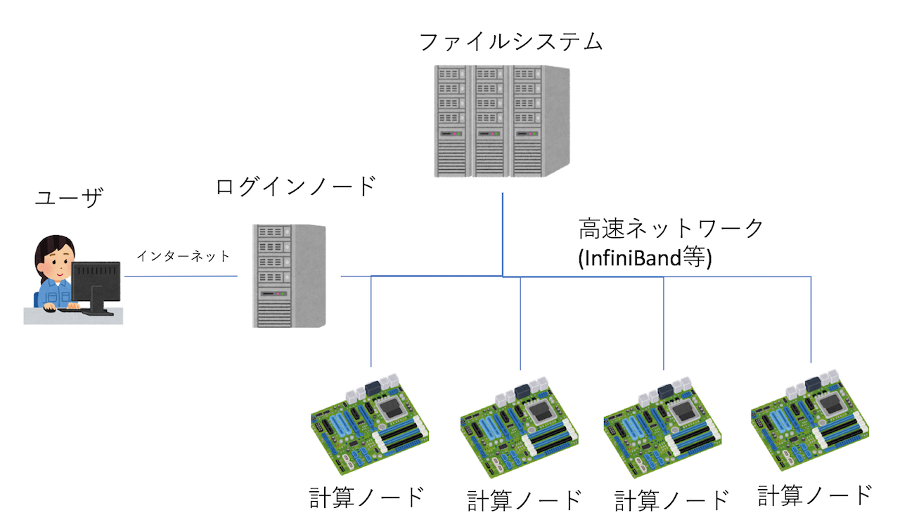
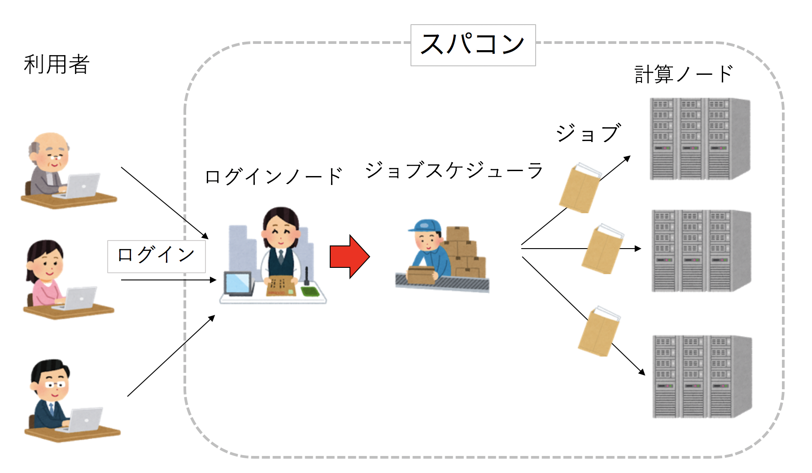

# 一週間でなれる！スパコンプログラマ

[](https://creativecommons.org/licenses/by/4.0/)

## はじめに

世の中にはスーパーコンピューター、略してスパコンというものがある。こういうすごそうな名前があるものの例にもれず、「スパコンとはなにか」という定義は曖昧である。人によって「何がスパコンか」の定義は違うと思うが、とりあえずここではCPUとメモリを積んだ「ノード」がたくさんあり、それらが高速なネットワークでつながっていて、大きなファイルシステムを持っているもの、と思っておけば良いと思う。

スパコンは名前に「スーパー」とついているだけに、「なんかすごそうなもの」「使うのが難しいもの」という印象を持つ人もいるだろう。しかし、スパコンを使うのに要求される技術そのものは非常に単純かつ簡単である。自分の経験として、プログラミングの素養がある学生であれば、詳しい人に一ヶ月もレクチャーを受ければ普通にスパコンにジョブを投げ始める。そのくらいスパコンを使うのは簡単なことである。しかし、スパコンは、「使いはじめる」のは簡単であるものの、「使い倒す」のはかなり難しい。経験的に、並列数が十進法で一桁増えるごとに、本質的に異なる難しさに直面する。例えば百並列で走ったコードが千並列で走らなかったり、千並列で走ったコードが一万並列でコケたりする。そのあたりの奥の深さは面白いものの、本稿では扱わない。

この記事では、近くにスパコンに詳しい人がいない人のために、「とりあえず7日間でスパコンを使えるようになる」ことを目指す。

勢いで一応リポジトリを作ったが、書き上がるかどうかはノストラダムスにもわかりません。

## Day 0 : なぜスパコンを使うのか

そもそも、なぜスパコンを使うのか？それは、そこにスパコンがあるからだ。
この日本語で書かれた文章を読んでいるということは、あなたは高確率で日本人であろう。おめでとう。あなたは世界有数のスパコンを使うことができる。なぜなら日本はスパコン大国だからだ。Top500のサイトに行くと、世界の性能トップ500に入るスパコンの、国の内訳を見ることができる。2018年6月時点で、トップは中国の206サイト、二位がアメリカの124サイト、日本は36サイトで三位に入っている。最近の中国の躍進は目覚ましいのだが、そこはさておく。Top500に入るスパコン数は世界三位で、しかも何度も世界一位となるスパコンを保持している日本は、世界有数のスパコン大国と言ってよいだろう。

個人的な経験で、こんなことがあった。とある海外の方と共同研究をしていた時、共同研究者に「こんな計算をしてみたらどうだろう」と提案してみた。
すると彼に「そういうことができたら面白いとは思うけど、計算が重すぎて無理だよ」と言われたので「いや、うちのスパコンでやったら一日仕事だ」と言ったらえらく驚いていた。これは、単に「日本は計算資源に恵まれている」という話にとどまらず、**人の想像力の上限は、普段使っている計算資源の規模で決まる**ということを示唆する。これは極めて重要だと思う。

普通、スパコンを使うのは、「まずローカルなPCで計算をして、それで計算が苦しくなってから、次のステップアップとしてスパコンを検討する」といった順番となるだろう。その時も、まず「これくらいの規模のスパコンを使ったら、これくらいの計算ができる」という事前の検討をしてからスパコンの利用申請をするであろう。つまり「テーマ(目的)が先、スパコン(手段)が後」となる。それは全くもって正しいのであるが、私個人の意見としては、「やることが決まってなくても、どのくらいの計算が必要かわからなくても、まずスパコンを使ってしまう」方がいろいろ良いと思う。普段からローカルPCでしか計算していない人は、なにか研究テーマを検討する際に、スパコンが必要となるテーマを無意識に却下してしまう。逆に、普段からスパコンを使いなれていると、想像力の上限が引き上げられ、普通のPCでは計算できないような選択肢を検討できる。つまり「スパコン(手段)が先、テーマ(目的)は後」である。そもそもスパコンを使うのはさほど難しくないのだし、いろいろ検討する前に、ささっと使い始めてみよう。


### 注意

並列プログラミングに限らないことだが、なにかを始めようとすると、ちょっと先にそれを始めていた人がなんやかんや言ってくることだろう。「並列化効率ガー」「そもそも実行効率が悪いコードを並列化するのは無駄無駄無駄ァ！」とか「最初から通信の最適化を考慮云々」とか、そういうことを言ってくる人が必ず湧くが、とりあえず二年くらいは無視してかまわない。なにはともあれスパコンを使えるようになること、チューニング不足の遅いコードであろうが並列化効率が悪かろうが、とりあえずそれなりのノード数で走るコードを書いて実行してみること、まずはそこを目指そう。それなりのノード数で走るコードが書ける、それだけで十分強力な武器になる。

## Day 1 : 環境構築

スパコン上で実行されるプログラムは並列プログラムである。したがって「スパコンを使う」ということは、
狭義には「並列化されたプログラムを実行する」ということを意味する。したがって、誰かが作った並列プログラムをスパコン上で実行すれば、スパコンは使えることになる。
それはそれでOKなのだが、本稿のタイトルは「一週間でなれる！スパコンプログラマ」であるから、スパコン上で動くコードを開発できるようになることを目的とする。
それはすなわち、「並列プログラミングをする」ということである。「並列プログラミング」という字面を見ると「難しそう」という印象を持つかもしれない。
しかし、(世の中の多くの「一見難しそうなもの」がそうであるように)並列プログラミングはさほど難しくない。
「一週間でなれる！スパコンプログラマ」の初日は、まずローカルに並列プログラミング環境を構築し、並列プログラミングに触れてみるところからはじめてみよう。

### MPIとは

一口に「並列化」といっても、様々な種類がありえる。一般に使われている並列プログラミングモデルは、「データ並列」「共有メモリ並列」「分散メモリ並列」の三種類であろう。

TODO: 三種類の並列モデルの説明

ここでは、MPIを用いた分散メモリ並列を主にを取り上げる。複数のノードを同時に使うためには、なんらかの分散メモリ並列プログラミングが必須となる。

### MPIのインストール

MPIの開発環境としては、Mac OSX、もしくはLinuxを強く推奨する。Linuxはなんでも良いが、とりあえずCentOSを想定する。
本稿の読者なら、GCCくらいは既に利用可能な状況であろう。あとはMPIをインストールすれば並列プログラミング環境が整う。

MacでHomebrewを使っているなら、

```sh
brew install openmpi
```

で一発、CentOSなら、

```sh
sudo yum install openmpi-devel 
export PATH=$PATH:/usr/lib64/openmpi/bin/ 
```

でおしまいである。

TODO: CentOS7でmpirunが実行できないのであとで原因を確認。

ここで

```sh
sudo yum install openmpi
```

とすると、開発環境がインストールされないので注意。

インストールがうまくいったかどうかは、コンパイラ`mpic++`にパスが通っているかどうかで確認できる。

Macの場合は

```sh
$ mpic++ --version 
Apple LLVM version 10.0.0 (clang-1000.11.45.2)
Target: x86_64-apple-darwin17.7.0
Thread model: posix
InstalledDir: /Applications/Xcode.app/Contents/Developer/Toolchains/XcodeDefault.xctoolchain/usr/bin
```

と、clang++にパスが通っていることがわかる。Linuxの場合はg++である。

```sh
$ mpic++ --version
g++ (GCC) 4.8.5 20150623 (Red Hat 4.8.5-28)
Copyright (C) 2015 Free Software Foundation, Inc.
This is free software; see the source for copying conditions.  There is NO
warranty; not even for MERCHANTABILITY or FITNESS FOR A PARTICULAR PURPOSE.
```

実は、mpic++はインクルードパスやリンクの設定をユーザの代わりにやってくれるラッパーに過ぎず、実際のコンパイラは`clang++`、もしくは`g++`が使われる。
したがって、インクルードパスやリンクの設定を明示的にするならば、`mpic++`を呼び出す必要はない。
スパコンサイトによっては、環境変数でMPIのインクルードパスが設定されている場合もあるだろう。その場合は単に`g++`でも`icpc`でも、MPIを用いたコードがそのままコンパイルできる。ただし、リンクのために`-lmpi`の指定が(場合によっては`-lmpi_cxx`も)必要なので注意。

### はじめてのMPI

環境構築ができたら、こんなコードを書いて、[hello.cpp](day1/hello.cpp)という名前で保存してみよう。

```c++
#include <cstdio>
#include <mpi.h>

int main(int argc, char **argv) {
  MPI_Init(&argc, &argv);
  printf("Hello MPI World!\n");
  MPI_Finalize();
}
```

以下のようにしてコンパイル、実行してみる。

```
$ mpic++ hello.cpp
$ ./a.out
Hello MPI World!
```

せっかくなので並列実行する前に、`mpic++`を使わずにコンパイルできることを確認してみよう。Macの場合、`g++`で先程の`hello.cpp`をコンパイルしようとすると「mpi.hが見つからないよ」と怒られる。

```sh
$ g++ hello.cpp
hello.cpp:2:10: fatal error: mpi.h: No such file or directory
 #include <mpi.h>
          ^~~~~~~
compilation terminated.
```

なので、コンパイラにその場所を教えてあげればよい。ヘッダファイルの場所だけ教えても「ライブラリが見つからないよ」と怒られるので、それも一緒に教えてあげよう。

```sh
g++ hello.cpp -I/usr/local/opt/open-mpi/include -L/usr/local/opt/open-mpi/lib -lmpi  -lmpi_cxx
```

問題なくコンパイルできた。ちなみに筆者の手元のCentOSでは、

```sh
g++ test.cpp -I/usr/include/openmpi-x86_64 -L/usr/lib64/openmpi/lib -lmpi -lmpi_cxx
```

でコンパイルできた。環境によってパスは異なるが、インクルードパスとライブラリパス、そしてライブラリ`-lmpi`(環境によっては`-lmpi_cxx`も)を指定すれば`mpic++`を使わなくてもコンパイルできる。「`mpic++`はラッパに過ぎず、ヘッダとライブラリを正しく指定すればどんなコンパイラでも使える」と知っていると、MPI関連でトラブルが起きた時にたまに役に立つので覚えておきたい。

さて、並列実行してみよう。並列実行には`mpirun`の引数に実行プログラムと並列数を指定する。

```sh
$ mpirun -np 2 ./a.out
Hello MPI World!
Hello MPI World!
```

メッセージが二行表示された。プログラムの実行の際、こんなことが起きている。

1. `mpirun`が`-np 2`を見て、プロセスを2つ立ち上げる。
2. `MPI_Init`が通信環境を初期化する
3. 各プロセスが、それぞれ`Hello MPI World`を実行する。
4. `MPI_Finalize`が通信環境を終了する。

複数のプロセスが立ち上がり、なにか処理をしているのだから、これは立派な並列プログラムである。しかし、このままでは、全てのプロセスが同じ処理しかできない。そこで、MPIは立ち上げたプロセスに **ランク(rank)** という通し番号を振り、それを使って並列処理をする。

## Day 2 : ジョブの投げ方

### スパコンとは

スパコンを使うのに、必ずしもスパコンがどのように構成されているかを知る必要はない。しかし、せっかくスパコンを使うのだから、スパコンとは何かについて簡単に知っておいても良いであろう。
ただし、こういう単語にありがちだが「何がスパコンか」は人によって大きく異なる。ここで紹介するのはあくまで「執筆者が思うスパコンの定義」の説明であり、他の人は他の定義があることを承知されたい。

普通のPCは、CPU、メモリ、ネットワーク、ディスクなどから構成されている。スパコンも全く同様に、CPU、メモリ、ネットワーク、ディスクがある。
それぞれちょっと高級品を使っているだけで、基本的には普通のPCと同じと思って良い。ただし、PCとはつなぎ方がちょっと異なる。
スパコンは、CPUとメモリをまとめたものを「ノード」と呼ぶ。このノードをたくさん集めて高速なネットワークでつないだものがスパコン本体である。普通のPCではCPUの近くにメモリがあったが、最近のスパコンのノードはディスクレスの構成にすることが多い。そのかわり、大きなファイルシステムとネットワークでつなぐ。



一般的なスパコンの構成は上図のような感じになる。ノードは大きく分けて「ログインノード」と「計算ノード」の二種類がある。ユーザはインターネット経由でログインノードにログインし、そこで作業をする。実際の計算は計算ノードで行う。ログインノード、計算ノード、ファイルシステムは、高速なネットワークで接続されている。この高速ネットワークは長らくInfiniBandという規格がデファクトスタンダードとなっていたが、近年になってIntelのOmniPathの採用例も増えているようである。ファイルシステムについては、Lustreというファイルシステムがデファクトスタンダードであるが、目的によってはGBFSなども選択される。

さて、「ノード」という呼び方をしているが、これは本質的にはパソコンと同じものなので、スパコンとはパソコンを大量に並べて高速なネットワークで相互につないだもの、と言える。特に最近はCPUとしてx86の採用が多いため、ますます「普通のスパコンを大量に並べたもの」という印象が強くなるだろう。しかし、**「普通のスパコンを大量に並べたらスパコンになるか」というとそうではない**。スパコンで最も重要なもの、それは「信頼性」である。

普通にPCを使っていたら、わりとPCの部品は壊れることを知っているであろう。ありとあらゆる箇所が壊れる可能性があるが、ファンやディスクなどの回るものなどは特に壊れやすい。また、メモリなどもよく壊れるものの代表である。CPUやマザー、ネットワークカードなども壊れる。スパコンは多くの部品から構成されるため、壊れるのが非常に稀であっても、全体としては無視できない確率で壊れてしまう。

例えば「京コンピュータ」が10ペタフロップスを達成した時には、[計算の実行に88128ノードを使って29時間28分かかっている](http://www.riken.jp/pr/topics/2011/20111102/)。これは約260万ノード時間であるから、この計算が90%の確率で実行できるためには、各ノードが3000年くらいは壊れない「保証」が必要になる。
逆に、もし各ノードが1年に一度くらい壊れるならば、およそ6分に一度どこかのノードが壊れることになり、とても使い物にならない。


つまり、大規模計算とは大縄跳びのようなものであり、それなりのノード数でまともに計算を行うためには、かなり高信頼なシステムを組む必要があることがわかるであろう。他にも様々な「スパコンらしさ」「スパコンならではの工夫」はあるのだが、なにはともあれ「高信頼であること」が非常に重要である。

TODO: BlueGeneのメモリエラー訂正について書く？

### スパコンのアカウントの取得方法

スパコンを使うためには、スパコンのアカウントを手に入れなければならない。ある意味ここが最難関である。スパコンを使う技術そのものは非常に簡単に身につくが、スパコンのアカウントを手に入れる、というのは技術に属すスキルではないからだ。

とりあえず、世の中には様々なスパコンがある。企業が開発のためにスパコンを導入していることもあるし、最近はクラウドもスパコンと呼んで良いような計算資源を用意している。将棋ソフト、Ponanzaの開発者の山本さんは機械学習のための計算資源が足りず、[さくらインターネットにお願いして大規模な計算資源を借りた](http://ascii.jp/elem/000/001/171/1171630/index-2.html)そうなのだが、そういう強いメンタルを持っていない人は、通常の手続きでスパコンのアカウントを取得しよう。

まず、スパコンといえば、大型計算機センター(大計センター)である。たとえば[東京大学情報基盤センター](https://www.itc.u-tokyo.ac.jp/)のようなところは、申請すれば、かなり割安な金額で計算資源を借りることができる。また、様々な公募を行っており、共同研究という形で無料で計算資源を借りることもできるようである。

[物性研究所](http://www.issp.u-tokyo.ac.jp/supercom/)は、テーマが「物性科学」に限られるが、申請が認められれば無料で計算資源を利用できる。ただし、利用資格は修士以上(原則として学部生不可)、申請資格は給料をもらっている研究者(ポスドク以上)なので注意。

「二位じゃだめなんでしょうか？」で話題となった[「京コンピュータ」もテーマを一般公募しており](http://www.hpci-office.jp/pages/proposal_submission)、研究目的であるならば、得られた成果を公表することを前提に無料で利用できる。最大8万ノード、64万コアの計算資源が神戸で君を待っている。

研究目的でスパコンを使うのであれば、利用者は修士以上、申請は研究者、というのが一般的であるが、たとえば「高校生だけどスパコンを使いたい」という人もいるであろう。そういう有望な若者のために、例えば阪大や東工大は「[SuperCon](http://www.gsic.titech.ac.jp/supercon/main/attwiki/index.php?SupercomputingContest2017)」という、スパコン甲子園のようなイベントを行っている。このイベントは、競技プログラミングの一種であるが、問題を解くのに並列計算が必須となる規模が要求されるのが特徴である。

また、2014年には「[高校生がスーパーコンピュータを使って5×5魔方陣の全解を求めることに成功](https://www.ccs.tsukuba.ac.jp/140228_press/)」している。これは筑波大学の学際共同利用プログラムを利用したもので、当時高校一年生が教授と共同研究を行い、スパコンを使い倒した事例である。

率直に言って、日本はスパコン大国であるわりに、若い人(例えば高校生)が「そうだ、スパコン使おう」と気軽に使える状況にはない(この状況はなんとかしたい)。しかし、門戸は狭いながらも高校生に開いているのは確かである。また、そもそも並列プログラミングができなければ、スパコンを使おう、という気持ちにはならないだろう。とりあえずさくっと並列プログラミングをできるようになっておき(どうせ簡単なので)、チャンスがあればスパコンを使う、というスタンスでいればいいんじゃないでしょうか。

### ジョブの実行の仕組み



ローカルPCは自分しか使わないので、好きな時に好きなプログラムを実行して良い。しかし、スパコンは大勢で共有する計算資源であり、各自が好き勝手にプログラムを実行したら大変なことになるため、なんらかの交通整理が必要となる。その交通整理を行うのが「ジョブスケジューラ」である。スパコンでは、プログラムは「ジョブ」という単位で実行される。ユーザはまず、「ジョブスクリプト」と呼ばれるシェルスクリプトを用意する。これは、自分のプログラムの実行手順を記した手紙のようなものである。次にユーザは、ログインノードからジョブスケジューラにジョブの実行を依頼する(封筒をポストに入れるイメージ)。こうしてジョブは実行待ちリストに入る。ジョブスケジューラは実行待ちのジョブのうち、これまでの利用実績や、要求ノード数、実行時間などを見て、次にどのジョブがどこで実行されるべきか決定する。

### ジョブスクリプトの書き方


ジョブスクリプトとは、

* ジョブスケジューラ
* ステージング

## Day 3 : 自明並列

### 自明並列、またの名を馬鹿パラとは

例えば、100個の画像データがあるが、それらを全部リサイズしたい、といったタスクを考える。
それぞれのタスクには依存関係が全くないので、全部同時に実行してもなんの問題もない。
したがって、100並列で実行すれば100倍早くなる。
このように、並列タスク間で依存関係や情報のやりとりが発生しない並列化のことを自明並列と呼ぶ。
英語では、Trivial Parallelization(自明並列)とか、Embarrassingly parallel(馬鹿パラ)などと表現される。
「馬鹿パラ」とは「馬鹿でもできる並列化」の略で(諸説あり)、その名の通り簡単に並列化できるため、
文字通り馬鹿にされることも多いのだが、並列化効率が100%であり、最も効率的に計算資源を利用していることになるため、
その意義は大きい。
なにはなくとも、まず馬鹿パラができないことには非自明並列もできないわけだし、馬鹿パラができるだけでも、できない人に比べて
圧倒的な攻撃力を持つことになる。
ここでは、まず馬鹿パラのやり方を見てみよう。

### 自明並列の例1: 円周率

まず、自明並列でよく出てくる例として、サンプリング数を並列化で稼ぐ方法を見てみよう。とりあえず定番の、
モンテカルロ法で円周率を計算してみる。

こんなコードを書いて、[calc_pi.cpp](day3/calc_pi.cpp)という名前で保存してみよう。

```cpp
#include <cstdio>
#include <random>
#include <algorithm>

const int TRIAL = 100000;

double calc_pi(const int seed) {
  std::mt19937 mt(seed);
  std::uniform_real_distribution<double> ud(0.0, 1.0);
  int n = 0;
  for (int i = 0; i < TRIAL; i++) {
    double x = ud(mt);
    double y = ud(mt);
    if (x * x + y * y < 1.0) n++;
  }
  return 4.0 * static_cast<double>(n) / static_cast<double>(TRIAL);
}

int main(void) {
  double pi = calc_pi(0);
  printf("%f\n", pi);
}
```

ここで、`main`関数から呼ばれる関数`calc_pi(const int seed)`が、わざとらしく乱数の種だけ受け取る形になっていることに注意。

普通にコンパイル、実行してみる。

```sh
$ g++ calc_pi.cpp
$ ./a.out
3.145000
```

100000回の試行の結果として、円周率の推定値「3.145000」が得られた。これを並列化してみよう。
並列化手順は簡単である。

1. `mpi.h`をインクルードする
2. main関数の最初と最後に`MPI_Init`と、`MPI_Finalize`をつける。ただし`MPI_Init`が引数に`argc`と`argv`を要求するので、`main`関数の引数をちゃんと書く。
3. `MPI_Comm_rank`関数で、ランク番号を得る。
4. ランク番号を乱数の種に使う
5. そのまま`calc_pi`を呼ぶ。

以上の修正をしたコードを[calc_pi_mpi.cpp](day3/calc_pi_mpi.cpp)という名前で作成する。

```cpp
#include <cstdio>
#include <random>
#include <algorithm>
#include <mpi.h>

const int TRIAL = 100000;

double calc_pi(const int seed) {
  std::mt19937 mt(seed);
  std::uniform_real_distribution<double> ud(0.0, 1.0);
  int n = 0;
  for (int i = 0; i < TRIAL; i++) {
    double x = ud(mt);
    double y = ud(mt);
    if (x * x + y * y < 1.0) n++;
  }
  return 4.0 * static_cast<double>(n) / static_cast<double>(TRIAL);
}

int main(int argc, char **argv) {
  MPI_Init(&argc, &argv);
  int rank;
  MPI_Comm_rank(MPI_COMM_WORLD, &rank);
  double pi = calc_pi(rank);
  printf("%d: %f\n", rank, pi);
  MPI_Finalize();
}
```

ついでに、円周率の推定値を表示するときに自分のランク番号も表示するようにしてみた。
実行結果はこの通り。

```sh
$ mpirun -np 4 --oversubscribe ./a.out
0: 3.145000
1: 3.142160
3: 3.144200
2: 3.146720

$ mpirun -np 4 --oversubscribe ./a.out
0: 3.145000
2: 3.146720
3: 3.144200
1: 3.142160
```

ただし、`--oversubscribe`は、論理コア以上の並列実行を許可するオプションである。
この実行結果から、

1. 実行するたびに出力順序が異なる
2. しかし、同じランクに対応する推定値は変わらない

ことがわかる。

ちゃんと並列計算されているか、timeコマンドで調べてみよう。

```sh
$ ./a.out
0: 3.145000
./a.out  0.04s user 0.01s system 57% cpu 0.086 total

$ time mpirun -np 4 --oversubscribe ./a.out
2: 3.146720
3: 3.144200
1: 3.142160
0: 3.145000
mpirun -np 4 --oversubscribe ./a.out  0.24s user 0.08s system 240% cpu 0.135 total
```

シリアル実行の場合はCPUの利用率が57%だったのが、4並列の場合には240%と、100%を超えたのがわかるだろう。
この例では実行が早く終わりすぎて分かりづらいが、`TRIAL`の値を大きくして実行に時間がかかるようにして、
実行中にtopしてみると、ちゃんと並列実行されていることがわかる。

```sh
PID    COMMAND      %CPU TIME     #TH   #WQ  #PORT MEM    PURG   CMPRS  PGRP
45163  a.out        92.1 00:12.44 3/1   0    15    2612K  0B     0B     45163
45165  a.out        91.8 00:12.48 3/1   0    15    2620K  0B     0B     45165
45164  a.out        91.5 00:12.42 3/1   0    15    2608K  0B     0B     45164
45162  a.out        89.1 00:12.47 3/1   0    15    2620K  0B     0B     45162
```

4並列実行したので、45162から45165まで4つのプロセスが起動され、実行していることがわかる。

### 自明並列テンプレート

先程の並列プログラム[calc_pi_mpi.cpp](day3/calc_pi_mpi.cpp)のmain関数はこうなっていた。

```cpp
int main(int argc, char **argv) {
  MPI_Init(&argc, &argv);
  int rank;
  MPI_Comm_rank(MPI_COMM_WORLD, &rank);
  double pi = calc_pi(rank);
  printf("%d: %f\n", rank, pi);
  MPI_Finalize();
}
```

実際のプログラムは`calc_pi(rank)`という関数だけで、これはランク(MPIプロセスの通し番号)を受け取って、その番号によって動作を変える関数である。
後はこの中身を書き換えるだけで、なんでも並列化できる。ファイル処理でもレンダリングでも機械学習でもなんでも。
「これくらい、MPI使わなくてもスレッドでもできる」とか言う人がいるかもしれない。
しかし、OpenMPや`std::thread`を使ったマルチスレッドプログラミングと、MPIを用いたマルチプロセスプログラミングには、
「ノードをまたげるかまたげないか」という大きな違いが存在する。マルチスレッドプログラミングはノードをまたぐことができない。
したがって、一つのプログラムが専有できる計算資源は1ノードまでである。しかし、MPIを使った場合は何ノードでも使える。
先程の円周率のコードは、あなたが望むなら数万ノードで実行することだってできる。
つまり、このコードがかけた時点で、誰がなんと言おうとあなたはスパコンプログラマだ。
「一週間でなれる！スパコンプログラマ」と題した本稿だが、三日目にしてもうスパコンプログラマになることができた。

* 自明並列の例2: 多数のファイル処理
* 並列化効率

## Day 4 : 領域分割による非自明並列

* 一次元拡散方程式
* モンテカルロ(乱数の状態保存) 書かないかも

## Day 5 : チェックポイントリスタート

スパコンにジョブを投げるとき、投げるキューを選ぶ。このとき、キューごとに「実行時間の上限」が決まっていることがほとんである。実行時間制限はサイトやキューごとに違うが、短いと一日、長くても一週間程度であることが多い。一般に長時間実行できるキューは待ち時間も長くなる傾向にあるため、可能であれば長いジョブを短く分割して実行したほうが良い。このときに必要となるのがチェックポイントリスタートである。

## Day 6 : ハイブリッド並列

* ハイブリッド並列とは
* なぜハイブリッド並列が必要か

## Day 7 : より実践的な並列プログラミング

* なにを書くか全く決めてない

## おわりに

本稿を読んでスパコンを使ってみよう、と思う人が一人でも増えたなら幸いである。

## ライセンス

(C) Hiroshi Watanabe 

Creative Commons License

This work is licensed under a [Creative Commons Attribution 4.0 International License](https://creativecommons.org/licenses/by/4.0/).