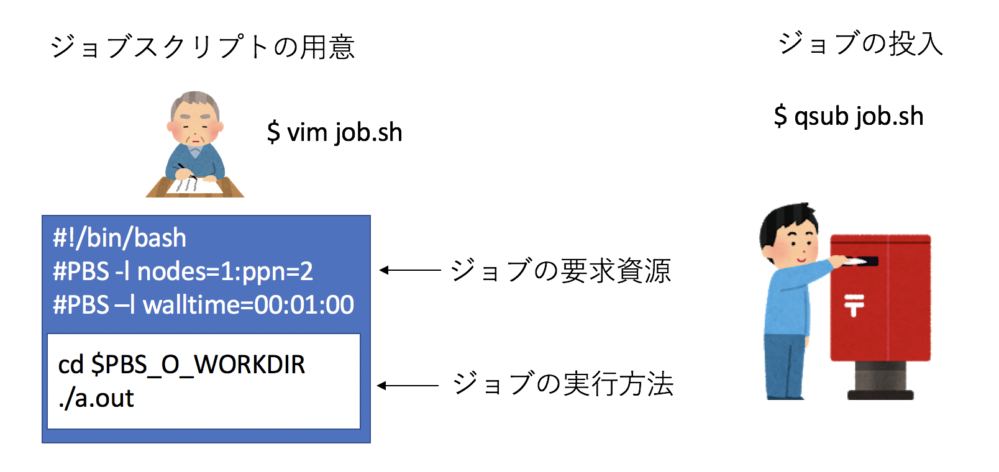
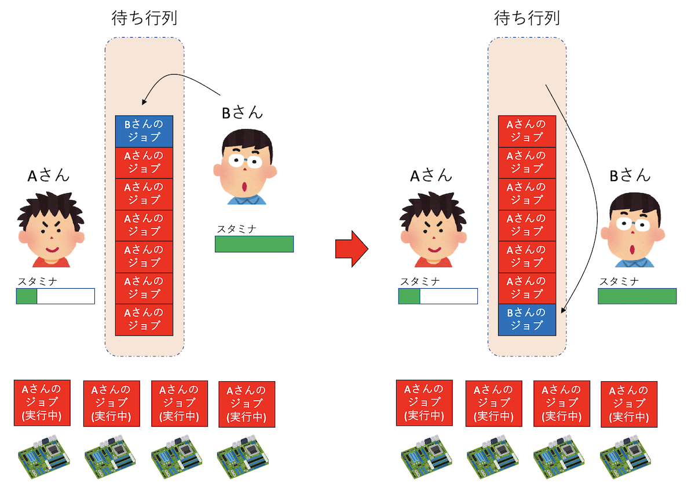
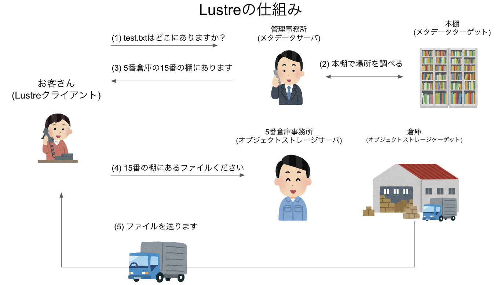

# Day 2 : スパコンの使い方

<!--- abstract --->
スパコンを使うのに、必ずしもスパコンがどのように構成されているかを知る必要はない。しかし、せっかくスパコンを使うのだから、スパコンとは何かについて簡単に知っておいても良いであろう。ただし、こういう単語にありがちだが「何がスパコンか」は人によって大きく異なる。ここで紹介するのはあくまで「執筆者が思うスパコンの定義」の説明であり、他の人は他の定義があることを承知されたい。ここは、「読むとなにかができるようになる」というよりは、「スパコンを使ったことがない人が、将来スパコンを使うにあたって知っておくと良さそうなこと」を書いておく。特に手を動かすところはない。読み物として流して読んでいただければ良い。
<!--- end --->

## スパコンとは

普通のPCは、CPU、メモリ、ネットワーク、ディスクなどから構成されている。スパコンも全く同様に、CPU、メモリ、ネットワーク、ディスクがある。
それぞれちょっと高級品を使っているだけで、基本的には普通のPCと同じと思って良い。ただし、PCとはつなぎ方がちょっと異なる。
スパコンは、CPUとメモリをまとめたものを「ノード」と呼ぶ。このノードをたくさん集めて高速なネットワークでつないだものがスパコン本体である。普通のPCではCPUの近くにディスクがあるが、最近のスパコンのノードはディスクレスの構成にすることが多い。そのかわり、大きなファイルシステムとネットワークでつなぐ。


一般的なスパコンの構成は上図のような感じになる。ノードは大きく分けて「ログインノード」と「計算ノード」の二種類がある。ユーザはインターネット経由でログインノードにログインし、そこで作業をする。実際の計算は計算ノードで行う。ログインノード、計算ノード、ファイルシステムは、高速なネットワークで接続されている。この高速ネットワークは長らくInfiniBandという規格がデファクトスタンダードとなっていたが、近年になってIntelのOmniPathの採用例も増えているようである。ファイルシステムについては、Lustreというファイルシステムがデファクトスタンダードであるが、目的によってはGPFS(今はIBM Spectrum Scaleに名前が変わったらしい)なども選択される。

さて、「ノード」という呼び方をしているが、これは本質的にはパソコンと同じものなので、スパコンとはパソコンを大量に並べて高速なネットワークで相互につないだもの、と言える。特に最近はCPUとしてx86の採用が多いため、ますます「普通のパソコンを大量に並べたもの」という印象が強くなるだろう。しかし、**「普通のパソコンを大量に並べたらスパコンになるか」というとそうではない**。スパコンで最も重要なもの、それは「信頼性」である。

普通にPCを使っていたら、わりとPCの部品は壊れることを知っているであろう。ありとあらゆる箇所が壊れる可能性があるが、ファンやディスクなどの回るものなどは特に壊れやすい。また、メモリなどもよく壊れるものの代表である。CPUやマザー、ネットワークカードなども壊れる。スパコンは多くの部品から構成されるため、壊れるのが非常に稀であっても、全体としては無視できない確率で壊れてしまう。

例えば「京コンピュータ」が10ペタフロップスを達成した時には、[計算の実行に88128ノードを使って29時間28分かかっている](http://www.riken.jp/pr/topics/2011/20111102/)。これは約260万ノード時間であるから、この計算が90%の確率で実行できるためには、各ノードが3000年くらいは壊れない「保証」が必要になる。
逆に、もし各ノードが1年に一度くらい壊れるならば、およそ6分に一度どこかのノードが壊れることになり、とても使い物にならない。


つまり、大規模計算とは大縄跳びのようなものであり、それなりのノード数でまともに計算を行うためには、かなり高信頼なシステムを組む必要があることがわかるであろう。他にも様々な「スパコンらしさ」「スパコンならではの工夫」はあるのだが、なにはともあれ「高信頼であること」が非常に重要である。たまにゲーム機や格安チップを並べて「格安スパコン」を作った、というニュースが話題になるのだが、実はスパコンでは計算部分だけでなく「信頼性」と「ネットワーク」にかなりコストがかかっており、そこをケチると、当然ながら「信頼性」や「ネットワーク」が必要とされる計算ができないスパコンになる。もちろん「やりたい計算」が「格安スパコン」でできるのであればそれを選択すれば良いが、ただピーク性能と値段を比較して「スパコンは高い」と即断しないようにしてほしい。星の王子さまも「いちばんたいせつなことは、目に見えない」って言ってることだしね・・・。

## 余談：BlueGene/Lのメモリエラー

スパコンは部品が多いために故障が問題になると書いた。
他にも、普通のPCではあまり問題にならないことがスパコンでは問題になることがある。それは宇宙線である。

宇宙線とは、文字通り宇宙から飛んでくる放射線のことである。
例えば国立科学博物館などに行った際には、霧箱展示を見て欲しい。普段意識していないが、宇宙線はわりとびゅんびゅん飛んでいる。
これが半導体素子にぶつかることで誤動作を起こす。
特に問題となるのはメモリで、宇宙線によりランダムにビット反転が起きてしまい、結果がおかしくなる。
この問題を防ぐため、メモリには1ビットのエラーは訂正可能、
2ビットのエラーについては検出可能となるようなエラー訂正機能をつけるのが一般的である。

しかし、この機能がついていないスパコンがある。IBMのBlueGene/Lである。
BlueGeneは、比較的非力なノードを多数結合させることで、全体として高い性能と省電力を両立させよう、という設計思想をもった
スパコンで、例えば計算ノードのOSがマルチユーザをサポートしないなど、随所に思い切った割り切りが見られる。
その中で特に驚くのが、CPUのL1キャッシュにエラー訂正機能がないことである。
BlueGene/LのL1には、1ビットのエラー検出機能のみがあり、訂正することができない。
したがって、ビットエラーが起きるとそのままシステムがクラッシュする。

当時、BlueGene/Lを導入したローレンス・リバモア国立研究所の[マニュアル](https://asc.llnl.gov/computing_resources/bluegenel/basics/)によると、
フルノード(20万コア)で計算すると平均的に6時間に一度程度、宇宙線によるL1のビットエラーで計算がクラッシュする、と試算されている。
これに対してユーザは、3つの手段を取ることができた。

* 諦める： フルノードで6時間程度なので、例えば1万コア使って計算しても、平均故障間隔は120時間程度になる。なので、そのまま計算して死んだら諦める、というのは現実的な選択であった。
* メモリ保護モードを使う： BlueGene/Lには「write throughモード」が用意されていた。これはL1のビットエラーをL2や主記憶を使ってソフトウェア的に保護するモードであったらしい。ユーザは何もしなくて良いが、このモードを選択すると10%から40%程度の性能劣化があったようだ。
* 例外を受け取ってユーザ側でなんとかする： L1がビットエラーの検出をした時、OSが例外を飛ばすモード。ユーザ側がなんとかする。

通常は「諦める」か、性能劣化が許容範囲内であればwrite throughモードを使っていたようだが、BlueGene/Lのフルノードで長時間計算し、
2007年のGordon Bell賞を受賞したリバモアのチームは「例外を受け取ってユーザ側でなんとかする」方法を選択した。
具体的には、メモリの一部にチェックポイントデータを保持しておき、例外を受け取ったら直近のチェックポイントからリスタートする
コードを書いたそうだ。[論文](https://dl.acm.org/citation.cfm?id=1362700)によると、フルノードを三日間程度の計算中、
数回例外を受け取ってリスタートしたらしい。このチームのメンバーに話を聞いたことがあるが、プログラムのどの場所で例外が来ても
大丈夫なように組むのが大変だったと言っていた記憶がある。

「システムが大きくなるとハードウェアだけで信頼性を担保するのは難しくなるため、一部をソフトウェアでなんとかしよう」というような話は昔から言われており、
多くの研究があって実験的にシステムに組み込まれたものもあるのだが、そのような思想が実運用に供されたのは筆者の知る限りBlueGene/Lを除いて他はない。

そもそもなぜL1にエラー訂正をつけなかったのか、つけられなかったのかはわからないのだが、後継機であるBlueGene/PにはどうやらL1にもエラー訂正がついたところを見ると、ユーザからは不評だったのかもしれない。BlueGeneシリーズはHPC業界ではかなり売れたようで、
[2007年6月のTop500リスト](https://www.top500.org/lists/2007/06/)のトップ10に、BlueGeneが4つ入っている。
BlueGeneは、第一世代のBlueGene/L、第二世代のBlueGene/P、第三世代のBlueGene/Qと開発が進められたが、そこでBlueGeneプロジェクトは終了した。

## スパコンのアカウントの取得方法

スパコンを使うためには、スパコンのアカウントを手に入れなければならない。ある意味ここが最難関である。スパコンを使う技術そのものは非常に簡単に身につくが、スパコンのアカウントを手に入れる、というのは技術に属すスキルではないからだ。

とりあえず、世の中には様々なスパコンがある。企業が開発のためにスパコンを導入していることもあるし、最近はクラウドもスパコンと呼んで良いような計算資源を用意している。将棋ソフト、Ponanzaの開発者の山本さんは機械学習のための計算資源が足りず、[さくらインターネットにお願いして大規模な計算資源を借りた](http://ascii.jp/elem/000/001/171/1171630/index-2.html)そうなのだが、そういう強いメンタルを持っていない人は、通常の手続きでスパコンのアカウントを取得しよう。

まず、スパコンといえば、大型計算機センター(大計センター)である。たとえば[東京大学情報基盤センター](https://www.itc.u-tokyo.ac.jp/)のようなところは、申請すれば、かなり割安な金額で計算資源を借りることができる。また、様々な公募を行っており、共同研究という形で無料で計算資源を借りることもできるようである。

[物性研究所](http://www.issp.u-tokyo.ac.jp/supercom/)は、テーマが「物性科学」に限られるが、申請が認められれば無料で計算資源を利用できる。ただし、利用資格は修士以上(原則として学部生不可)、申請資格は給料をもらっている研究者(ポスドク以上)なので注意。

「二位じゃだめなんでしょうか？」で話題となった「京コンピュータ」もテーマを一般公募しており、研究目的であるならば、得られた成果を公表することを前提に無料で利用できる。最大8万ノード、64万コアの計算資源が神戸で君を待って・・・いたのだが、2019年8月30日に運用を終了し、シャットダウンされた。しかし、「京」の次のスパコンの準備が進められており、順調にいけばまた大きな計算資源が稼働するであろう。

研究目的でスパコンを使うのであれば、利用者は修士以上、申請は研究者、というのが一般的であるが、たとえば「高校生だけどスパコンを使いたい」という人もいるであろう。そういう有望な若者のために、例えば阪大や東工大は「[SuperCon](http://www.gsic.titech.ac.jp/supercon/main/attwiki/index.php?SupercomputingContest2017)」という、スパコン甲子園のようなイベントを行っている。このイベントは、競技プログラミングの一種であるが、問題を解くのに並列計算が必須となる規模が要求されるのが特徴である。

また、2014年には「[高校生がスーパーコンピュータを使って5×5魔方陣の全解を求めることに成功](https://www.ccs.tsukuba.ac.jp/140228_press/)」している。これは筑波大学の学際共同利用プログラムを利用したもので、当時高校一年生が教授と共同研究を行い、スパコンを使い倒した事例である。

率直に言って、日本はスパコン大国であるわりに、若い人(例えば高校生)が「そうだ、スパコン使おう」と気軽に使える状況にはない(この状況はなんとかしたい)。しかし、門戸は狭いながらも高校生に開いているのは確かである。また、そもそも並列プログラミングができなければ、スパコンを使おう、という気持ちにはならないだろう。とりあえずさくっと並列プログラミングをできるようになっておき(どうせ簡単なので)、チャンスがあればスパコンを使う、というスタンスでいればいいんじゃないでしょうか。

## ジョブの実行の仕組み


ローカルPCは自分しか使わないので、好きな時に好きなプログラムを実行して良い。しかし、スパコンは大勢で共有する計算資源であり、各自が好き勝手にプログラムを実行したら大変なことになるため、なんらかの交通整理が必要となる。その交通整理を行うのが「ジョブスケジューラ」である。スパコンでは、プログラムは「ジョブ」という単位で実行される。ユーザはまず、「ジョブスクリプト」と呼ばれるシェルスクリプトを用意する。これは、自分のプログラムの実行手順を記した手紙のようなものである。次にユーザは、ログインノードからジョブスケジューラにジョブの実行を依頼する(封筒をポストに入れるイメージ)。こうしてジョブは実行待ちリストに入る。ジョブスケジューラは実行待ちのジョブのうち、これまでの利用実績や、要求ノード数、実行時間などを見て、次にどのジョブがどこで実行されるべきか決定する。

## ジョブスクリプトの書き方



先に述べたように、スパコンにおいては、プログラムをコンパイルする場所と、実行する場所が異なる。
ユーザは、実行ファイルの他に、ジョブスクリプトというファイルを用意し、それをジョブスケジューラに投げることで
ジョブの実行を依頼する。ジョブスクリプトにはジョブの要求資源と、ジョブの実行の仕方が書いてあり、
ジョブスケジューラは要求資源をもとに、そのジョブをいつ、どこで実行するかを決める。
そして実行の順番がきたら、ジョブスクリプトはシェルスクリプトとして実行され、それによってジョブが実行される。
ちなみに待ち行列に入っているジョブが実行状態になることを「ディスパッチ」と呼ぶ。

まず、ジョブスクリプトの冒頭に、特殊なコメントを使ってジョブの要求資源を書く。
ジョブスクリプトの書き方は、どんなジョブスケジューラを使っているか、そのスパコンサイトがどういう運用をしているかによって
異なるので、もしスパコンを使う場合は、スパコンサイトが用意しているであろうマニュアルを適宜参照されたい。
しかし、基本的には、ジョブの要求ノード数や、実行時間を書けば良い。

例えば、ジョブスケジューラの一つ、PBSならば、`#PBS`の後に指示文を書く。
2ノード、12時間の実行を要求するなら

```sh
#PBS -l nodes=2
#PBS -l walltime=24:00:00
```

といった具合である。その次に、ジョブの実行方法を書く。ここで注意して欲しいのは、このプログラムはコンパイル、ジョブ投入をした計算機とは
異なる場所で実行されるということだ。したがって、カレントディレクトリや環境変数などは引き継がれない。
特に、カレントディレクトリが変わるということには注意したい。なので、

```sh
cd /home/path/to/dir
./a.out
```

といった感じに絶対パスで書いても良いが、普通は「ジョブ投入時のカレントディレクトリ」が特別な環境変数に入っているので
それを使う。PBSならば`PBS_O_WORKDIR`にカレントディレクトリが入っているので、

```sh
cd $PBS_O_WORKDIR
./a.out
```

と書くと良いだろう。他にも実行に必要な環境変数などがあれば、それも指定しよう。
こうしてできたジョブスクリプトを、例えば`go.sh`という名前で保存し、

```sh
qsub go.sh
```

などと、ジョブをサブミットするコマンドに渡してやればジョブ投入完了である。ジョブの状態を見るコマンド(PBSならqstat)で、
ジョブが実行待ちに入ったことを確認しよう。

スパコンによっては、搭載メモリ量が多いノード(Fatノードなどと呼ばれる)や、GPGPUが搭載されているノードなど、異なる種類のノードから
構成されている場合がある。その場合はノードの種類ごとに「キュー」と呼ばれる実行単位が設定されているため、
適切なキューを選んで実行すれば良い。

## フェアシェア

実行待ちになったジョブは、ジョブスケジューラによって実行予定の場所と時刻が決定される。
基本的には、前のジョブが終わった時に、待ち行列の先頭にあるジョブが実行されるのだが、
他にも様々な要因がある。その中で重要なのは「フェアシェア」という概念である。

こんな状況を考えてみよう。計算ノードが4ノードあるクラスタを考えよう。
最初にAさんが1ノードジョブを10個投げた。4つのジョブが4ノードで実行され、6つが待ち行列に入った。
その後、Bさんが1ノードジョブを1つ投げたとする。この時、普通にFIFOでスケジューリングしてしまうと、
Bさんのジョブは待ち行列の最後に入ってしまう。すでにAさんは4ノードも占有しているのだから、
次に走るべきジョブはBさんのジョブのような気がしてくるであろう。そうするためには、Bさんのジョブが
既に待ち行列に入っていたジョブを追い越さなければならない。



このようなスケジューリングを行うのがフェアシェアである。まず、ユーザごとに優先度を考える。
ジョブを実行すればするほど優先度が下がり、しばらくジョブが実行されていなければ優先度が上がるようにしよう。
例えばソーシャルゲームのスタミナのようなものだと考えれば良い。
ジョブスケジューラは、計算資源が空いたら、その計算資源で実行できるジョブのうち、もっとも優先度の高いジョブを選んで実行する。
これにより、たくさんジョブを実行している人は優先度が下がり、あまりジョブを実行していない人が後からジョブを投げたら、そちらが優先されるように
ジョブがスケジューリングされる。

では、Aさんの4つのジョブが走り始めた瞬間はどうだろう？まだほとんど計算が走っていないので、Aさんのスタミナは減っていない。
もし「これまでに実際に走らせたジョブの実行時間」でスタミナを減らしてしまうと、現在4ノードジョブが走っているにもかかわらず、次に走る予定のジョブのもAさんのジョブになってしまう。
もちろん、時間がたってAさんのスタミナが実際に減った後、再スケジューリングによりBさんのジョブが優先されることになるが、これでは不便な気がしてくるであろう。
そこで、ある種のジョブスケジューラでは、ジョブが走り始めた瞬間に、ノード数と「予定実行時間」の積によってスタミナを減らしてしまう。
そうすると、スケジューラが描く「現在の予定」では、次にBさんのジョブが走ることになる。
もちろん、実際のジョブは「予定実行時間」に達する前に終了することもあるだろう。その場合はAさんのスタミナをその分回復させ、再度スケジューリングする。

ジョブのスケジューリングは、「計算資源の利用効率を上げること」を重視するか、「最悪待ち時間を減らすこと」を重視するかで大きくポリシーが変わる。
また、大きなジョブと小さなジョブが混在するキューを作ると隙間が空きやすく、またスケジューリングが難しくなるため、非効率的になることが多い。
そこで、ネットワーク構成などもにらみつつ「これくらいの規模のジョブはこの計算資源にディスパッチする」と、ジョブのサイズに応じていくつかのキューに分けて
運用することも行われている。

## バックフィル


今、4ノードの計算資源があったとして、1ノードから4ノードのジョブを実行できるとしよう。
最初に1ノードのジョブが実行され、次に4ノードのジョブが投入された。4ノードを要求するジョブは、
4ノードとも空かないと実行できないため待たされる。さて、その後、さらに1ノードジョブが投入された。
もし、ジョブスケジューラが「待ち行列に入っているジョブのうち、次に実行可能なジョブを選ぶ」という
アルゴリズムでジョブを選ぶと、いま3ノード空いており、4ノードジョブと1ノードジョブがあるので、
1ノードジョブを選んで実行してしまう。すると、1ノードジョブと4ノードジョブが混ざって投入されるような場合、
1ノードジョブのみが実行され、4ノードジョブは永遠に実行できなくなってしまう。
逆に、1ノードジョブが走っている状況で、次に4ノードジョブを実行させようとすると、先に走っている1ノードジョブが
終わるまで、3ノードが無駄になってしまう。こんな状況を改善するのが「バックフィル」である。

ジョブには「実行予定時間」が記載されている。
したがって、ジョブスケジューラは、先に走っているジョブがいつ終わるか、その終了予定時刻を知っている。
したがって、その終了予定時刻前に終わるジョブであれば、4ノードジョブの実行前に実行させて良い。
このようなジョブのディスパッチを「バックフィル」と呼ぶ。

普通、スパコンにはキューごとにデフォルトで「最長実行時間」が決められており、
ジョブに要求時間の記載がなければ最長実行時間を要求したとみなされるのが普通である。
ユーザは自分のジョブの実行時間が「最長実行時間内に終わるかどうか」だけを気にして、
ジョブの要求時間を記載しない(＝最長実行時間を要求する)ことが多い。
しかし、ちょっと考えてみればわかるが、すべてのジョブが同じ実行時間を要求すると、バックフィルされない。
逆に、もし短い時間で終わることがわかっているジョブに、ちゃんとその時間を要求して投入すれば、
バックフィルによってジョブの隙間に入りやすくなり、ジョブが実行されやすくなる。

スパコン運用担当としての経験から、ジョブスケジューリングを全く気にしないでジョブを投げるユーザと、
ジョブスケジューリングを気にして、最適なジョブ投入戦略を練るユーザの両極端に分かれる。
まぁ、あまりそういうのを気にするのもアレなのだが、3時間とかで終わるジョブなのに、実行時間を指定せずに
24時間を要求し、その結果なかなか実行されずに待たされて「すぐ終わるジョブなのに長く待たされる！」と文句を言うのも
どうかと思うので、少しはジョブスケジューリングを気にしても良いかもしれない。

## チェーンジョブ

既に述べたように、ジョブの予定実行時間を短くしたほうがバックフィルによってジョブが実行されやすくなる。
したがって、最大24時間の実行が許されるキューであっても、4時間ジョブ6つに分けて走らせれば、早く結果が得られる可能性が高い。
この場合、前のジョブが終了したらチェックポイントファイルを吐いて、次のジョブはそれを読み込んで続きを実行することになる。
したがって、前のジョブが終了していないにもかかわらず、次のジョブが走り走り始めるとジョブが失敗してしまう。
また、6つのジョブのうちの最初の方のジョブが失敗した場合、残りのジョブは実行してほしくない。
このような状況に対応するため、多くのジョブスケジューラでは「チェーンジョブ」もしくは「ジョブチェーン (Job Chaining)」という仕組みを用意している。
これは、ジョブ同士に依存関係を指定する方法であり、例えば「このジョブが終了しなければこのジョブは実行してはならない」
「前のジョブが失敗したら次のジョブは実行しない」といった指定が可能である。
チェーンジョブの指定の仕方はジョブスケジューラシステムに依存するが、一般的にはジョブを投入した際に振られるJOB IDを使い、
次のジョブを「このJOB IDを持つジョブが正常終了したら実行する」という条件付きでジョブを投入することで、ジョブの依存関係を指定する。
例えばPBSであれば以下のようにする。

ターミナルから直接依存関係を指定する場合。

```sh
qsub go.sh –W depend=afterok:123456
```

ジョブスクリプトに記載する場合。

```sh
# PBS -W depend=afterok:123456
```

ここで`afterok`は、「正常終了した場合」を意味する。バックフィルとチェーンジョブを有効活用するだけでなく、
ジョブを実行した後に「あ、もうちょっと長く実行したい」と思うこともあるので、スパコンに投入するプログラムはなるべく
チェックポイントリスタートにさせておきたい。

## ステージング


スパコンが、大きく分けて「ログインノード」「計算ノード」「ファイルシステム」から構成され、それらが
高速なネットワークで結合されていることは既に述べた。ファイルシステムはログインノードにマウントされており、
そこで作業をするのだが、計算ノードからファイルシステムが見えるかどうかはスパコンの構成による。
ログインノードからもすべての計算ノードからファイルシステムが見えるようにしている場合、「グローバルファイルシステム」などと
呼ばれる。計算ノードからグローバルファイルシステムにファイルの読み書きをする場合、ネットワークを経由するため、
ネットワークの構成によっては渋滞が起きることがある。特に大規模なジョブが多数のノードから一気にファイルの読み書きをすると、
通信路がサチって性能がでなくなったり、他のジョブと競合して性能劣化してしまったりする。
そうすると、ファイルの読み書きがボトルネックになってしまい、シミュレーションなどが遅くなってしまう。
こういう状況を防ぐため、計算ノードに小容量だが高速なローカルファイルシステムをつける場合がある。
ローカルファイルシステムは、各計算ノードからしか見えない。もちろんログインノードからも見えない。
各計算ノードが独占して利用できるため、高速に読み書きできる。ローカルファイルシステムとしてSSDを採用する例もあるようだ。

さて、各計算ノードにローカルファイルシステムが用意されているが、それは計算ノードからしか見えない(計算ノードにしかマウントされていない)。
例えば、大量のファイルを処理したいとしよう。そのためには、各プロセスが処理すべきファイルを、
そのプロセスが実行されるノードに接続されたローカルファイルシステムにコピーする必要がある。
また、処理が終わったファイルを、ジョブ終了時にローカルファイルシステムからグローバルファイルシステムに持ってこなければならない。
しかし、ジョブが実行されるまで、ジョブがどの計算ノードで実行されるかわからない。
そこで、これもジョブスケジューラが面倒を見る。


ジョブスクリプトに、どのプロセスが、どんなファイルを必要とし、最後にどんなファイルをグローバルファイルシステムに持ってきて欲しいのかを記載する。
ジョブスケジューラはそれを見て、グローバルファイルシステムとローカルファイルシステムの間のファイルのコピーを行う。
このような作業を「ステージング」と呼ぶ。実行前にローカルにファイルをコピーするのを「ステージイン」、
実行終了後にローカルからグローバルにファイルをとってくるのを「ステージアウト」と呼ぶ。
ステージングはスパコンサイトによって様々な方式があるので、詳細はマニュアルを参照して欲しいが、とにかく
「すべての計算ノードからグローバルファイルシステムを見えるようにしてファイルを読み書きすると、途中の通信路で
渋滞が起きるので、計算ノードの近くにファイルをおいて、計算ノードとグローバルファイルシステムの間のやりとりは
ジョブの実行前と実行後の一回ずつだけにしましょう」というのがステージングである。
例えるなら、会社員が一ヶ月遠くに出向することになって、通勤できなくもないがすごく大変なので、
出向先の近くにマンスリーマンションを借りてしまえば、長時間の移動は最初と最後だけだよね、みたいな感じである。

## 並列ファイルシステム

あなたが将来ものすごく大量のファイルを吐いたりすることがなければ、ファイルシステムについてあまり気を使うことはないだろう。しかし、ファイルシステムもスパコンを構成する重要な要素なので、それについてざっくりとでも知っておくことは有用であろう。

そもそもファイルシステムとはなんだろうか？我々が普段、クリックでファイルを開いたり、`cat`でファイルの中身を表示させたりしている時に、そのファイルがハードディスクのどこに、どのように保存されているか意識することはほとんどない。例えばハードディスクは「プラッタ」と呼ばれる円盤に情報が保存される仕組みだが、この「プラッタ」は「セクタ」と呼ばれる扇型の部分に分割されている。ファイルは、その「セクタ」単位で保存される。したがって、なにかファイルの情報がほしければ、まずそのファイルがどこのセクタに保存されているかを調べ、そのセクタに対して読み出しをかける必要がある。また、ファイルは複数のセクタに分かれて保存されている場合もあり、その場合は必要な回数だけセクタを読み出す必要がある。こういった作業を我々の代わりにやってくれるのがファイルシステムである。ファイルシステムは、主に二つの情報を扱う。一つはもちろんファイルのデータそのものである。もう一つは「どのファイルが、どの場所にあるか」という、いわば索引データである。この索引データのことを「メタデータ」と呼ぶ。

端末で作業している時、日常的に`ls`を叩くと思う。この時、「現在のディレクトリにはどんなファイルがありますか？」とファイルシステムに問い合わせていることになる。このアクションではファイルの情報は更新されないから、メタデータ情報のみが必要になる。スパコン向けに大容量のファイルシステムを組むと、大量のファイルが作成される。すると、「どのファイルがどこにあるか」の索引を調べるだけでも結構な労力となる。とあるスパコン向けファイルシステムでは、総ファイル数が増えてくるとメタデータの処理が目に見えて遅くなり、`ls`を叩いても帰ってくるのに数秒〜10秒以上かかるようになっていた。`ls`が重いと作業が極めてストレスフルになるため、メタデータの処理速度はユーザの幸せ度に直結する。

さて、スパコンは、複数のノードをネットワークでつないだものである。その複数のノードそれぞれに、別々のファイルシステムがつながっていたら、ジョブを投げるたびに「どのノードで実行されたか」を調べ、そこにファイルをコピーしなければならず不便である。したがって、複数のノードから共通して見えるファイルシステムが欲しくなる。この目的で昔から広く使われていたのがNFSというファイルシステムである。これは、あるPCにぶら下がっているファイルシステムを、別のファイルシステムからネットワーク越しに見えるようにしたもので、異なるOSや異なるファイルシステム間で接続できるように、その違いを吸収する層を持っている。「ファイルシステムを提供する側」をNFSサーバ、「ネットワーク越しにマウントする側」をNFSクライアントと呼ぶ。NFSクライアントからは、そのファイルはディレクトリの一つに見える。しかし、そのディレクトリにアクセスすると、ネットワーク越しにNFSサーバに問い合わせが飛び、ファイルの検索やファイルの作成、削除などができるシステムになっている。

このNFS、比較的小さなシステムを組むには便利なのだが、サーバにぶら下がるクライアントが増えてくると極めて遅くなる。複数のクライアントから同時に一つのサーバに問い合わせが飛ぶため、サーバも忙しくなるし、ネットワーク帯域を使い切ると、そこもボトルネックになる。近年のスパコンは千ノード、一万ノードといった構成を取るが、一つのNFSサーバに一万ノードをぶら下げるのは(おそらく)不可能である。また、昔はNFSサーバに多数のクライアントをぶら下げていっきにアクセスすると、NFSサーバごと落ちる、なんてことが頻繁にあった(筆者の設定が悪かったからかもしれないが……)。ちなみに並列向けのpNFSという規格もあるようなのだが、筆者はよく知らない。

とにかく、スパコン向けには、非常の多くのクライアントからの問い合わせを高速にさばいてくれる、スケーラブルな並列ファイルシステムが必要となる。現在、その目的で広く使われているのがLustreファイルシステムである。Lustreで特徴的なのは、メタデータを管理するサーバと、ファイルの実体を管理するサーバを分けて用意することである。これにより、多数のクライアントから大量の問い合わせが押し寄せても高速にさばくことができる。筆者の実感としては、Lustreは特にメタデータの問い合わせへの応答速度が早いように思う。

簡単にLustreの仕組みを見てみよう。まず、ファイルの索引情報であるメタデータを管理する「メタデータサーバ (Meta Data Server, MDS)」がある。メタデータの実体は、「メタデータターゲット (Meta Data Target, MDT)」と呼ばれる場所に格納されている。ファイルの実体を管理するのは「オブジェクトストレージサーバ (Object Storage Server, OSS)」であり、ファイルの実体そのものは「オブジェクトストレージターゲット (Object Storage Target, OST)」に保存されている。



ユーザが使うログインノードや、計算ノードは、Lustreのクライアントとして、Lusterシステムとネットワークでつながっている。ファイルの中身が欲しい時、例えば`cat test.txt`などとした時、Lustreクライアントは、まずMDSに「このファイルはどこにあるか？」と問い合わせる。するとMDSから、「どのOSTのどこにある」という回答が帰ってくるため、それをもとにOSTにファイルを要求、OSTからファイルが届く、という手順を取る。

Lustreのメタデータ性能や、Read/Write性能は、サーバの構成や、ネットワーク、ディスクのコントローラの性能などに依存する。また、Lustreには耐障害の保証は含まれていないため、MDTやOSTでRAIDを組むなどして対応する。このあたりを真面目に考えるといろいろ面倒なのだが、ここでは深入りしない。

最後に、手近にLustreファイルシステムがある人向けに、ちょっとだけLustreクライアントで遊んでみよう。まず、Lustreをマウントしたディレクトリに移動しよう。だいたいのスパコンでは、`/home`はLustreで構成していると思われるので、普通はホームディレクトリで良い。念の為`df -T /home`で確認してみよう。手近なスパコンで試した結果はこんな感じになる。

```sh
$ df -T /home
ファイルシス        タイプ  1K-ブロック   使用   使用可   使用% マウント位置
path/to/mds:/home lustre XXXXXXXXXX YYYYYYY ZZZZZ   PP%   /home
```

「/home」のタイプが「lustre」になっていることがわかる。数字その他はなんとなく伏せた。ここで、適当にディレクトリを掘る。例えば`temp`というディレクトリを作り、そこに移動しよう。

```sh
mkdir temp
cd temp
```

次に、適当にファイルを作る。例えば`test.txt`にしよう。

```sh
$ touch test.txt
$ ls
test.txt
```

この状態で、Lustreクライアントコマンド、`lfs`を叩いてみる。ここではファイルIDをとってみよう。

```sh
$ lfs path2fid test.txt  
[0x20005cf46:0x1794e:0x0]
```

Lustreは、ファイルを「ファイルID (File Identifier, FID)」で管理する。Lustre 2.x系列では、FIDは128ビットで表現されている。
最初の64ビットがSequence、次の32ビットがObject ID、最後の32ビットがバージョンである。ここでは`0x20005cf46`がSequence、`0x1794e`がObject ID、`0x0`がバージョン番号である。

このFIDはファイルに追記したり、リネームしても変わらない。

```sh
$ echo 1 >> test.txt
$ lfs path2fid test.txt  
[0x20005cf46:0x1794e:0x0]

$ mv test.txt test2.txt  
$ lfs path2fid test2.txt  
[0x20005cf46:0x1794e:0x0]
```

しかし、一度削除してから作り直すとFIDは変わる。

```sh
$ rm test2.txt; touch test2.txt
$ lfs path2fid test2.txt
[0x20005cf46:0x1799c:0x0]
```

LustreがこのFIDをどう使ってファイルを管理しているか、なぜSequenceを導入したかなどはここでは深入りしない。興味のある人は[Lustreの公式ドキュメント](http://doc.lustre.org/lustre_manual.xhtml)などを参照してほしい。