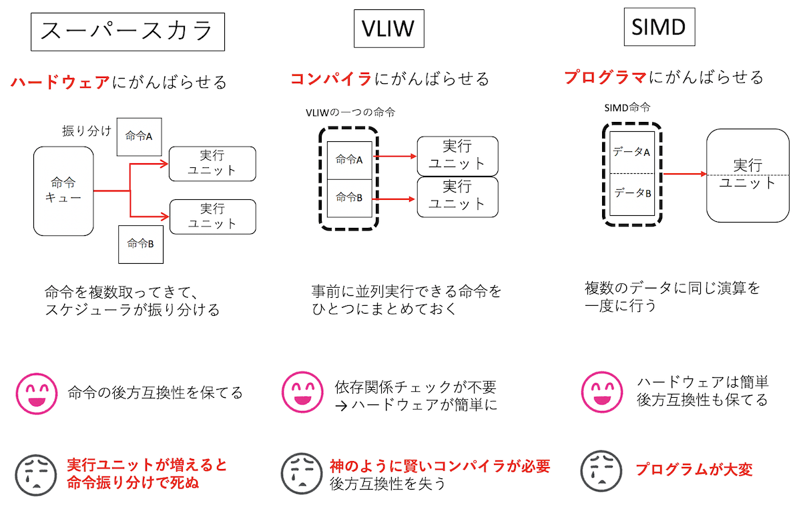
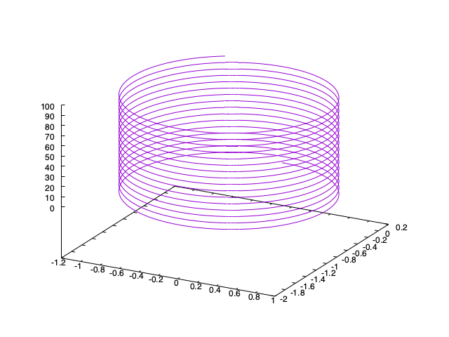
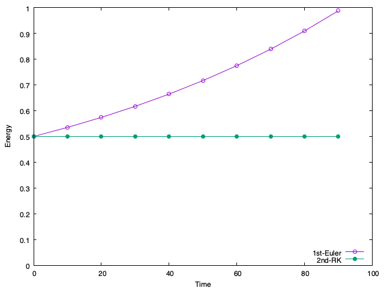
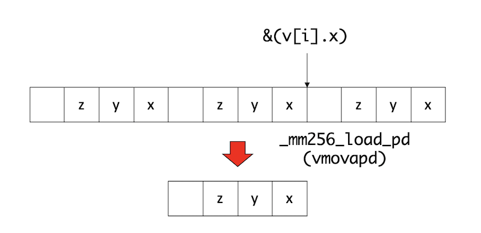
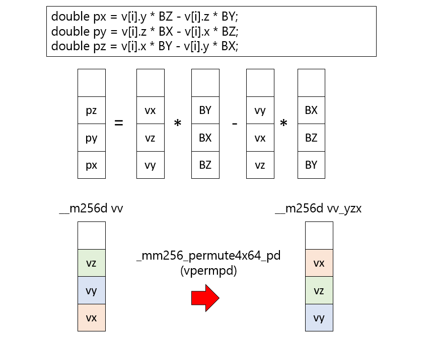

# Day 7 : SIMD化

<!--- abstract --->
ここまで読んだ人、お疲れ様です。ここから読んでいる人、問題ありません。スパコンにおける並列化には、プロセス並列、スレッド並列、データ並列の三種類がある。これまでプロセス並列、スレッド並列について述べたので、最後はデータ並列であるSIMD化について紹介しよう。
<!--- end --->

## SIMDとは

スパコンプログラミングに興味があるような人なら、「SIMD」という言葉を聞いたことがあるだろう。SIMDとは、「single instruction multiple data」の略で、「一回の命令で複数のデータを同時に扱う」という意味である。先に、並列化は大きく分けて「データ並列」「共有メモリ並列」「分散メモリ並列」の三種類になると書いたが、SIMDはデータ並列(Data parallelism)に属す。現在、一般的に数値計算に使われるCPUにはほとんどSIMD命令が実装されている。後述するが、SIMDとは1サイクルに複数の演算を同時に行う技術であり、CPUの「理論ピーク性能」は、SIMDの能力を使い切った場合の性能を指す。したがって、**まったくSIMD化できなければ、ピーク性能が数分の1になることと等価である**。ここでは、なぜSIMDが必要になるか、そしてSIMDとは何かについて見てみよう。

計算機というのは、要するにメモリからデータと命令を取ってきて、演算器に投げ、結果をメモリに書き戻す機械である。CPUの動作単位は「サイクル」で表される。演算器に計算を投げてから、結果が返ってくるまでに数サイクルかかるが、現代のCPUではパイプライン処理という手法によって事実上1サイクルに1個演算ができる。1サイクル1演算できるので、あとは「1秒あたりのサイクル数=動作周波数」を増やせば増やすほど性能が向上することになる。

というわけでCPUベンダーで動作周波数を向上させる熾烈な競争が行われたのだが、2000年代に入って動作周波数は上がらなくなった。これはリーク電流による発熱が主な原因なのだが、ここでは深く立ち入らない。1サイクルに1演算できる状態で、動作周波数をもう上げられないのだから、性能を向上させるためには「1サイクルに複数演算」をさせなければならない。この「1サイクルに複数演算」の実現にはいくつかの方法が考えられた。



まず、単純に演算器の数を増やすという方法が考えられる。1サイクルで命令を複数取ってきて、その中に独立に実行できるものがあれば、複数の演算器に同時に投げることで1サイクルあたりの演算数を増やそう、という方法論である。これを **スーパースカラ** と呼ぶ。独立に実行できる命令がないと性能が上がらないため、よくアウトオブオーダー実行と組み合わされる。要するに命令をたくさん取ってきて命令キューにためておき、スケジューラがそこを見て独立に実行できる命令を選んでは演算器に投げる、ということをする。

この方法には「命令セットの変更を伴わない」という大きなメリットがある。ハードウェアが勝手に並列実行できる命令を探して同時に実行してくれるので、プログラマは何もしなくて良い。そういう意味において、 **スーパースカラとはハードウェアにがんばらせる方法論** である。デメリット、というか問題点は、実行ユニットの数が増えると、依存関係チェックの手間が指数関数的に増えることである。一般的には整数演算が4つ程度、浮動小数点演算が2つくらいまでが限界だと思われる。

さて、スーパースカラの問題点は、命令の依存関係チェックが複雑であることだった。そこさえ解決できるなら、演算器をたくさん設置すればするほど性能が向上できると期待できる。そこで、事前に並列に実行できる命令を並べておいて、それをそのままノーチェックで演算器に流せばいいじゃないか、という方法論が考えられた。整数演算器や浮動小数点演算器、メモリのロードストアといった実行ユニットを並べておき、それらに供給する命令を予め全部ならべたものを「一つの命令」とする。並列実行できる実行ユニットの数だけ命令を「パック」したものを一つの命令にとするため、命令が極めて長くなる。そのため、この方式は「Very Long Instruction Word (超長い命令語)」、略してVLIWと呼ばれる。実際にはコンパイラがソースコードを見て並列に実行できる命令を抽出し、なるべく並列に実行できるように並べて一つの命令を作る。そういう意味において、 **VLIWとはコンパイラにがんばらせる方法論**である。

この方式で性能を稼ぐためには、VLIWの「命令」に有効な命令が並んでなければならない。しかし、命令に依存関係が多いと同時に使える実行ユニットが少なくなり、「遊ぶ」実行ユニットに対応する箇所には「NOP(no operation = 何もしない)」が並ぶことになる。VLIWはIntelとHPが共同開発したIA-64というアーキテクチャに採用され、それを実装したItanium2は、ハイエンドサーバやスパコン向けにそれなりに採用された。個人的にはItanium2は(レジスタもいっぱいあって)好きな石なのだが、この方式が輝くためには「神のように賢いコンパイラ」が必須となる。一般に「神のように賢いコンパイラ」を要求する方法はだいたい失敗する運命にある。また、命令セットが実行ユニットの仕様と強く結びついており、後方互換性に欠けるのも痛い。VLIWは組み込み用途では人気があるものの、いまのところハイエンドなHPC向けとしてはほぼ滅びたと言ってよいと思う。

さて、「ハードウェアにがんばらせる」方法には限界があり、「コンパイラにがんばらせる」方法には無理があった。残る方式は **プログラマにがんばらせる方法論** だけである。それがSIMDである。

異なる命令をまとめてパックするのは難しい。というわけで、命令ではなく、データをパックすることを考える。たとえば「C=A+B」という足し算を考える。これは「AとBというデータを取ってきて、加算し、Cとしてメモリに書き戻す」という動作をする。ここで、「C1 = A1+B1」「C2 = A2+B2」という独立な演算があったとしよう。予め「A1:A2」「B1:B2」とデータを一つのレジスタにパックしておき、それぞれの和を取ると「C1:C2」という、2つの演算結果がパックしたレジスタが得られる。このように複数のデータをパックするレジスタをSIMDレジスタと呼ぶ。例えばAVX2なら256ビットのSIMDレジスタがあるため、64ビットの倍精度実数を4つパックできる。そしてパックされた4つのデータ間に独立な演算を実行することができる。ここで、ハードウェアはパックされたデータの演算には依存関係が無いことを仮定する。つまり依存関係の責任はプログラマ側にある。ハードウェアから見れば、レジスタや演算器の「ビット幅」が増えただけのように見えるため、ハードウェアはさほど複雑にならない。しかし、性能向上のためには、SIMDレジスタを活用したプログラミングを行わなければならない。
SIMDレジスタを活用して性能を向上させることを俗に「SIMD化 (SIMD-vectorization)」などと呼ぶ。
原理的にはコンパイラによってSIMD化することは可能であり、実際に、最近のコンパイラのSIMD最適化能力の向上には目を見張るものがある。
しかし、効果的なSIMD化のためにはデータ構造の変更を伴うことが多く、コンパイラにはそういったグローバルな変更を伴う最適化が困難であることから、基本的には「SIMD化はプログラマが手で行う必要がある」のが現状である。

## SIMDレジスタを触ってみる

SIMD化とは、CPUに実装されているSIMDレジスタをうまく使うコードを書いて実行速度を加速させることである。
そのためには、まずSIMDレジスタを使う必要がある。SIMDレジスタとは、要するに複数のデータを一度に保持できる変数である。
これを読んでいる人の大多数はAVX2に対応したx86系CPUのパソコンを持っているだろう。まずはAVX2の256bitレジスタ、YMMレジスタを使ってみよう。
以下、変数としては倍精度実数型を使う。倍精度実数は64ビットなので、256ビットレジスタは倍精度実数を4つ保持できる。

SIMDを明示的に扱うには、まず`x86intrin.h`をincludeする。すると、SIMDレジスタに対応する`_m256d`という型が使えるようになる。
これは256bitのYMMレジスタを、倍精度実数4つだと思って使う型である。この型の変数に値を入れるには、例えば`_mm256_set_pd`という組み込み関数を使う。

```cpp
__m256d v1 =  _mm256_set_pd(3.0, 2.0, 1.0, 0.0);
```

この関数は、**右から** 下位に値を放り込んでいく。上記の例なら、一番下位の64ビットに倍精度実数の0、次の64ビットに1・・・と値が入る。
さて、SIMDレジスタとは、変数を複数同時に保持できるものである。今回のケースでは、`_m256d`という型は、ほぼ`double [4]`だと思ってかまわない。
実際、これらはそのままキャスト可能である。SIMD化を行う時、こんなデバッグ用の関数を作っておくと便利である。

```cpp
void print256d(__m256d x) {
  printf("%f %f %f %f\n", x[3], x[2], x[1], x[0]);
}
```

`_m256d x`が、そのまま`double x[4]`として使えているのがわかると思う。この時、`x[0]`が一番下位となる。
先程の代入と合わせるとこんな感じになる(`print.cpp`)。

```cpp
#include <cstdio>
#include <x86intrin.h>

void print256d(__m256d x) {
  printf("%f %f %f %f\n", x[3], x[2], x[1], x[0]);
}

int main(void) {
  __m256d v1 =  _mm256_set_pd(3.0, 2.0, 1.0, 0.0);
  print256d(v1);
}
```

これをg++でコンパイルするには、AVX2を使うよ、と教えてあげる必要がある。

```sh
$ g++ -mavx2 print.cpp
$ ./a.out
3.000000 2.000000 1.000000 0.000000
```

ちゃんとSIMDレジスタに値が代入され、それが表示されたことがわかる。

さて、SIMDレジスタの強みは、SIMDレジスタ同士で四則演算をすると、4つ同時に計算が実行できることであった。それを確認してみよう。

単に`_m256d`同士の足し算をやる関数を書いてみる。`_m256d`の型は、そのまま四則演算ができる。`double[4]`の型をラップしたクラスを作り、オペレータのオーバーロードをしたようなイメージである。

```cpp
#include <cstdio>
#include <x86intrin.h>

__m256d add(__m256d v1, __m256d v2) {
  return v1 + v2;
}
```

アセンブリを見てみる。少し最適化したほうがアセンブリが読みやすい。

```sh
g++ -mavx2 -O2 -S add.cpp
```

アセンブリはこうなる。

```asm
__Z3addDv4_dS_:
  vaddpd  %ymm1, %ymm0, %ymm0
  ret
```

`vaddpd`はSIMDの足し算を行う命令であり、ちゃんとYMMレジスタの足し算が呼ばれていることがわかる。

実際に4要素同時に足し算できることを確認しよう(`add.cpp`)。

```cpp
#include <cstdio>
#include <x86intrin.h>

void print256d(__m256d x) {
  printf("%f %f %f %f\n", x[3], x[2], x[1], x[0]);
}

int main(void) {
  __m256d v1 =  _mm256_set_pd(3.0, 2.0, 1.0, 0.0);
  __m256d v2 =  _mm256_set_pd(7.0, 6.0, 5.0, 4.0);
  __m256d v3 = v1 + v2;
  print256d(v3);
}
```

```sh
$ g++ -mavx2 add.cpp
$ ./a.out
10.000000 8.000000 6.000000 4.000000
```

`(0,1,2,3)`というベクトルと、`(4,5,6,7)`というベクトルの和をとり、`(4,6,8,10)`というベクトルが得られた。
このように、ベクトル同士の演算に見えるので、SIMD化のことをベクトル化と呼んだりする。ただし、線形代数で出てくる
ベクトルの積とは違い、SIMDの積は単に要素ごとの積になることに注意。実際、さっきの和を積にするとこうなる(`mul.cpp`)。

```cpp
#include <cstdio>
#include <x86intrin.h>

void print256d(__m256d x) {
  printf("%f %f %f %f\n", x[3], x[2], x[1], x[0]);
}

int main(void) {
  __m256d v1 =  _mm256_set_pd(3.0, 2.0, 1.0, 0.0);
  __m256d v2 =  _mm256_set_pd(7.0, 6.0, 5.0, 4.0);
  __m256d v3 = v1 * v2; // 積にした
  print256d(v3);
}
```

```sh
$ g++ -mavx2 mul.cpp
$ ./a.out
21.000000 12.000000 5.000000 0.000000
```

それぞれ、`0*0`、`1*5`、`2*6`、`3*7`が計算されていることがわかる。

あとSIMD化で大事なのは、SIMDレジスタへのデータの読み書きである。先程はデバッグのために`_mm256_set_pd`を使ったが、これは極めて遅い。どんな動作をするか見てみよう(`setpd.cpp`)。

```cpp
#include <x86intrin.h>
  
__m256d setpd(double a, double b, double c, double d) {
  return _mm256_set_pd(d, c, b, a);
}
```

このアセンブリを見てみる。

```sh
g++ -mavx2 -O2 -S setpd.cpp
```

```asm
__Z5setpddddd:
  vunpcklpd %xmm3, %xmm2, %xmm2
  vunpcklpd %xmm1, %xmm0, %xmm0
  vinsertf128 $0x1, %xmm2, %ymm0, %ymm0
  ret
```

これは、

1. aとbをxmm2レジスタにパック
2. cとdをxmm0レジスタにパック
3. xmm2レジスタの値をymm0レジスタの上位に挿入

ということをしている。ここで、`xmm0`レジスタと`ymm0`レジスタの下位128ビットは共有していることに注意。
つまり、`xmm0`レジスタに読み書きすると、`ymm0`レジスタの下位128ビットも影響を受ける。
上記の例はそれを利用して、最終的に欲しい情報、つまり4要素をパックしたレジスタを作っている。

とりあえず4つの要素をYMMレジスタに載せることができれば、あとは4要素同時に計算ができるようになるのだが、
4要素をパックする際に`_mm256_set_pd`を使うとメモリアクセスが多くなって性能が出ない。
そのため、メモリから連続するデータをごそっとレジスタにとってきたり、書き戻したりする命令がある。
例えば、`_mm256_load_pd`は、指定されたポインタから連続する4つの倍精度実数をとってきて
YMMレジスタに入れてくれる。ただし、そのポインタの指すアドレスは32バイトアラインされていなければならない。

利用例はこんな感じになる(`load.cpp`)。

```cpp
#include <cstdio>
#include <x86intrin.h>

void print256d(__m256d x) {
  printf("%f %f %f %f\n", x[3], x[2], x[1], x[0]);
}

__attribute__((aligned(32))) double a[] = {0.0, 1.0, 2.0, 3.0, 4.0, 5.0, 6.0, 7.0};

int main(void) {
  __m256d v1 = _mm256_load_pd(a);
  __m256d v2 = _mm256_load_pd(a + 4);
  __m256d v3 = v1 + v2;
  print256d(v3);
}
```

ここで`__attribute__((aligned(32)))`が、「後に続くデータを32バイトアライメントにしてください」という指示である。
メモリアライメントについてはここでは深入りしないが、「利用メモリの端がちょうど良いとこから始まっていること」とおぼえておけば良い。
具体的には、配列の先頭アドレスが32で割り切れる値になる。メモリアライメントが合わないと遅くなったり、実行時にSIGSEGVで落ちたりする。

コンパイル、実行はこんな感じ。

```sh
$ g++ -mavx2 load.cpp
$ ./a.out
10.000000 8.000000 6.000000 4.000000
```

`_mm256_load_pd`が何をやっているか(どんなアセンブリに対応するか)も見てみよう。こんなコードのアセンブリを見てみる(`loadasm.cpp`)。

```cpp
#include <x86intrin.h>  
__m256d load(double *a, int index) {
  return _mm256_load_pd(a + index);
}
```

```sh
g++ -O2 -mavx2 loadasm.cpp
```

例によって、少し最適化をかけておく。

```asm
__Z4loadPdi:
  movslq  %esi, %rsi
  vmovapd (%rdi,%rsi,8), %ymm0
  ret
```

`ymm0`レジスタに、`vmovapd`一発でデータがロードされていることがわかる。

ここでは読み出しを見たが、書き戻し(`_mm256_store_pd`)も同様である。

さて、これでSIMD化の基礎は終わりである。ようするにデータを複数個とってきて、SIMDレジスタに乗せて、
レジスタでなんか計算して、それを書き戻せばよろしい。簡単でしょう？
ただし、バラバラのデータをpack/unpackすると遅いので、なるべく連続したデータをロードしたりストアしたりするように心がける必要がある。
実際に使おうとすると、「あれ？if文があるんだけど、どうすればいいんだろう？」とか「メモリの配置とレジスタに載せたい配置が微妙に違う」とかいろいろ出てくると思うが、それに対応してSIMDのための補助命令(シャッフルとか)が死ぬほどある。まぁ、それは必要に応じて覚えておけばいいと思う。以下、簡単な例でSIMD化の実際を見てみよう。

## 余談：アセンブリ言語？アセンブラ言語？

アセンブリの話になると、必ずといっていいほど「アセンブリ言語(assembly language)が正しく、アセンブラ言語(assembler language)は誤り」と言い出す人がいる。
もちろんほとんどの場合において、**アセンブリ言語** (assembly language)」を**アセンブル**(assemble)して**機械語**(machine language)に変換するのが**アセンブラ**(assembler)である、という認識で良い。しかし、「アセンブラ言語 (assembler language)」という用法が無いわけではない。
もっとも有名なのがIBMである。IBMは昔から「アセンブラ言語 (assembler language)」という呼び方をしてきた。
IBMが現在サポートしているアセンブリ言語はIBM High Level Assembler(HLASM)であり、メインフレームであるSystem z上で動作する。
[HLASMのマニュアル](http://publibfp.dhe.ibm.com/epubs/pdf/asmg1022.pdf)内でも「アセンブラ言語(assembler language)」という呼び方をしている。
しかし、System zの祖先であるSystem 360上で動作するアセンブリ言語は「[IBM Basic Assembly Language (BAL)](https://en.wikipedia.org/wiki/IBM_Basic_assembly_language_and_successors)」と呼ばれており、「Assembly language」と「Assembler language」の使い分けは微妙である。しかし、IBM自身はBALのことを
[Basic Assembler Language](http://bitsavers.trailing-edge.com/pdf/ibm/360/bos_bps/C20-6503-0_BAL_Feb65.pdf)と表現しているので、
もしかしたらBALのことをIBMはBasic Assembler Language、サードパーティはBasic Assembly Languageと呼んでいるのかもしれない。

IBM以外でも、ARMが規定したアセンブリ言語であるUALは「[Unified Assembler Language](http://www.keil.com/support/man/docs/armasm/armasm_dom1359731145130.htm)」の略である。
直訳すると「統合**アセンブラ**言語」とでもなるだろうか。しかし、ARM自身はアセンブリ言語のことを「assembly language」と呼んでおり、やはりその使い分けは微妙である。
これは筆者の経験になるが、日本でも昔は「アセンブリ言語」のことを指して「アセンブラ」と呼ぶのがかなり一般的であった記憶がある。C言語などを使わずに書くことを「フルアセンブラで書く」といった具合である。
いまでもそのような使い方をしている人を見かける。どうでもいいが、当時x86のアセンブラを書いていた人は、機械語のことを「マシン語」と呼ぶのが一般的であった気もする。

繰り返しになるが、現在は「アセンブリ言語 (assembly language)」の方が一般的な用語であると思われるので、「アセンブリ言語をアセンブラがアセンブルして機械語にする」と表現することになんの問題もない。
しかし、誰かが「アセンブラを書く」もしくは「アセンブラ言語」と言ったときに、脊髄反射で「アセンブリ言語が正しい」とマウントを取る前に、上記のような事情を思い出していただけたらと思う。

余談の余談となるが、アセンブリで書かれたものを手で機械語に翻訳する作業を「ハンドアセンブル」と呼ぶ。昔のアセンブリはほぼ機械語と一対一対応しており、「便利なマクロ付き機械語」といった趣であったため、ハンドアセンブルはさほど難しい作業ではなかった。しかし、現在の機械語、特にx86の機械語はかなり複雑になっており、アセンブリから機械語に翻訳するのはかなり大変になっている。そのあたりは例えば[x86_64機械語入門](https://tanakamura.github.io/pllp/docs/x8664_language.html)なんかを参照してほしい。

## 簡単なSIMD化の例

では、実際にSIMD化をやってみよう。こんなコードを考える。
一次元の配列の単純な和のループである(`func.cpp`)。

```cpp
const int N = 10000;
double a[N], b[N], c[N];

void func() {
  for (int i = 0; i < N; i++) {
    c[i] = a[i] + b[i];
  }
}
```

これを普通にコンパイルすると、こんなアセンブリになる。

```sh
g++ -O1 -S func.cpp  
```

```asm
  xorl  %eax, %eax
  leaq  _a(%rip), %rcx
  leaq  _b(%rip), %rdx
  leaq  _c(%rip), %rsi
  movsd (%rax,%rcx), %xmm0
  addsd (%rax,%rdx), %xmm0
  movsd %xmm0, (%rax,%rsi)
  addq  $8, %rax
  cmpq  $80000, %rax
  jne LBB0_1
```

配列`a`,`b`,`c`のアドレスを`%rcx`, `%rdx`, `%rsi`に取得し、
`movsd`で`a[i]`のデータを`%xmm0`に持ってきて、`addsd`で`a[i]+b[i]`を計算して`%xmm0`に保存し、
それを`c[i]`の指すアドレスに`movsd`で書き戻す、ということをやっている。
これはスカラーコードなのだが、`xmm`は128ビットSIMDレジスタである。
x86は歴史的経緯からスカラーコードでも浮動小数点演算にSIMDレジスタである`xmm`を使う(後述の余談参照)。

さて、このループをAVX2を使ってSIMD化することを考える。SIMD化の基本は、ループをアンロールして
独立な演算を複数作り、それをSIMDレジスタで同時に演算することである。AVX2のSIMDレジスタはymmで表記される。ymmレジスタは256ビットで、倍精度実数(64ビット)が4つ保持できるので、

* ループを4倍展開する
* 配列aから4つデータを持ってきてymmレジスタに乗せる
* 配列bから4つデータを持ってきてymmレジスタに乗せる
* 二つのレジスタを足す
* 結果のレジスタを配列cのしかるべき場所に保存する

ということをすればSIMD化完了である。コードを見たほうが早いと思う(`func_simd.cpp`)。

```cpp
#include <x86intrin.h>
void func_simd() {
  for (int i = 0; i < N; i += 4) {
    __m256d va = _mm256_load_pd(&(a[i]));
    __m256d vb = _mm256_load_pd(&(b[i]));
    __m256d vc = va + vb;
    _mm256_store_pd(&(c[i]), vc);
  }
}
```

先程みたように、4つ連続したデータを持ってくる命令が`_mm256_load_pd`であり、
SIMDレジスタの内容をメモリに保存する命令が`_mm256_load_pd`である。
これをコンパイルしてアセンブリを見てみよう。

```sh
g++ -O1 -mavx2 -S func_simd.cpp
```

```asm
  xorl  %eax, %eax
  leaq  _a(%rip), %rcx
  leaq  _b(%rip), %rdx
  leaq  _c(%rip), %rsi
  xorl  %edi, %edi
LBB0_1:  
  vmovupd (%rax,%rcx), %ymm0         # (a[i],a[i+1],a[i+2],a[i+3]) -> ymm0
  vaddpd  (%rax,%rdx), %ymm0, %ymm0  # ymm0 + (b[i],b[i+1],b[i+2],b[i+3]) -> ymm 0
  vmovupd %ymm0, (%rax,%rsi)         # ymm0 -> (c[i],c[i+1],c[i+2],c[i+3])
  addq  $4, %rdi    # i += 4
  addq  $32, %rax
  cmpq  $10000, %rdi
  jb  LBB0_1
```

ほとんどそのままなので、アセンブリ詳しくない人でも理解は難しくないと思う。
配列のアドレスを`%rcx`, `%rdx`, `%rsi`に取得するところまでは同じ。
元のコードでは`movsd`で`xmm`レジスタにデータをコピーしていたのが、
`vmovupd`で`ymm`レジスタにデータをコピーしているのがわかる。
どの組み込み関数がどんなSIMD命令に対応しているかは[Intel Intrinsics Guide](https://software.intel.com/sites/landingpage/IntrinsicsGuide/#)が便利である。

念の為、このコードが正しく計算できてるかチェックしよう。
適当に乱数を生成して配列`a[N]`と`b[N]`に保存し、ついでに答えも`ans[N]`に保存しておく。

```cpp
int main() {
  std::mt19937 mt;
  std::uniform_real_distribution<double> ud(0.0, 1.0);
  for (int i = 0; i < N; i++) {
    a[i] = ud(mt);
    b[i] = ud(mt);
    ans[i] = a[i] + b[i];
  }
  check(func, "scalar");
  check(func_simd, "vector");
}
```

倍精度実数同士が等しいかチェックするのはいろいろと微妙なので、バイト単位で比較しよう。
ここでは配列`c[N]`と`ans[N]`を`unsigned char`にキャストして比較している。

```cpp
void check(void(*pfunc)(), const char *type) {
  pfunc();
  unsigned char *x = (unsigned char *)c;
  unsigned char *y = (unsigned char *)ans;
  bool valid = true;
  for (int i = 0; i < 8 * N; i++) {
    if (x[i] != y[i]) {
      valid = false;
      break;
    }
  }
  if (valid) {
    printf("%s is OK\n", type);
  } else {
    printf("%s is NG\n", type);
  }
}
```

全部まとめたコードを`simdcheck.cpp`として保存、実行してみよう。

```cpp
#include <cstdio>
#include <random>
#include <algorithm>
#include <x86intrin.h>

const int N = 10000;

double a[N], b[N], c[N];
double ans[N];

void check(void(*pfunc)(), const char *type) {
  pfunc();
  unsigned char *x = (unsigned char *)c;
  unsigned char *y = (unsigned char *)ans;
  bool valid = true;
  for (int i = 0; i < 8 * N; i++) {
    if (x[i] != y[i]) {
      valid = false;
      break;
    }
  }
  if (valid) {
    printf("%s is OK\n", type);
  } else {
    printf("%s is NG\n", type);
  }
}

void func() {
  for (int i = 0; i < N; i++) {
    c[i] = a[i] + b[i];
  }
}

void func_simd() {
  for (int i = 0; i < N; i += 4) {
    __m256d va = _mm256_load_pd(&(a[i]));
    __m256d vb = _mm256_load_pd(&(b[i]));
    __m256d vc = va + vb;
    _mm256_store_pd(&(c[i]), vc);
  }
}

int main() {
  std::mt19937 mt;
  std::uniform_real_distribution<double> ud(0.0, 1.0);
  for (int i = 0; i < N; i++) {
    a[i] = ud(mt);
    b[i] = ud(mt);
    ans[i] = a[i] + b[i];
  }
  check(func, "scalar");
  check(func_simd, "vector");
}
```

実際に実行してテストしてみよう。

```sh
$ g++ -mavx2 -O3 simdcheck.cpp
$ ./a.out
scalar is OK
vector is OK
```

正しく計算できているようだ。

さて、これくらいのコードならコンパイラもSIMD化してくれる。で、問題はコンパイラがSIMD化したかどうかをどうやって判断するかである。
一つの方法は、コンパイラの吐く最適化レポートを見ることだ。インテルコンパイラなら`-qopt-report`で最適化レポートを見ることができる。

```sh
$ icpc -march=core-avx2 -O2 -c -qopt-report -qopt-report-file=report.txt func.cpp
$ cat report.txt
Intel(R) Advisor can now assist with vectorization and show optimization
  report messages with your source code.
(snip)
LOOP BEGIN at func.cpp(5,3)
   remark #15300: LOOP WAS VECTORIZED
LOOP END
```

実際にはもっとごちゃごちゃ出てくるのだが、とりあえず最後に「LOOP WAS VECTORIZED」とあり、SIMD化できたことがわかる。
しかし、どうSIMD化したのかはさっぱりわからない。`-qopt-report=5`として最適レポートのレベルを上げてみよう。

```sh
$ icpc -march=core-avx2 -O2 -c -qopt-report=5 -qopt-report-file=report5.txt func.cpp
$ cat report5.txt
Intel(R) Advisor can now assist with vectorization and show optimization
  report messages with your source code.
(snip)
LOOP BEGIN at func.cpp(5,3)
   remark #15388: vectorization support: reference c has aligned access   [ func.cpp(6,5) ]
   remark #15388: vectorization support: reference a has aligned access   [ func.cpp(6,5) ]
   remark #15388: vectorization support: reference b has aligned access   [ func.cpp(6,5) ]
   remark #15305: vectorization support: vector length 4
   remark #15399: vectorization support: unroll factor set to 4
   remark #15300: LOOP WAS VECTORIZED
   remark #15448: unmasked aligned unit stride loads: 2
   remark #15449: unmasked aligned unit stride stores: 1
   remark #15475: --- begin vector loop cost summary ---
   remark #15476: scalar loop cost: 6
   remark #15477: vector loop cost: 1.250
   remark #15478: estimated potential speedup: 4.800
   remark #15488: --- end vector loop cost summary ---
   remark #25015: Estimate of max trip count of loop=625
LOOP END
```

このレポートから以下のようなことがわかる。

* ymmレジスタを使ったSIMD化であり (vector length 4)
* ループを4倍展開しており(unroll factor set to 4)
* スカラーループのコストが6と予想され (scalar loop cost: 6)
* ベクトルループのコストが1.250と予想され (vector loop cost: 1.250)
* ベクトル化による速度向上率は4.8倍であると見積もられた (estimated potential speedup: 4.800)

でも、こういう時にはアセンブリ見ちゃった方が早い。

```sh
icpc -march=core-avx2 -O2 -S func.cpp
```

コンパイラが吐いたアセンブリを、少し手で並び替えたものがこちら。

```asm
        xorl      %eax, %eax
..B1.2:
        lea       (,%rax,8), %rdx
        vmovupd   a(,%rax,8), %ymm0
        vmovupd   32+a(,%rax,8), %ymm2
        vmovupd   64+a(,%rax,8), %ymm4
        vmovupd   96+a(,%rax,8), %ymm6
        vaddpd    b(,%rax,8), %ymm0, %ymm1
        vaddpd    32+b(,%rax,8), %ymm2, %ymm3
        vaddpd    64+b(,%rax,8), %ymm4, %ymm5
        vaddpd    96+b(,%rax,8), %ymm6, %ymm7
        vmovupd   %ymm1, c(%rdx)
        vmovupd   %ymm3, 32+c(%rdx)
        vmovupd   %ymm5, 64+c(%rdx)
        vmovupd   %ymm7, 96+c(%rdx)
        addq      $16, %rax
        cmpq      $10000, %rax
        jb        ..B1.2
```

先程、手でループを4倍展開してSIMD化したが、さらにそれを4倍展開していることがわかる。

これ、断言しても良いが、こういうコンパイラの最適化について調べる時、コンパイラの最適化レポートとにらめっこするよりアセンブリ読んじゃった方が絶対に早い。
「アセンブリを読む」というと身構える人が多いのだが、どうせSIMD化で使われる命令ってそんなにないし、
最低でも「どんな種類のレジスタが使われているか」を見るだけでも「うまくSIMD化できてるか」がわかる。
ループアンロールとかそういうアルゴリズムがわからなくても、アセンブリ見てxmmだらけだったらSIMD化は(あまり)されてないし、ymmレジスタが使われていればAVX/AVX2を使ったSIMD化で、
zmmレジスタが使われていればAVX-512を使ったSIMD化で、`vmovupd`が出てればメモリからスムーズにデータがコピーされてそうだし、
`vaddpd`とか出てればちゃんとSIMDで足し算しているなとか、そのくらいわかれば実用的にはわりと十分だったりする。
そうやっていつもアセンブリを読んでいると、そのうち「アセンブリ食わず嫌い」が治って、コンパイラが何を考えたかだんだんわかるようになる……かもしれない。

## 余談：x86における浮動小数点演算の扱い

数値計算においては、浮動小数点演算が必須である。この浮動小数点数は、単精度なら32ビット、倍精度なら64ビットで表現される。
その表現方法は[IEEE 754](https://ja.wikipedia.org/wiki/IEEE_754)という仕様で決まっている。
CPUは演算をレジスタで行うが、整数演算を行う汎用レジスタと、浮動小数点演算を行う浮動小数点レジスタは別々に用意されているのが一般的である。
そして、倍精度実数演算をサポートするCPUは64ビットの浮動小数点レジスタを持っていることが多いのだが、x86は例外で64ビットの浮動小数点レジスタが無い。ではどうするかというと、普通の浮動小数点演算に128ビットのXMMというSIMDレジスタを使う。これにはx86における浮動小数点演算のサポートの歴史的な事情がある。

もともと、x86はハードウェアレベルで浮動小数点演算ができなかった。したがって、浮動小数点演算をやろうとすると、汎用レジスタでソフトウェア的に浮動小数点演算をエミュレートしてやる必要があり、極めて遅かった。そこで、浮動小数点演算をサポートするためにx87というコプロセッサが用意された。
コプロセッサとは、CPUの近くに外付けして機能拡張する装置で、コプロセッサに対応する命令が来ると、CPUからコプロセッサに処理が依頼される。
ユーザからはCPUの命令セットが拡張されたように見える。このx87コプロセッサは80ビットマシンであり、単精度(32ビット)でも倍精度(64ビット)でも、一度内部で80ビットに変換されてから計算され、演算結果をまた単精度なり倍精度なりに変換する。なお、`long double`型は、80ビットそのままで計算され、変換を伴わない。x86系の石で`long double`が80ビットなのはこういう事情による。

x87コプロセッサは、x86の進化に合わせて一緒に進化していった。Intel 8086にはIntel 8087が、80186には80187が、80286には80287が、といった具合である。なのでx86と同様にx87と呼ばれる。x87はしばらく外付けのコプロセッサだったが、80486からx87がCPU内に内蔵されるようになった。

さて、浮動小数点演算にはもう一本の歴史がある。SIMDである。CPUの処理能力が上がると、音声や動画のエンコード、デコードや、3D処理などの処理能力がもっとほしい、という要望が出てきた。そうした声に答える形でAMDが3DNow!というSIMD命令拡張を発表した。これはIntelによるMMXを拡張し、64ビットのMMXレジスタを使って単精度実数の演算を二つ同時にできるようにしたものだ。その後、IntelもSSEというSIMD命令拡張を作り、ここで128ビットであるXMMレジスタが導入された。当初、XMMレジスタは単精度実数の演算しかできなかったが、SSE2で倍精度実数を扱えるようになる。AMDは倍精度実数の計算にデフォルトでXMMレジスタを使うようになり、その後Intelもそうなったと思われる(そのあたりの前後関係はよく知らない)。

そんなわけで、x86には浮動小数点レジスタとして、x87で導入された80ビットのレジスタと、SSEで導入された128ビットのXMMレジスタがあるが、「普通の」64ビットの浮動小数点レジスタはついに導入されなかった。現在のx86では、SIMDではない普段遣いの倍精度実数演算でも、SIMDレジスタであるXMMレジスタの下位64ビットを使って演算する。

その後、SIMD命令拡張はAVX、AVX2、AVX-512と発展を続け、SIMD幅も256ビット、512ビットと増えていった。それに伴ってSIMDレジスタもYMM、ZMMと拡張されていく。YMMの下位128ビットがXMM、ZMMの下位256ビットがYMMになるのは、汎用レジスタAX、EAX、RAXに包含関係があるのと同様である。

## もう少し実戦的なSIMD化

上記で触れたSIMD化は非常に単純なもので、コンパイラが自動でできるものだった。しかし、一般にはSIMD化はレジスタ内をシャッフルしたり、データ構造を考えたりといろいろ複雑である。
ここでは「もっとガチなSIMD化をしたい！」というコアなSIMDerのために、もう少しだけ実践的な例を挙げてみよう。

磁場中の荷電粒子の運動を考える。磁場ベクトルを$\vec{B}$、速度ベクトルを$\vec{v}$、位置ベクトルを$\vec{r}$とする。簡単のため、素電荷も質量も光速も1とする単位系を取ろう。
運動方程式はこんな感じになる。

$$
\dot{\vec{v}} = \vec{v} \times \vec{B}
$$

$$
\dot{\vec{r}} = \vec{v}
$$

ここで、速度の時間微分を要素をあらわに書くとこうなる。

$$
\dot{v_x} = v_y B_z - v_z B_y
$$

$$
\dot{v_y} = v_z B_x - v_x B_z
$$

$$
\dot{v_z} = v_x B_y - v_y B_x
$$

磁場中の荷電粒子の運動は、磁場と平行な向きには等速直線運動、垂直な向きには円運動をするため、結果として螺旋を描いてすすむ。こんな感じ。



さて、適当な方向に向いた磁場中に、ランダムな向きに初速を持った荷電粒子たちをばらまいた系を計算してみよう。なお、粒子同士の相互作用も無視する。
三次元シミュレーションなので、三次元ベクトルを構造体で表現する。

```cpp
struct vec {
  double x, y, z;
};
```

粒子数を`N`とし、位置ベクトル、速度ベクトルを構造体の配列にとる。

```cpp
const int N = 100000;
vec r[N], v[N];
```

この時、一次のオイラー法で時間発展を書くとこんな感じになる。

```cpp
void calc_euler() {
  for (int i = 0; i < N; i++) {
    double px = v[i].y * BZ - v[i].z * BY;
    double py = v[i].z * BX - v[i].x * BZ;
    double pz = v[i].x * BY - v[i].y * BX;
    v[i].x += px * dt;
    v[i].y += py * dt;
    v[i].z += pz * dt;
    r[i].x = r[i].x + v[i].x * dt;
    r[i].y = r[i].y + v[i].y * dt;
    r[i].z = r[i].z + v[i].z * dt;
  }
}
```

しかし、よく知られているように一次のオイラー法は非常に精度が悪い。あなたが物理を学んだのなら、「磁場は荷電粒子に仕事をしない」ということを知っているはずである。つまり、全エネルギーは保存しなければならない。粒子間相互作用がないため、エネルギーは運動エネルギーだけである。

```cpp
double energy(void) {
  double e = 0.0;
  for (int i = 0; i < N; i++) {
    e += v[i].x * v[i].x;
    e += v[i].y * v[i].y;
    e += v[i].z * v[i].z;
  }
  return e * 0.5 / static_cast<double>(N);
}
```

ちなみに、運動エネルギーなどは「一粒子あたり」の量にしておく(つまり平均エネルギーとする)と、粒子数の増減にエネルギーがよらなくなって便利である。時間発展はこんな感じにかけるだろう。

```cpp
  init();
  double t = 0.0;
  for (int i = 0; i < 10000; i++) {
    calc_euler();
    t += dt;
    if ((i % 1000) == 0) {
      std::cout << t << " " << energy() << std::endl;
    }
  }
```

平均エネルギーの時間発展はこうなる。



1st-Eulerとあるのが1次のオイラー法である。保存するべきエネルギーがどんどん増えてしまっていることがわかる。

さて、精度を上げる数値積分法はいくらでもあるが、ここでは簡単に二次のRunge-Kutta(RK)法を採用しよう。

```cpp
void calc_rk2() {
  for (int i = 0; i < N; i++) {
    double px = v[i].y * BZ - v[i].z * BY;
    double py = v[i].z * BX - v[i].x * BZ;
    double pz = v[i].x * BY - v[i].y * BX;
    double vcx = v[i].x + px * dt * 0.5;
    double vcy = v[i].y + py * dt * 0.5;
    double vcz = v[i].z + pz * dt * 0.5;
    double px2 = vcy * BZ - vcz * BY;
    double py2 = vcz * BX - vcx * BZ;
    double pz2 = vcx * BY - vcy * BX;
    v[i].x += px2 * dt;
    v[i].y += py2 * dt;
    v[i].z += pz2 * dt;
    r[i].x += v[i].x * dt;
    r[i].y += v[i].y * dt;
    r[i].z += v[i].z * dt;
  }
}
```

二次のRKは、まず1次のオイラー法で時間刻みの半分だけ系を仮想的に時間発展させ、その場所において再度時間微分を計算し、その微分係数をもとに現在時刻から時間発展させる方法である。一般にRunge-Kuttaというと4次の方法を指すが、ここでは手抜きして2次にする。また、座標の更新はどうせ同じなので1次のオイラーのままにする。

こうして計算したエネルギーが先程の図の「2nd-RK」と記されたデータ点である。エネルギーがきっちり保存していることがわかるだろう。この関数`calc_rk2`をSIMD化して見ることにしよう。

先に、SIMD化では、連続したデータを取ってくるのが重要であると書いた。いまはYMMレジスタを使うので、4つの要素を取ってきたい。しかし、三次元シミュレーションなので、各粒子は3要素の速度と3要素の位置を持っている。まずこれをなんとかしよう。

具体的には、3要素のベクトルを4要素にしてしまう。

```cpp
struct vec {
  double x, y, z, w; // wを増やした
};
```

こうすると、一命令で粒子の速度がごそっとレジスタに乗る。



上図の例では、ポインタ`&v[i].x`が、i番目の粒子の速度ベクトルの先頭位置を示すため、

```cpp
// vv <- (w,z,y,x)
__m256d vv = _mm256_load_pd((double *)(&(v[i].x)));
```

とすると、レジスタに3つのデータを一度に持ってくることができる(一要素は無駄になる)。

次に、レジスタに載せたデータから微分を計算したいのだが、そのままではベクトル積の形にならない。
具体的にやりたいのはこんな計算であった。

```cpp
    double px = v[i].y * BZ - v[i].z * BY;
    double py = v[i].z * BX - v[i].x * BZ;
    double pz = v[i].x * BY - v[i].y * BX;
```

この計算をデータをレジスタに載せたままで実行するためには、レジスタ内で(x,y,z,w)と並んでいるデータを(y,z,x,w)という順番に並び替えなければならない。このようなレジスタ内の要素の並び替えをするためにシャッフル命令が用意されている。シャッフルのやり方については、例えば[AVXの倍精度実数シャッフル系命令チートシート](https://qiita.com/kaityo256/items/ee8afca236e0af21ad96)を参照してほしいが、シャッフル後の要素の並び方を四進数で表現してやる。
たとえば(0,1,2,3)とあるレジスタを(1,2,0,3)の順番にしたければ、

```cpp
const int im_yzx = 64 * 3 + 16 * 0 + 4 * 2 + 1 * 1;
```

という数字を引数に与えてやれば良い。上記の数を四進数表記すると3021になることに注意。
これを

```cpp
// (w,x,z,y) <- (w,z,y,x)
 __m256d vv_yzx = _mm256_permute4x64_pd(vv, im_yzx);
```

注：このあたり、左右どちらを下位に取るかいつも混乱する。レジスタは右に下位ビットを取るのが慣例であるため、その意味では(w,z,y,x)という順番で並んでいる。しかし、普通の数学の意味でのベクトルは最初の要素を左に書くのが慣例なので(x,y,z,w)と書きたくなる。そのあたり混乱しがちだが、適当に補って読んでほしい。



これによりレジスタの中身を適宜並び替えて、足したりかけたり引いたりすればよろしい。磁場については、使うベクトルが(z,x,y,0)と(z,x,y,0)のパターンしかないので、最初に宣言しておこう。

```cpp
  __m256d vb_zxy = _mm256_set_pd(0.0, BY, BX, BZ);
  __m256d vb_yzx = _mm256_set_pd(0.0, BX, BZ, BY);
```

先程の図の中央に縦に並んだベクトルの計算は、実際のコードでは

```cpp
__m256d vp = vv_yzx * vb_zxy - vv_zxy * vb_yzx;
```

と一行で書ける(SIMDがベクトル演算と呼ばれる所以である)。

これを使って中点の微分係数を求めるのはさほど難しくなく、中点の微分係数がもとまったら、それを使って速度を更新するのも難しくないだろう。

さて、速度ベクトルが、`__m256d vv`に保存されたとする。これはレジスタであるため、メモリに書き戻してやる必要がある。これはロードと同様にポインタ`&v[i].x`が指す場所にストアしてやればよろしい。

```cpp
// (w,z,y,z) -> v[i]
_mm256_store_pd((double *)(&(v[i].x)), vv);
```

位置の更新も同様に、更新された速度を使って

```cpp
    __m256d vr = _mm256_load_pd((double *)(&(r[i].x)));
    vr += vv * vdt;
    _mm256_store_pd((double *)(&(r[i].x)), vr);
```

とすれば良い。以上をまとめると、時間発展ルーチンのSIMD版はこんな感じにかける。

```cpp
void calc_rk2_simd() {
  __m256d vb_zxy = _mm256_set_pd(0.0, BY, BX, BZ);
  __m256d vb_yzx = _mm256_set_pd(0.0, BX, BZ, BY);
  __m256d vdt = _mm256_set_pd(0.0, dt, dt, dt);
  __m256d vdt_h = _mm256_set_pd(0.0, dt * 0.5, dt * 0.5, dt * 0.5);
  const int im_yzx = 64 * 3 + 16 * 0 + 4 * 2 + 1 * 1;
  const int im_zxy = 64 * 3 + 16 * 1 + 4 * 0 + 1 * 2;
  for (int i = 0; i < N; i++) {
    __m256d vv = _mm256_load_pd((double *)(&(v[i].x)));
    __m256d vr = _mm256_load_pd((double *)(&(r[i].x)));
    __m256d vv_yzx = _mm256_permute4x64_pd(vv, im_yzx);
    __m256d vv_zxy = _mm256_permute4x64_pd(vv, im_zxy);
    __m256d vp = vv_yzx * vb_zxy - vv_zxy * vb_yzx;
    __m256d vc = vv + vp * vdt_h;
    __m256d vp_yzx = _mm256_permute4x64_pd(vc, im_yzx);
    __m256d vp_zxy = _mm256_permute4x64_pd(vc, im_zxy);
    __m256d vp2 = vp_yzx * vb_zxy - vp_zxy * vb_yzx;
    vv += vp2 * vdt;
    vr += vv * vdt;
    _mm256_store_pd((double *)(&(v[i].x)), vv);
    _mm256_store_pd((double *)(&(r[i].x)), vr);
  }
}
```

19行が23行になっただけなので、さほどややこしいことはないと思う。増えた4行も、磁場ベクトルを作るところとシャッフルのインデックスの準備だけである。いきなりこのルーチンを作るとバグが入りやすいが、シリアルコードに埋め込む形でSIMD化をすすめ、各ステップごとにシリアルルーチンとSIMDレジスタの内容が一致することを確認しながらやればさほど難しいことはない。

さて、これはSIMD化はしたが、演算順序その他は全く変えていないため、丸め誤差も含めて完全にシリアルコードと一致するはずである。それを確認するため、時間発展後に位置ベクトルのダンプを取ろう。

```cpp
void dump() {
  for (int i = 0; i < N; i++) {
    std::cout << r[i].x << " ";
    std::cout << r[i].y << " ";
    std::cout << r[i].z << std::endl;
  }
}
```

時間発展後に座標をダンプして、その結果を比較しよう。シリアル版を[mag.cpp](https://github.com/kaityo256/sevendayshpc/blob/master/day7/magnetic/mag.cpp)、SIMD版を[mag_simd.cpp](https://github.com/kaityo256/sevendayshpc/blob/master/day7/magnetic/mag_simd.cpp)としておき、以下のようにコンパイル、実行、結果の比較をする。

```sh
$ g++ -std=c++11 -O3 -mavx2 -mfma mag.cpp -o a.out
$ g++ -std=c++11 -O3 -mavx2 -mfma mag_simd.cpp -o b.out
$ time ./a.out > a.txt
./a.out > a.txt  4.58s user 0.27s system 99% cpu 4.876 total

$ time ./b.out > b.txt
./b.out > b.txt  2.54s user 0.29s system 99% cpu 2.849 total

$ diff a.txt b.txt # 結果が一致

```

実行時間が4.58s → 2.54sと高速化され、かつ実行結果が一致していることがわかる。

さて、この結果を見て「おお！まぁまぁSIMD化の効果あるじゃん！」と思うのは早計である。先程のデータ構造は、構造体の配列の形になっていた。このような構造を **Array of Structure (AoS)** と呼ぶ。逆に、同じデータを、配列の構造体で表現することもできる。

```cpp
double rx[N], ry[N], rz[N];
double vx[N], vy[N], vz[N];
```

ここでは配列を構造体にまとめていないが、このようなデータ構造を **Structure of Array (SoA)** と呼ぶ。AoSとSoA、どちらが良いかは場合によるのだが、SIMD化においてはSoAにしたほうが性能がでる場合が多い。

先程のAoSのシリアルコードと全く同じ内容を、データ構造をSoAにして書いたものを[mag_soa.cpp](magnetic/mag_soa.cpp)とする。例えば、時間発展ルーチンはこんな感じにかける。

```cpp
void calc_rk2() {
  for (int i = 0; i < N; i++) {
    double px = vy[i] * BZ - vz[i] * BY;
    double py = vz[i] * BX - vx[i] * BZ;
    double pz = vx[i] * BY - vy[i] * BX;
    double vcx = vx[i] + px * dt * 0.5;
    double vcy = vy[i] + py * dt * 0.5;
    double vcz = vz[i] + pz * dt * 0.5;
    double px2 = vcy * BZ - vcz * BY;
    double py2 = vcz * BX - vcx * BZ;
    double pz2 = vcx * BY - vcy * BX;
    vx[i] += px2 * dt;
    vy[i] += py2 * dt;
    vz[i] += pz2 * dt;
    rx[i] = rx[i] + vx[i] * dt;
    ry[i] = ry[i] + vy[i] * dt;
    rz[i] = rz[i] + vz[i] * dt;
  }
}
```

`v[i].x`が`vx[i]`とかになっているだけで、そのまんまなのがわかるかと思う。これも実行して、結果を比較しよう。

```sh
$ g++ -std=c++11 -O3 -mavx2 -mfma mag_soa.cpp -o c.out
$ time ./c.out > c.txt
./c.out > c.txt  1.20s user 0.28s system 98% cpu 1.493 total

$ diff a.txt c.txt # 結果が一致

```

手でSIMD化した場合に比べて、2.54s → 1.20sと倍以上高速化されたことがわかる。もともとのシリアルコードが4.58sだったので、4倍近い。つまり、このコードはコンパイラによる自動SIMD化により4倍早くなったわけで、理想的なSIMD化ができたことがわかる。

実際にコンパイラはこんなコードを吐いている。

```asm
L10:
  vmovapd (%rdi,%rax), %ymm0
  vmovapd (%r9,%rax), %ymm11
  vmovapd (%r8,%rax), %ymm10
  vmulpd  %ymm7, %ymm0, %ymm2
  vmulpd  %ymm11, %ymm5, %ymm1
  vfmsub231pd %ymm6, %ymm0, %ymm1
  vmulpd  %ymm4, %ymm1, %ymm1
  vmulpd  %ymm10, %ymm6, %ymm3
  vfmadd132pd %ymm8, %ymm10, %ymm1
  vfmsub231pd %ymm11, %ymm7, %ymm3
  vfmsub231pd %ymm10, %ymm5, %ymm2
  vmulpd  %ymm4, %ymm3, %ymm3
  vmulpd  %ymm4, %ymm2, %ymm2
  vfmadd132pd %ymm8, %ymm0, %ymm3
  vfmadd132pd %ymm8, %ymm11, %ymm2
  vmulpd  %ymm6, %ymm1, %ymm9
  vfmsub231pd %ymm7, %ymm2, %ymm9
  vmulpd  %ymm5, %ymm2, %ymm2
  vfmadd132pd %ymm4, %ymm0, %ymm9
  vfmsub231pd %ymm6, %ymm3, %ymm2
  vmovapd %ymm9, (%rdi,%rax)
  vfmadd132pd %ymm4, %ymm10, %ymm2
  vfmadd213pd (%rsi,%rax), %ymm4, %ymm9
  vmovapd %ymm2, (%r8,%rax)
  vmulpd  %ymm7, %ymm3, %ymm0
  vfmadd213pd (%rdx,%rax), %ymm4, %ymm2
  vfmsub231pd %ymm5, %ymm1, %ymm0
  vmovapd %ymm9, (%rsi,%rax)
  vfmadd132pd %ymm4, %ymm11, %ymm0
  vmovapd %ymm2, (%rdx,%rax)
  vmovapd %ymm0, (%r9,%rax)
  vfmadd213pd (%rcx,%rax), %ymm4, %ymm0
  vmovapd %ymm0, (%rcx,%rax)
  addq  $32, %rax
  cmpq  $800000, %rax
  jne L10
```

最内ループだけ抜き出したが、基本的に`ymm`レジスタだらけであり、理想的にSIMD化されていることがわかる。また、シャッフル命令も全く出ていないことがわかる。コンパイラはループを素直に4倍展開し、各レジスタに(x1, x2, x3, x4)のような形でデータを保持して計算している。ループカウンタは`%rax`で、毎回32ずつ増えており、800000になったら終了なので、このループは25000回転することがわかる。

ちなみに、先程手でSIMD化したループのアセンブリはこうなっている。

```asm
L13:
  vmovapd (%rax), %ymm2
  addq  $32, %rax
  addq  $32, %rdx
  vpermpd $201, %ymm2, %ymm0
  vpermpd $210, %ymm2, %ymm1
  vmulpd  %ymm3, %ymm1, %ymm1
  vfmsub132pd %ymm4, %ymm1, %ymm0
  vfmadd132pd %ymm6, %ymm2, %ymm0
  vpermpd $201, %ymm0, %ymm1
  vpermpd $210, %ymm0, %ymm0
  vmulpd  %ymm3, %ymm0, %ymm0
  vfmsub231pd %ymm4, %ymm1, %ymm0
  vfmadd132pd %ymm5, %ymm2, %ymm0
  vmovapd %ymm0, -32(%rax)
  vmovapd %ymm0, %ymm1
  vfmadd213pd -32(%rdx), %ymm5, %ymm1
  vmovapd %ymm1, -32(%rdx)
  cmpq  %rcx, %rax
  jne L13
```

`vpermpd`がシャッフル命令である。ループボディがかなり小さいが、このループは100000回まわるため、25000回しかまわらないコンパイラによる自動SIMD化ルーチンには勝てない。大雑把な話、ループボディの計算コストが半分だが、回転数が4倍なので2倍負けた、という感じである。

上記の例のように、「いま手元にあるコード」をがんばって「そのままSIMD化」して高速化しても、データ構造を変えるとコンパイラがあっさり自動SIMD化できて負けることがある。多くの場合「SIMD化」はデータ構造のグローバルな変更を伴う。先のコードのAoS版である[mag.cpp](https://github.com/kaityo256/sevendayshpc/blob/master/day7/magnetic/mag.cpp)と、SoA版である[mag_soa.cpp](https://github.com/kaityo256/sevendayshpc/blob/master/day7/magnetic/mag_soa.cpp)は、全く同じことをしているが **全書き換え** になっている。今回はコードが短いから良いが、10万行とかあるコードだと「やっぱりSoAの方が早いから全書き換えで！」と気軽には言えないだろう。また、デバイスによってデータ構造の向き不向きもある。例えば「CPUではAoSの方が早いが、GPGPUではSoAの方が早い」なんてこともざらにある。こういう場合には、ホットスポットルーチンに入る前にAoS←→SoAの相互変換をしたりすることも検討するが、もちろんその分オーバーヘッドもあるので面倒くさいところである。

まぁ、以上のようにいろいろ面倒なことを書いたが、ちゃんと手を動かして上記を試してみた方には「SIMD化は(原理的には)簡単だ」ということには同意してもらえると思う。MPIもSIMD化も同じである。いろいろ考えることがあって面倒だが、やること自体は単純なので難しくはない。今回はシャッフル命令を取り上げたが、他にもマスク処理やgather/scatter、pack/unpackなど、SIMDには実に様々な命令がある。しかし、「そういう命令欲しいな」と思って調べたらたいがいある。あとは対応する組み込み関数を呼べばよい。要するに「やるだけ」である。ただし、MPI化は「やれば並列計算ができ、かつプロセスあたりの計算量を増やせばいくらでも並列化効率を上げられる」ことが期待されるのに対して、SIMD化は「やっても性能が向上するかはわからず、下手に手を出すよりコンパイラに任せた方が早い」なんてこともある。全くSIMD化されていないコードに対してSIMD化で得られるゲインは、256bitなら4倍、512ビットでも8倍程度しかなく、現実にはその半分も出れば御の字であろう。SIMD化はやってて楽しい作業であるが、手間とコストが釣り合うかどうかは微妙だな、というのが筆者の実感である。
